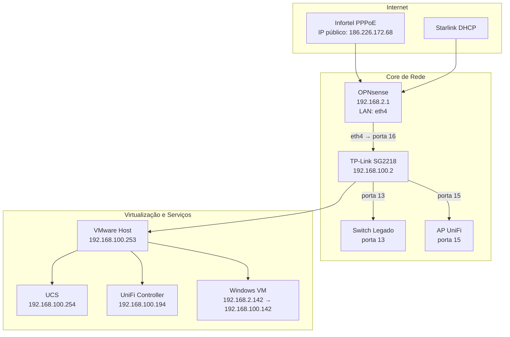

## Resumo

A topologia da **Colônia Agrícola** é centralizada em um firewall **OPNsense**, que recebe dois links de internet e distribui a conectividade para a rede interna através de um switch gerenciável **TP-Link SG2218**.

A partir desse switch, a infraestrutura é segmentada em três VLANs principais:

- **VLAN 1** → Segurança / Monitoramento
- **VLAN 10** → Visitantes / Wi-Fi
- **VLAN 100** → Rede local cabeada / servidores internos

Além disso, a infraestrutura conta com dois ambientes VMware:

- um appliance VMware dedicado ao OPNsense;
- um servidor VMware principal, que hospeda UCS, UniFi Controller e uma VM Windows.

## Fluxo principal da rede

```text
Internet
 ├─ Infortel (PPPoE) → OPNsense eth0
 └─ Starlink (DHCP) → OPNsense eth1

OPNsense
 └─ eth4 (LAN) → Switch TP-Link SG2218 porta 16

Switch TP-Link SG2218
 ├─ Portas 1 a 12 → VLAN 100 (rede local)
 ├─ Porta 13 → Switch legado / VLAN 1
 ├─ Porta 15 → AP UniFi (VLANs 1, 10 e 100)
 └─ Porta 16 → uplink vindo do firewall

Servidor VMware principal
 ├─ UCS
 ├─ UniFi Controller
 └─ VM Windows
```

## Segmentação por VLAN

### VLAN 1 — Segurança / Monitoramento

| Item | Informação |
| --- | --- |
| Rede | `192.168.2.0/24` |
| Gateway | `192.168.2.1` |
| DHCP | `192.168.2.100` até `192.168.2.200` |
| Uso | Câmeras, monitoramento e infraestrutura legada de segurança |

### VLAN 10 — Visitantes

| Item | Informação |
| --- | --- |
| Rede | `192.168.10.0/24` |
| Gateway | Firewall |
| DHCP | `192.168.10.100` até `192.168.10.200` |
| Uso | Rede Wi-Fi de visitantes |

### VLAN 100 — Rede local

| Item | Informação |
| --- | --- |
| Rede | `192.168.100.0/24` |
| Gateway | Firewall |
| DHCP | `192.168.100.100` até `192.168.100.200` |
| Uso | PCs, impressoras, servidores e serviços internos |

## Caminho físico principal

### Firewall

O OPNsense recebe internet por duas interfaces WAN:

- **eth0** → Infortel / PPPoE
- **eth1** → Starlink / DHCP

A saída LAN ocorre por:

- **eth4** → porta 16 do switch TP-Link SG2218

### Switch principal

O switch TP-Link SG2218 distribui a rede conforme a configuração das portas:

- **Portas 1 a 12** → rede local / VLAN 100
- **Porta 13** → ligação com switch legado / segurança
- **Porta 15** → AP UniFi com múltiplas VLANs
- **Porta 16** → uplink vindo do firewall

### Segurança / Monitoramento

A porta 13 conecta um switch não gerenciável utilizado para equipamentos de segurança e monitoramento, preservando a estrutura anterior.

### Wi-Fi

A porta 15 conecta o AP UniFi, que recebe as VLANs 1, 10 e 100 e distribui os SSIDs conforme a rede configurada.

Exemplos:

- **Visitantes** → VLAN 10
- **Colônia Agrícola** → VLAN 100

## Equipamentos principais

| Equipamento | IP / Acesso | Função |
| --- | --- | --- |
| Firewall OPNsense | `192.168.2.1` | Gateway, DHCP, failover WAN e roteamento entre VLANs |
| Switch TP-Link SG2218 | `192.168.100.2` | Distribuição principal da rede interna |
| VMware principal | `192.168.100.253` | Hospedar serviços internos |
| VMware Host firewall | `192.168.2.3` | VMware que roda a vm opnsense do firewall |
| UCS | `192.168.100.254` | Servidor Univention / arquivos / Nextcloud |
| UniFi Controller | `192.168.100.194` | Gerenciamento do ambiente UniFi |
| VM Windows | `192.168.2.142` → `192.168.100.142` | Em fase de migração |

## Relações entre equipamentos

- O OPNsense recebe os dois links WAN e faz o roteamento interno.
- O switch TP-Link distribui a LAN do firewall para os demais equipamentos.
- O switch legado depende da porta 13 do switch principal.
- O AP UniFi depende da porta 15 para transportar múltiplas VLANs.
- O VMware principal hospeda o UCS, o UniFi Controller e a VM Windows.
- O Nextcloud roda dentro do UCS.

## Diagrama Mermaid



## Resumo da rede

- `OPNsense eth4 -> Switch SG2218 porta 16`
- `Switch SG2218 porta 13 -> Switch legado`
- `Switch SG2218 porta 15 -> AP UniFi`
- `VMware principal -> UCS`
- `VMware principal -> UniFi Controller`
- `VMware principal -> VM Windows`

## Observações técnicas

- A rede de segurança foi mantida separada para evitar migração em massa.
- A VLAN 100 será a base principal da rede local interna.
- A VM Windows ainda está em fase de migração de endereçamento.
- O firewall é o elemento central de roteamento entre todas as VLANs.
- O ambiente possui dois links de internet com failover.