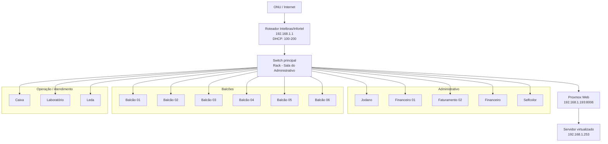

## Resumo

A topologia da Jodano é composta por uma ONU do provedor, um roteador Intelbras/Infortel e um switch principal localizado no rack da sala do administrativo.

Esse switch distribui a rede para toda a loja.

O ambiente também possui um host **Proxmox**, responsável por hospedar o servidor principal da operação.

## Fluxo principal da rede

```text
Internet / ONU
    ↓
Roteador Intelbras/Infortel (192.168.1.1)
    ↓
Switch principal no rack (sala do administrativo)
    ├─ Proxmox (192.168.1.193:8006)
    │   └─ Servidor virtualizado (192.168.1.253)
    ├─ Administrativo
    ├─ Balcões
    ├─ Caixa
    ├─ Laboratório
    └─ Demais pontos da loja
```

## Equipamentos centrais

### ONU / Internet

- **Função:** entrega do link de internet ao roteador.

### Roteador Intelbras/Infortel

- **IP:** `192.168.1.1`
- **Função:** gateway principal da rede local.
- **DHCP:** ativo.
- **Faixa DHCP:** `192.168.1.100` até `192.168.1.200`.

### Switch principal

- **Local:** rack da sala do administrativo.
- **Função:** redistribuir a rede para toda a loja.

### Proxmox

- **Acesso web:** `192.168.1.193:8006`
- **Função:** host de virtualização.

### Servidor principal

- **IP:** `192.168.1.253`
- **Hospedagem:** virtualizado dentro do Proxmox.
- **Função:** servidor principal da operação.

## Agrupamentos da rede

### Administrativo

- Rack principal
- Switch principal
- Proxmox
- Servidor
- Jodano
- Financeiro 01
- Faturamento 02
- Financeiro
- Selfcolor

### Balcões

- Balcão 01
- Balcão 02
- Balcão 03
- Balcão 04
- Balcão 05
- Balcão 06

### Operação / Atendimento

- Caixa
- Leda
- Laboratório

## Diagrama Mermaid



## Observações técnicas

- O ambiente opera em uma única rede principal `192.168.1.0/24`.
- Os equipamentos da loja utilizam DHCP.
- O servidor principal está hospedado virtualmente no Proxmox.
- O rack principal está na sala do administrativo.
- Não há, até o momento, segmentação por VLAN documentada neste ambiente.