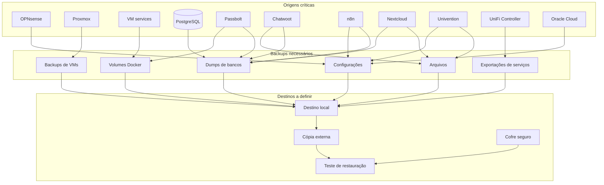

## Visão geral

Esta página documenta os pontos de backup da infraestrutura interna da **Tekz Tecnologias**.

A infraestrutura da Tekz possui vários componentes críticos, incluindo:

- firewall OPNsense;
- servidor Proxmox;
- máquinas virtuais internas;
- VM `services`;
- Docker / Portainer;
- Traefik;
- bancos PostgreSQL;
- Redis;
- Passbolt;
- Chatwoot;
- n8n;
- Evolution / EvoGo;
- Nextcloud;
- Univention Server;
- UniFi Controller;
- Oracle Cloud;
- Nginx Proxy Manager;
- Uptime Kuma.

<Warning>
  A política de backup ainda precisa ser validada e documentada em detalhes. Esta página serve como mapa inicial do que deve ser protegido e revisado.
</Warning>

## Objetivo

O objetivo da estratégia de backup é garantir recuperação em caso de:

- falha física do servidor Proxmox;
- falha em VM crítica;
- perda de volumes Docker;
- corrupção de banco de dados;
- erro humano;
- atualização mal sucedida;
- ataque/ransomware;
- perda de configuração de firewall;
- perda de configuração de proxy/DNS;
- indisponibilidade de serviços críticos.

## Criticidade dos backups

| Item | Criticidade | Motivo |
| --- | --- | --- |
| OPNsense | Crítica | Firewall, VPN, NAT, DHCP e VLANs |
| Proxmox | Crítica | Hospeda as VMs internas |
| VM `services` | Crítica | Docker, Portainer, Traefik e serviços públicos |
| Passbolt | Crítica | Cofre de senhas |
| PostgreSQL | Crítica | Banco de vários serviços |
| Chatwoot | Alta | Atendimento e histórico |
| n8n | Alta | Workflows, automações e webhooks |
| Univention | Alta | AD e arquivos locais |
| Nextcloud | Alta | Arquivos e colaboração |
| UniFi Controller | Alta | Gerenciamento de APs de clientes |
| Evolution / EvoGo | Alta | Integração WhatsApp |
| Traefik | Alta | Publicação de serviços |
| Oracle Cloud / NPM | Alta | Proxy externo e monitoramento |
| Uptime Kuma | Média / Alta | Monitoramento externo |
| Dify / PGVector | Média | IA/RAG, uso eventual |
| VM `automation` | Média | Serviços legados e relatórios |

## Status atual

Até o momento, a política de backup detalhada da infraestrutura interna da Tekz ainda precisa ser levantada e confirmada.

| Área | Status |
| --- | --- |
| Backup do Proxmox | A confirmar |
| Backup das VMs | A confirmar |
| Backup dos volumes Docker | A confirmar |
| Backup do PostgreSQL | A confirmar |
| Backup do Passbolt | A confirmar |
| Backup do OPNsense | A confirmar |
| Backup do Traefik | A confirmar |
| Backup do Portainer | A confirmar |
| Backup do Nextcloud | A confirmar |
| Backup do Univention | A confirmar |
| Backup do UniFi Controller | A confirmar |
| Backup do Nginx Proxy Manager | A confirmar |
| Backup do Uptime Kuma | A confirmar |
| Teste de restauração | A confirmar |

<Note>
  Enquanto não houver confirmação da rotina real, considerar esta página como checklist de levantamento.
</Note>

---

## Backups do firewall OPNsense

O OPNsense é um dos componentes mais críticos da infraestrutura.

Ele concentra:

- LAN;
- VLANs;
- DHCP;
- OpenVPN;
- NAT;
- regras de firewall;
- regras de publicação;
- redirecionamentos de portas;
- configuração de DNS interno.

## Itens que devem ser salvos

| Item | Observação |
| --- | --- |
| Configuração completa do OPNsense | Exportação XML |
| Configuração OpenVPN | Servidor, certificados e usuários |
| Regras de firewall | LAN, WAN, VLANs e VPN |
| Regras de NAT | Portas públicas e destinos internos |
| DHCP | Escopos e reservas |
| VLANs | Interfaces, gateways e regras |
| DNS/Unbound | Configurações e redirecionamentos |
| Certificados | Validar forma segura de backup |

## Frequência recomendada

| Situação | Ação recomendada |
| --- | --- |
| Antes de alteração crítica | Exportar backup manual |
| Após alteração crítica | Exportar novo backup |
| Rotina periódica | Backup mensal ou semanal |
| Antes de atualização do OPNsense | Exportar configuração completa |

<Warning>
  Não armazenar certificados, chaves ou arquivos sensíveis em locais inseguros.
</Warning>

---

## Backups do Proxmox

O Proxmox hospeda as VMs principais da Tekz.

| Item | Informação |
| --- | --- |
| Host | `172.16.0.230:8006` |
| Função | Virtualização local |
| Criticidade | Crítica |

## VMs que devem ter backup

| VM | IP | Criticidade |
| --- | --- | --- |
| `services` | `172.16.0.253` | Crítica |
| `univention` | `172.16.0.254` | Alta |
| `nextcloud` | `172.16.0.118` | Alta |
| `unifi-auto` | `172.16.0.250` | Alta |
| `automation` | `172.16.0.152` | Média / Alta |

## Estratégia recomendada

- backup completo das VMs críticas;
- backup antes de atualizações;
- retenção mínima diária/semanal/mensal;
- cópia externa para pelo menos os dados críticos;
- teste de restauração periódico;
- monitoramento de falha nos jobs.

## Pontos a confirmar

- Existe storage dedicado para backup?
- Existe Proxmox Backup Server?
- Existe backup externo?
- Qual a frequência atual?
- Qual a retenção?
- Os backups são testados?
- Quem recebe alerta de falha?
- Há espaço suficiente no destino?

---

## Backup da VM `services`

A VM `services` é crítica porque hospeda Docker, Portainer, Traefik e grande parte dos serviços públicos da Tekz.

| Item | Informação |
| --- | --- |
| IP | `172.16.0.253` |
| Função | Docker, Portainer, Traefik e serviços |
| Criticidade | Crítica |

## Itens que devem ser protegidos

| Item | Motivo |
| --- | --- |
| Volumes Docker | Dados persistentes das aplicações |
| Compose/stacks | Permitem reconstruir serviços |
| Configuração do Portainer | Controle do ambiente Docker |
| Configuração do Traefik | Publicação dos serviços |
| Certificados, se aplicável | HTTPS e roteamento |
| Banco PostgreSQL | Dados de serviços |
| Passbolt | Cofre de senhas |
| Chatwoot | Atendimento e anexos |
| n8n | Workflows e credenciais internas |
| Evolution / EvoGo | Instâncias e integrações WhatsApp |
| Report Service | Configurações e dados |
| NOC-TV | Configuração do dashboard |

## Cuidados

<Warning>
  Backup apenas da VM pode não ser suficiente se os bancos e volumes estiverem em estados inconsistentes. Para bancos, priorizar dumps/exportações consistentes.
</Warning>

## Recomendação

- backup da VM;
- dumps periódicos do PostgreSQL;
- backup dos volumes Docker;
- exportação das stacks/compose;
- backup específico do Passbolt;
- exportação dos workflows do n8n;
- backup da configuração do Traefik;
- documentação de restauração.

---

## Backup do PostgreSQL

O PostgreSQL é uma dependência de vários serviços.

| Item | Informação |
| --- | --- |
| Stack | `postgres` |
| Ambiente | Docker / Swarm |
| Criticidade | Crítica |

## Serviços que podem depender do PostgreSQL

- Chatwoot;
- n8n;
- Dify;
- Passbolt;
- PGAdmin;
- PGVector;
- outros serviços internos.

## Estratégia recomendada

- dump individual por banco;
- rotina automatizada;
- retenção mínima diária e semanal;
- armazenamento fora da própria VM, quando possível;
- teste periódico de restauração;
- documentação de usuário, banco e dependências no cofre.

## Modelo de registro

```text
Banco:
Serviço relacionado:
Frequência:
Destino:
Retenção:
Último teste de restauração:
Observações:
```

---

## Backup do Passbolt

O Passbolt é o cofre de senhas da Tekz e deve ter prioridade máxima.

| Item | Informação |
| --- | --- |
| Serviço | Passbolt |
| Acesso | `https://172.16.0.253:8443` |
| Criticidade | Crítica |
| Exposição | Privada / LAN / VPN |

## Itens importantes

- banco de dados do Passbolt;
- volumes persistentes;
- chaves GPG;
- configuração do container;
- variáveis de ambiente;
- compose/stack;
- procedimento de restauração.

<Warning>
  Backup incompleto do Passbolt pode impedir a recuperação das senhas mesmo que o banco seja restaurado.
</Warning>

## Pontos a confirmar

- Onde estão as chaves GPG?
- Existe backup das chaves?
- Existe dump do banco?
- Existe backup dos volumes?
- Existe teste de restauração?
- Quem consegue restaurar?

---

## Backup do Chatwoot

O Chatwoot armazena informações importantes de atendimento.

| Item | Informação |
| --- | --- |
| Serviço | Chatwoot |
| Domínio | `chat.tekz.com.br` |
| Stack | `chatwoot` |
| Criticidade | Alta |

## Itens a proteger

- banco PostgreSQL;
- anexos/uploads;
- configurações;
- integrações;
- variáveis de ambiente;
- stack/compose;
- Redis, se houver necessidade operacional.

## Pontos a confirmar

- Onde ficam os anexos?
- O banco possui dump?
- Existe backup de volumes?
- Existe rotina de exportação?
- Existe teste de restauração?

---

## Backup do n8n

O n8n armazena workflows e credenciais de automações.

| Item | Informação |
| --- | --- |
| Serviços | `n8n_editor`, `n8n_webhook`, `n8n_worker`, `n8n_mcp_api` |
| Domínios | `editorncst.tekz.com.br`, `hookncst.tekz.com.br` |
| Criticidade | Alta |

## Itens a proteger

- banco do n8n;
- workflows;
- credenciais criptografadas;
- chave de criptografia;
- variáveis de ambiente;
- stacks/compose;
- webhooks e URLs;
- dados de execução, se necessário.

<Warning>
  Sem a chave de criptografia correta, credenciais salvas no n8n podem não ser recuperáveis.
</Warning>

## Pontos a confirmar

- Onde está a chave de criptografia?
- Está armazenada no cofre?
- Existe dump do banco?
- Workflows são exportados?
- Existe backup das credenciais?
- Existe teste de restauração?

---

## Backup do Evolution / EvoGo

As stacks Evolution/EvoGo são usadas para integração WhatsApp.

| Item | Informação |
| --- | --- |
| Stacks | `evolutiongo`, `evo-go-connector`, legados |
| Domínios | `evogo.tekz.com.br`, `evoncst.tekz.com.br`, `wa.tekz.com.br` |
| Criticidade | Alta |

## Itens a proteger

- banco de dados;
- instâncias;
- arquivos de sessão;
- configurações;
- webhooks;
- integrações com Chatwoot;
- variáveis de ambiente;
- compose/stack.

## Pontos a confirmar

- Onde ficam os dados de sessão?
- Existe backup das instâncias?
- Existe dependência com PostgreSQL?
- Existe dependência com Redis?
- Como restaurar uma instância sem reconectar tudo?
- Qual stack está oficialmente em produção?

---

## Backup do Nextcloud

A VM `nextcloud` hospeda o Nextcloud da Tekz.

| Item | Informação |
| --- | --- |
| VM | `nextcloud` |
| IP | `172.16.0.118` |
| Serviço | Nextcloud |
| Criticidade | Alta |

## Itens a proteger

- arquivos dos usuários;
- banco de dados;
- configuração do Nextcloud;
- diretório `config`;
- apps instalados;
- dados de usuários;
- certificado, se aplicável.

## Pontos a confirmar

- Onde ficam os dados?
- Qual banco é usado?
- Existe backup dos arquivos?
- Existe backup do banco?
- Existe backup externo?
- Existe teste de restauração?

---

## Backup do Univention Server

A VM `univention` é usada para AD e arquivos locais.

| Item | Informação |
| --- | --- |
| VM | `univention` |
| IP | `172.16.0.254` |
| Serviço | UCS / Univention |
| Criticidade | Alta |

## Itens a proteger

- arquivos locais;
- usuários e grupos;
- configuração do domínio;
- compartilhamentos;
- permissões;
- configurações do UCS;
- bancos/configurações internas do Univention.

## Pontos a confirmar

- Existe backup dos arquivos?
- Existe backup do domínio?
- Existe backup das permissões?
- Existe rotina de snapshot/backup da VM?
- Existe teste de restauração?

---

## Backup do UniFi Controller

A VM `unifi-auto` hospeda o controlador UniFi central.

| Item | Informação |
| --- | --- |
| VM | `unifi-auto` |
| IP | `172.16.0.250` |
| Domínio | `unifi.tekz.com.br` |
| Criticidade | Alta |

## Itens a proteger

- backup/exportação do UniFi Controller;
- sites;
- dispositivos adotados;
- configurações de WLAN;
- configurações de redes;
- usuários administrativos;
- certificado, se aplicável.

<Warning>
  Perder a configuração do UniFi Controller pode afetar o gerenciamento centralizado dos APs de clientes.
</Warning>

---

## Backup da Oracle Cloud

A Oracle Cloud hospeda serviços auxiliares importantes.

| Item | Informação |
| --- | --- |
| IP | `144.22.149.6` |
| Serviços | Nginx Proxy Manager e Uptime Kuma |
| Criticidade | Alta |

## Itens a proteger

- configuração do Nginx Proxy Manager;
- proxy hosts;
- certificados;
- usuários;
- configuração do Uptime Kuma;
- monitores;
- histórico, se necessário;
- volumes/containers;
- regras de firewall/security list;
- chave SSH da VM.

## Pontos a confirmar

- Existe backup da VM Oracle?
- Existe backup do NPM?
- Existe backup do Uptime Kuma?
- Existe exportação dos monitores?
- Existe snapshot da instância?
- Existe procedimento de recuperação?

---

## Backup do Cloudflare e DNS

O Cloudflare não é backup tradicional, mas os registros DNS devem ser documentados e exportáveis.

## Itens a proteger

- lista de registros DNS;
- comentários dos registros;
- zonas relevantes;
- regras de proxy;
- configurações críticas;
- tokens/API keys, se usados.

## Recomendação

- manter documentação atualizada;
- exportar registros quando possível;
- registrar alterações em DNS;
- evitar alterações sem histórico.

---

## Modelo geral de registro de backup

Use este modelo para cada serviço crítico:

```text
Serviço:
Origem:
Tipo de backup:
Destino:
Frequência:
Retenção:
Responsável:
Última execução:
Último teste de restauração:
Status:
Observações:
```

## Checklist de revisão periódica

- Existem backups das VMs críticas?
- Existem dumps dos bancos?
- Os volumes Docker estão protegidos?
- O Passbolt possui backup completo?
- O n8n possui chave de criptografia salva?
- O OPNsense possui exportação recente?
- O UniFi Controller possui backup exportado?
- O Nextcloud possui backup de banco e arquivos?
- O Univention possui backup de arquivos e domínio?
- A Oracle Cloud possui backup ou snapshot?
- Existe teste de restauração?
- Os backups estão fora do mesmo servidor?
- Há alerta de falha de backup?

## Prioridade de implementação

Caso a política de backup ainda precise ser organizada, priorizar nesta ordem:

1. Passbolt.
2. OPNsense.
3. VM `services`.
4. PostgreSQL.
5. Chatwoot.
6. n8n.
7. Univention Server.
8. Nextcloud.
9. UniFi Controller.
10. Oracle Cloud / NPM / Uptime Kuma.
11. Dify / PGVector.
12. VM `automation`.

## Recomendações

- Não depender apenas de snapshot local.
- Manter cópia externa dos itens críticos.
- Testar restauração periodicamente.
- Documentar onde cada backup fica.
- Automatizar dumps de banco.
- Separar backup de dados e backup de configuração.
- Manter exportação do OPNsense após alterações.
- Manter backup do Passbolt validado.
- Registrar falhas de backup como incidentes.
- Revisar periodicamente retenção e espaço disponível.

## Diagrama Mermaid



## Observações

<Note>
  A documentação de backup deve evoluir de “o que precisa ser protegido” para “como restaurar”. Backup sem teste de restauração não deve ser considerado totalmente confiável.
</Note>

```text
```