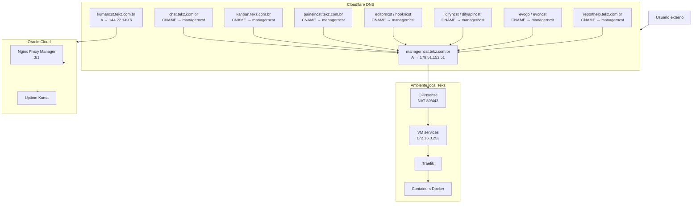

## Visão geral

O **Cloudflare** é usado pela **Tekz Tecnologias** para gerenciar registros DNS públicos e direcionar o tráfego dos serviços publicados.

A estratégia principal é usar um registro `A` apontando para o IP público local da Tekz e criar múltiplos registros `CNAME` apontando para esse registro principal.

Assim, a publicação dos serviços locais segue este padrão:

```text
Cloudflare
    ↓
CNAME do serviço
    ↓
managerncst.tekz.com.br
    ↓
IP público local da Tekz
    ↓
Firewall OPNsense
    ↓
Traefik na VM services
    ↓
Container correspondente
```

## Registro principal local

O principal registro usado para publicar serviços locais da Tekz é:

| Registro | Tipo | Destino | Proxy | Observação |
| --- | --- | --- | --- | --- |
| `managerncst.tekz.com.br` | A | `179.51.153.51` | Somente DNS | Envia tráfego para o IP público local da Tekz |

Esse IP público encaminha as portas `80` e `443` no firewall OPNsense para a VM `services`, onde o Traefik roteia o tráfego para os containers.

## Registro da Oracle Cloud

A Tekz também possui serviços externos rodando na Oracle Cloud.

| Registro | Tipo | Destino | Proxy | Observação |
| --- | --- | --- | --- | --- |
| `kumancst.tekz.com.br` | A | `144.22.149.6` | Somente DNS | Aponta para Oracle Cloud, onde roda o Uptime Kuma |

<Note>
  O Uptime Kuma foi migrado para a Oracle Cloud para não depender exclusivamente do link local da Tekz.
</Note>

## Estratégia de CNAMEs

A maioria dos serviços publicados localmente usa `CNAME` apontando para:

```text
managerncst.tekz.com.br
```

Isso evita criar vários registros `A` apontando diretamente para o mesmo IP público.

## Registros DNS principais

| Domínio | Tipo | Destino | Proxy | Função |
| --- | --- | --- | --- | --- |
| `managerncst.tekz.com.br` | A | `179.51.153.51` | Somente DNS | Entrada principal para Traefik local |
| `kumancst.tekz.com.br` | A | `144.22.149.6` | Somente DNS | Uptime Kuma na Oracle Cloud |
| `chat.tekz.com.br` | CNAME | `managerncst.tekz.com.br` | Somente DNS | Chatwoot |
| `kanban.tekz.com.br` | CNAME | `managerncst.tekz.com.br` | Somente DNS | Chatwoot Kanban |
| `painelncst.tekz.com.br` | CNAME | `managerncst.tekz.com.br` | Somente DNS | Portainer |
| `editorncst.tekz.com.br` | CNAME | `managerncst.tekz.com.br` | Somente DNS | n8n Editor |
| `hookncst.tekz.com.br` | CNAME | `managerncst.tekz.com.br` | Somente DNS | n8n Webhook |
| `difyncst.tekz.com.br` | CNAME | `managerncst.tekz.com.br` | Somente DNS | Dify Web |
| `difyapincst.tekz.com.br` | CNAME | `managerncst.tekz.com.br` | Somente DNS | Dify API |
| `evogo.tekz.com.br` | CNAME | `managerncst.tekz.com.br` | Somente DNS | Evolution Go |
| `evoncst.tekz.com.br` | CNAME | `managerncst.tekz.com.br` | Somente DNS | Evolution antigo |
| `reporthelp.tekz.com.br` | CNAME | `managerncst.tekz.com.br` | Somente DNS | Gerador de relatórios HelpTekz |

## Registros relacionados a serviços externos

Além dos serviços que passam pelo Traefik local, existem registros que apontam para ambientes externos ou fluxos específicos.

| Domínio | Destino | Observação |
| --- | --- | --- |
| `agent.gen.helptekz.tekz.com.br` | Oracle Cloud / Nginx Proxy Manager → `179.51.153.51:8899` | Gerador `.exe` do agente HelpTekz |
| `chatwoot.tekz.com.br` | Oracle Cloud / Nginx Proxy Manager → `179.51.153.51:8085` | Publicação antiga/alternativa do Chatwoot |
| `drive.tekz.com.br` | Oracle Cloud / Nginx Proxy Manager → `179.51.153.51:8086` | Nextcloud Tekz |
| `elastic.tekz.com.br` | Oracle Cloud / Nginx Proxy Manager → `179.51.153.51:9200` | Elastic |
| `n8n.tekz.com.br` | Oracle Cloud / Nginx Proxy Manager → `179.51.153.51:5678` | n8n legado |
| `unifi.tekz.com.br` | Oracle Cloud / Nginx Proxy Manager → `179.51.153.51:8443` | UniFi Controller |
| `wa.tekz.com.br` | Oracle Cloud / Nginx Proxy Manager → `179.51.153.51:8081` | Evolution API antiga |

<Warning>
  Existem serviços publicados pelo Nginx Proxy Manager na Oracle Cloud que apontam para portas específicas do IP público local. Esses serviços devem ser revisados para identificar o que ainda é produção e o que é legado.
</Warning>

## Relação com Traefik

O Cloudflare resolve o domínio, mas quem decide para qual container enviar o tráfego é o **Traefik**.

Fluxo:

```text
servico.tekz.com.br
    ↓
Cloudflare DNS
    ↓
managerncst.tekz.com.br
    ↓
179.51.153.51
    ↓
OPNsense
    ↓
NAT 80/443
    ↓
Traefik
    ↓
Container
```

## Relação com OPNsense

O Cloudflare aponta para o IP público local `179.51.153.51`.

No firewall OPNsense, existem NATs principais:

| Porta externa | Destino interno | Porta interna | Serviço |
| --- | --- | --- | --- |
| `80` | `172.16.0.253` | `80` | Traefik HTTP |
| `443` | `172.16.0.253` | `443` | Traefik HTTPS |

Se esses NATs forem alterados ou removidos, os serviços publicados via `managerncst.tekz.com.br` deixarão de funcionar externamente.

## Relação com Oracle Cloud

A Oracle Cloud possui o IP:

```text
144.22.149.6
```

Nela rodam:

- Nginx Proxy Manager;
- Uptime Kuma.

O Nginx Proxy Manager publica alguns domínios que redirecionam para serviços locais da Tekz usando o IP público `179.51.153.51` e portas específicas.

## Nginx Proxy Manager na Oracle Cloud

Acesso administrativo:

```text
http://144.22.149.6:81/
```

Exemplos de hosts configurados:

| Domínio | Destino | Observação |
| --- | --- | --- |
| `agent.gen.helptekz.tekz.com.br` | `http://179.51.153.51:8899` | Gerador `.exe` agente HelpTekz |
| `chatwoot.tekz.com.br` | `http://179.51.153.51:8085` | Chatwoot antigo |
| `drive.tekz.com.br` | `https://179.51.153.51:8086` | Nextcloud |
| `elastic.tekz.com.br` | `https://179.51.153.51:9200` | Elastic |
| `n8n.tekz.com.br` | `http://179.51.153.51:5678` | n8n legado |
| `unifi.tekz.com.br` | `https://179.51.153.51:8443` | UniFi Controller |
| `wa.tekz.com.br` | `http://179.51.153.51:8081` | Evolution API antiga |
| `kumancst.tekz.com.br` | `http://uptime-kuma:3001` | Uptime Kuma na Oracle |

## Registros “Somente DNS”

Os registros listados estão configurados como **Somente DNS**.

Isso significa que o Cloudflare atua apenas como DNS, sem proxy reverso intermediando o tráfego.

## Vantagens do padrão atual

- Simples de manter.
- Um único registro `A` concentra o IP público local.
- Novos serviços podem ser adicionados com `CNAME`.
- O Traefik decide o roteamento internamente.
- Evita criar vários registros apontando diretamente para o mesmo IP.
- Facilita migração futura do IP principal alterando apenas o registro `A`.

## Riscos do padrão atual

| Risco | Impacto |
| --- | --- |
| IP público local mudar | Todos os serviços que dependem do `managerncst` podem parar |
| NAT 80/443 quebrar | Serviços via Traefik ficam fora |
| Traefik cair | Serviços por CNAME ficam fora |
| VM `services` cair | Serviços Docker ficam fora |
| OPNsense cair | Acesso externo local fica fora |
| CNAME criado sem rota no Traefik | Domínio resolve, mas serviço não abre |
| Serviço legado exposto por porta direta | Risco de segurança maior |

## Diagrama Mermaid



## Procedimento para publicar novo serviço via Traefik

1. Criar ou atualizar a stack no Portainer.
2. Garantir que o serviço esteja configurado no Traefik.
3. Definir domínio desejado.
4. Criar registro `CNAME` no Cloudflare apontando para:

```text
managerncst.tekz.com.br
```

5. Confirmar que o registro está como **Somente DNS**.
6. Validar se o domínio resolve corretamente.
7. Testar acesso externo.
8. Documentar o serviço em:
   - `infra-tekz/dns-publico`;
   - `infra-tekz/traefik`;
   - `infra-tekz/servicos-publicos`;
   - `infra-tekz/stacks`.

## Procedimento para alterar IP público local

Se o IP público local `179.51.153.51` mudar:

1. Confirmar novo IP público.
2. Atualizar o registro `A`:

```text
managerncst.tekz.com.br
```

3. Validar propagação DNS.
4. Testar serviços principais:
   - `chat.tekz.com.br`;
   - `painelncst.tekz.com.br`;
   - `editorncst.tekz.com.br`;
   - `hookncst.tekz.com.br`;
   - `evogo.tekz.com.br`;
   - `reporthelp.tekz.com.br`.
5. Registrar alteração em `infra-tekz/incidentes`.

## Checklist de troubleshooting

### Serviço não abre

1. Verificar se o domínio existe no Cloudflare.
2. Confirmar se é `A` ou `CNAME`.
3. Se for `CNAME`, confirmar se aponta para `managerncst.tekz.com.br`.
4. Validar se `managerncst.tekz.com.br` aponta para `179.51.153.51`.
5. Confirmar se o registro está como **Somente DNS**.
6. Validar NAT no OPNsense.
7. Validar Traefik.
8. Validar container/serviço.

### Domínio resolve, mas mostra erro 404

Possíveis causas:

- DNS correto, mas rota não existe no Traefik;
- domínio não configurado nas labels;
- regra `Host()` incorreta;
- serviço em rede Docker diferente;
- container parado.

### Domínio resolve, mas mostra erro 502

Possíveis causas:

- Traefik não consegue acessar o container;
- porta interna errada;
- aplicação fora do ar;
- container reiniciando;
- rede Docker incorreta.

### Nenhum serviço via `managerncst` funciona

Verificar:

- IP público local;
- registro `A` no Cloudflare;
- link de internet da Tekz;
- OPNsense;
- NAT 80/443;
- VM `services`;
- Traefik.

## Boas práticas

- Usar `CNAME` para `managerncst.tekz.com.br` em serviços locais.
- Evitar múltiplos registros `A` apontando para o mesmo IP.
- Documentar todo novo domínio.
- Manter comentários claros no Cloudflare.
- Revisar domínios legados periodicamente.
- Remover registros sem uso.
- Evitar expor serviços administrativos sem VPN ou proteção adicional.
- Conferir se o serviço está atrás do Traefik antes de criar DNS.
- Registrar alterações críticas.

## Pontos a revisar

- Quais registros ainda estão ativos e em uso.
- Quais registros apontam para serviços legados.
- Se `chatwoot.tekz.com.br` ainda deve existir além de `chat.tekz.com.br`.
- Se `n8n.tekz.com.br` ainda deve apontar para serviço legado.
- Se `wa.tekz.com.br` ainda é usado.
- Se `elastic.tekz.com.br` deve continuar exposto.
- Se todos os serviços novos devem ir para Traefik.
- Se o Cloudflare deve permanecer como **Somente DNS** para todos esses serviços.
- Se algum domínio deveria usar proxy do Cloudflare.
- Se há registros duplicados ou sem comentário.

## Observações

<Note>
  O Cloudflare é a primeira camada de resolução dos serviços públicos da Tekz. Um DNS errado pode deixar um serviço fora mesmo que o container, Traefik e firewall estejam funcionando corretamente.
</Note>

```text
```