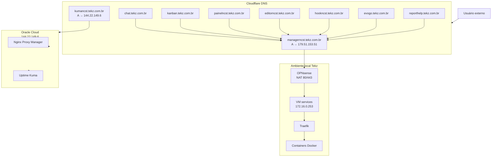

## Visão geral

Esta página documenta os registros de **DNS público** usados pela **Tekz Tecnologias** para publicar serviços internos, serviços externos, proxies, monitoramento e aplicações auxiliares.

A maior parte dos serviços locais publicados pela Tekz segue o padrão:

```text
CNAME do serviço
    ↓
managerncst.tekz.com.br
    ↓
179.51.153.51
    ↓
OPNsense
    ↓
Traefik na VM services
    ↓
Container correspondente
```

## Objetivo

O objetivo desta página é centralizar:

- domínios usados pela Tekz;
- subdomínios de serviços;
- registros `A`;
- registros `CNAME`;
- destino de cada apontamento;
- função de cada domínio;
- serviços locais publicados;
- serviços publicados via Oracle Cloud;
- serviços legados que precisam de revisão.

<Warning>
  Alterações em DNS podem derrubar serviços mesmo quando o container, firewall e Traefik estão funcionando corretamente.
</Warning>

## Domínio principal

O domínio principal usado pela Tekz é:

```text
tekz.com.br
```

Os subdomínios são usados para publicar sistemas, painéis, automações, atendimento, monitoramento e serviços internos.

## Registros principais

| Domínio | Tipo | Destino | Função |
| --- | --- | --- | --- |
| `managerncst.tekz.com.br` | A | `179.51.153.51` | Entrada principal para serviços locais via Traefik |
| `kumancst.tekz.com.br` | A | `144.22.149.6` | Uptime Kuma na Oracle Cloud |

## Registro principal local

O registro mais importante para publicação local é:

```text
managerncst.tekz.com.br
```

Ele aponta para o IP público local da Tekz:

```text
179.51.153.51
```

Esse IP chega no firewall OPNsense, que encaminha as portas `80` e `443` para a VM `services`, onde o Traefik roteia os serviços.

## Registro principal Oracle Cloud

O registro usado para monitoramento externo é:

```text
kumancst.tekz.com.br
```

Ele aponta para a VM da Oracle Cloud:

```text
144.22.149.6
```

Essa VM hospeda o Uptime Kuma e o Nginx Proxy Manager.

## Padrão de publicação via Traefik

Para serviços publicados localmente via Traefik, o padrão recomendado é:

1. Criar o serviço/stack no Portainer.
2. Configurar o roteamento no Traefik.
3. Criar um CNAME no Cloudflare apontando para:

```text
managerncst.tekz.com.br
```

4. Manter o registro como **Somente DNS**.
5. Testar o domínio.
6. Documentar o serviço.

## Registros CNAME para o ambiente local

| Domínio | Tipo | Aponta para | Serviço / Função |
| --- | --- | --- | --- |
| `chat.tekz.com.br` | CNAME | `managerncst.tekz.com.br` | Chatwoot |
| `kanban.tekz.com.br` | CNAME | `managerncst.tekz.com.br` | Chatwoot Kanban |
| `painelncst.tekz.com.br` | CNAME | `managerncst.tekz.com.br` | Portainer |
| `editorncst.tekz.com.br` | CNAME | `managerncst.tekz.com.br` | n8n Editor |
| `hookncst.tekz.com.br` | CNAME | `managerncst.tekz.com.br` | n8n Webhook |
| `difyncst.tekz.com.br` | CNAME | `managerncst.tekz.com.br` | Dify Web |
| `difyapincst.tekz.com.br` | CNAME | `managerncst.tekz.com.br` | Dify API |
| `evogo.tekz.com.br` | CNAME | `managerncst.tekz.com.br` | Evolution Go |
| `evoncst.tekz.com.br` | CNAME | `managerncst.tekz.com.br` | Evolution antigo |
| `reporthelp.tekz.com.br` | CNAME | `managerncst.tekz.com.br` | Gerador de relatórios HelpTekz |

## Serviços publicados via Traefik

| Serviço | Domínio | Stack / Origem |
| --- | --- | --- |
| Chatwoot | `chat.tekz.com.br` | `chatwoot` |
| Chatwoot Kanban | `kanban.tekz.com.br` | `chatwoot_kanban` |
| Portainer | `painelncst.tekz.com.br` | `portainer` |
| n8n Editor | `editorncst.tekz.com.br` | `n8n_editor` |
| n8n Webhook | `hookncst.tekz.com.br` | `n8n_webhook` |
| Dify Web | `difyncst.tekz.com.br` | `dify_web` |
| Dify API | `difyapincst.tekz.com.br` | `dify_api` |
| Evolution Go | `evogo.tekz.com.br` | `evolutiongo` |
| Evolution antigo | `evoncst.tekz.com.br` | `evolution_v2Inactive` / legado |
| Report HelpTekz | `reporthelp.tekz.com.br` | `report-service` |

## Registros relacionados à Oracle Cloud

A Oracle Cloud possui o IP:

```text
144.22.149.6
```

Nela rodam:

- Nginx Proxy Manager;
- Uptime Kuma.

| Domínio | Tipo / Destino | Função |
| --- | --- | --- |
| `kumancst.tekz.com.br` | A → `144.22.149.6` | Uptime Kuma |
| `agent.gen.helptekz.tekz.com.br` | NPM → `179.51.153.51:8899` | Gerador `.exe` agente HelpTekz |
| `chatwoot.tekz.com.br` | NPM → `179.51.153.51:8085` | Chatwoot antigo/alternativo |
| `drive.tekz.com.br` | NPM → `179.51.153.51:8086` | Nextcloud Tekz |
| `elastic.tekz.com.br` | NPM → `179.51.153.51:9200` | Elastic legado |
| `n8n.tekz.com.br` | NPM → `179.51.153.51:5678` | n8n legado |
| `unifi.tekz.com.br` | NPM → `179.51.153.51:8443` | UniFi Controller |
| `wa.tekz.com.br` | NPM → `179.51.153.51:8081` | Evolution API antiga |

<Warning>
  Os domínios publicados via Nginx Proxy Manager da Oracle Cloud apontam para portas específicas e, em muitos casos, serviços legados. Revisar periodicamente o que ainda deve permanecer ativo.
</Warning>

## Serviços externos ou de clientes no NPM

Além dos serviços da Tekz, existem domínios configurados no Nginx Proxy Manager da Oracle Cloud para serviços externos ou de clientes.

| Domínio | Destino | Observação |
| --- | --- | --- |
| `apiei.antonia.com.vc` | `https://ei.antonia.com.vc:443` | Serviço Antonia |
| `drive.coloniaagricola.com` | `https://186.226.172.68:443` | Drive/Nextcloud Colônia Agrícola |
| `glpi.tekz.com.br` | `http://164.152.53.201:80` | GLPI externo |
| `serplan.tekz.com.br` | `http://serplan2.tekz.com.br:8080` | Proxy Serplan |

## Comparativo dos fluxos DNS

### Fluxo padrão atual — Cloudflare \+ Traefik

```text
servico.tekz.com.br
    ↓
CNAME → managerncst.tekz.com.br
    ↓
A → 179.51.153.51
    ↓
OPNsense
    ↓
Traefik
    ↓
Container
```

### Fluxo via Oracle Cloud \+ NPM

```text
servico.tekz.com.br
    ↓
Cloudflare
    ↓
Oracle Cloud - 144.22.149.6
    ↓
Nginx Proxy Manager
    ↓
179.51.153.51:porta
    ↓
OPNsense
    ↓
Serviço interno
```

### Fluxo externo

```text
servico.tekz.com.br
    ↓
Cloudflare
    ↓
Oracle Cloud - NPM
    ↓
Servidor externo
```

## Registros “Somente DNS”

Os registros listados estão configurados como **Somente DNS**.

Isso significa que o Cloudflare atua apenas como resolvedor DNS, sem proxy ativo entre o usuário e o destino.

## Quando usar CNAME para `managerncst`

Use CNAME para `managerncst.tekz.com.br` quando:

- o serviço roda na VM `services`;
- o serviço está atrás do Traefik;
- o serviço usa HTTP/HTTPS;
- o serviço deve usar o IP público local da Tekz;
- o serviço deve seguir o padrão novo de publicação.

## Quando não usar CNAME para `managerncst`

Não usar esse padrão quando:

- o serviço roda na Oracle Cloud;
- o serviço é monitoramento externo;
- o serviço precisa passar pelo Nginx Proxy Manager;
- o serviço aponta para um IP de cliente;
- o serviço ainda usa NAT direto em porta específica;
- o serviço não está atrás do Traefik.

## Modelo para novo registro DNS

```text
Domínio:
Tipo: A ou CNAME
Destino:
Proxy: Somente DNS ou Proxied
Serviço relacionado:
Stack:
Ambiente: Local / Oracle / Externo
Responsável:
Observações:
```

## Procedimento para publicar novo serviço local

1. Criar stack ou serviço no Portainer.
2. Configurar Traefik.
3. Validar que o serviço responde internamente.
4. Criar CNAME no Cloudflare:

```text
novo-servico.tekz.com.br → managerncst.tekz.com.br
```

5. Deixar como **Somente DNS**.
6. Aguardar propagação.
7. Testar o domínio.
8. Documentar em:
   - `infra-tekz/dns-publico`;
   - `infra-tekz/traefik`;
   - `infra-tekz/servicos-publicos`;
   - `infra-tekz/stacks`.

## Procedimento para alterar IP público local

Se o IP público da Tekz mudar, atualizar o registro:

```text
managerncst.tekz.com.br
```

Novo destino:

```text
NOVO_IP_PUBLICO
```

Depois testar:

- `chat.tekz.com.br`;
- `kanban.tekz.com.br`;
- `painelncst.tekz.com.br`;
- `editorncst.tekz.com.br`;
- `hookncst.tekz.com.br`;
- `evogo.tekz.com.br`;
- `reporthelp.tekz.com.br`.

## Procedimento para remover registro DNS

Antes de remover um registro:

1. Confirmar se o serviço ainda existe.
2. Confirmar se não há usuários usando o domínio.
3. Verificar se há rota no Traefik.
4. Verificar se há proxy host no NPM.
5. Verificar se há automações usando o domínio.
6. Fazer print ou registrar configuração atual.
7. Remover o registro.
8. Registrar alteração.

<Warning>
  Não remover registros legados sem confirmar se ainda existem integrações, webhooks ou clientes apontando para eles.
</Warning>

## Checklist de troubleshooting

### Domínio não resolve

1. Verificar se o registro existe no Cloudflare.
2. Conferir se o tipo está correto: A ou CNAME.
3. Conferir destino.
4. Conferir se está como Somente DNS.
5. Testar resolução DNS.
6. Verificar se houve alteração recente.

### Domínio resolve, mas serviço não abre

1. Confirmar se o domínio aponta para o destino correto.
2. Se for local, validar `managerncst.tekz.com.br`.
3. Confirmar se o IP público local está online.
4. Verificar OPNsense.
5. Verificar NAT.
6. Verificar Traefik ou NPM.
7. Verificar serviço interno.

### Domínio abre outro serviço

Possíveis causas:

- CNAME correto, mas regra do Traefik incorreta;
- rota duplicada;
- Host configurado errado;
- proxy host do NPM apontando para serviço incorreto;
- DNS antigo ainda em cache;
- container usando labels de outro domínio.

## Diagrama Mermaid



## Riscos principais

| Risco | Impacto |
| --- | --- |
| `managerncst` apontando para IP errado | Todos os CNAMEs locais podem parar |
| Registro removido sem validação | Serviço fica inacessível |
| DNS correto, mas Traefik sem rota | Erro 404 ou serviço fora |
| DNS correto, mas container fora | Erro 502 ou timeout |
| Registros legados esquecidos | Risco de segurança |
| IP local alterado | Serviços locais ficam fora |
| NPM apontando para serviço antigo | Exposição indevida ou confusão operacional |

## Boas práticas

- Usar comentários nos registros DNS.
- Criar novos serviços locais como CNAME para `managerncst`.
- Evitar múltiplos registros A para o mesmo IP.
- Revisar registros antigos.
- Documentar todo subdomínio criado.
- Remover DNS apenas após validar dependências.
- Registrar alterações relevantes.
- Evitar publicar serviços administrativos sem proteção.
- Padronizar nomes de subdomínios.
- Validar DNS após mudanças em Cloudflare, Traefik ou NPM.

## Pontos a revisar

- Se `chatwoot.tekz.com.br` ainda deve existir.
- Se `n8n.tekz.com.br` ainda deve existir.
- Se `wa.tekz.com.br` ainda é usado.
- Se `elastic.tekz.com.br` deve continuar exposto.
- Se `evoncst.tekz.com.br` aponta para stack ativa ou legada.
- Se `drive.tekz.com.br` deve migrar para Traefik.
- Se `unifi.tekz.com.br` deve continuar via Oracle/NPM.
- Se `agent.gen.helptekz.tekz.com.br` deve continuar no NPM.
- Se todos os CNAMEs locais estão documentados.
- Se registros antigos possuem comentários claros.

## Observações

<Note>
  O DNS público é uma camada crítica da infraestrutura da Tekz. Sempre que um domínio for criado, alterado ou removido, a documentação deve ser atualizada para evitar perda de rastreabilidade.
</Note>

```text
```