## Visão geral

Esta página registra incidentes, falhas, alterações relevantes e ocorrências operacionais da infraestrutura interna da **Tekz Tecnologias**.

Ela deve ser usada para documentar eventos que impactem ou possam impactar:

- firewall OPNsense;
- internet local;
- VPN;
- Proxmox;
- VMs internas;
- VM `services`;
- Docker / Portainer;
- Traefik;
- Cloudflare / DNS;
- Oracle Cloud;
- Uptime Kuma;
- Nginx Proxy Manager;
- Chatwoot;
- n8n;
- Evolution / EvoGo;
- Passbolt;
- Nextcloud;
- Univention;
- UniFi Controller;
- serviços públicos e privados.

<Warning>
  Todo incidente relevante deve ser registrado, mesmo que tenha sido resolvido rapidamente. O histórico ajuda a identificar padrões e evita retrabalho.
</Warning>

## Objetivo

O objetivo desta página é manter um histórico claro de:

- indisponibilidades;
- falhas recorrentes;
- alterações críticas;
- quedas de serviços;
- problemas de DNS;
- problemas de firewall;
- problemas de proxy;
- problemas em containers;
- migrações;
- remoções de serviços;
- ações corretivas;
- pendências pós-incidente.

## Registro rápido de incidentes

| Data | Serviço afetado | Impacto | Causa | Solução | Responsável |
| --- | --- | --- | --- | --- | --- |
| A preencher | A preencher | A preencher | A preencher | A preencher | A preencher |

## Modelo completo de incidente

Use este modelo para registrar incidentes relevantes.

```text
Data:
Horário de início:
Horário de normalização:
Serviço afetado:
Ambiente:
Impacto:
Sintoma percebido:
Causa provável:
Causa confirmada:
Ação aplicada:
Responsável:
Tempo de indisponibilidade:
Status:
Pendências:
Observações:
```

## Modelo de alteração relevante

Use este modelo para registrar alterações que possam afetar a operação.

```text
Data:
Alteração:
Serviço/equipamento afetado:
Motivo:
Risco:
Executado por:
Rollback previsto:
Resultado:
Pendências:
Observações:
```

## Tipos de incidentes que devem ser registrados

## Rede e firewall

Registrar quando houver:

- queda do OPNsense;
- perda de acesso ao firewall;
- falha em NAT;
- falha em VLAN;
- erro em regra de firewall;
- problema de DHCP;
- falha de DNS interno;
- perda de internet local;
- alteração de IP público;
- problema no redirecionamento `80/443`;
- falha no OpenVPN;
- alteração importante em regra WAN/LAN/VPN.

## Virtualização

Registrar quando houver:

- Proxmox indisponível;
- VM desligada inesperadamente;
- VM travada;
- storage cheio;
- snapshot causando problema;
- queda da VM `services`;
- queda da VM `univention`;
- queda da VM `unifi-auto`;
- queda da VM `nextcloud`;
- queda da VM `automation`;
- erro de backup de VM;
- alteração de recursos de VM.

## Docker / Portainer

Registrar quando houver:

- Portainer fora;
- Docker parado;
- stack em falha;
- container em restart loop;
- volume removido ou corrompido;
- rede Docker com problema;
- stack removida;
- erro após update;
- falha em deploy;
- problema com PostgreSQL ou Redis;
- alteração em stack crítica.

## Publicação web

Registrar quando houver:

- Traefik fora;
- erro 404 em serviço publicado;
- erro 502 em serviço publicado;
- certificado HTTPS vencido;
- domínio sem resolver;
- DNS incorreto no Cloudflare;
- NAT incorreto;
- serviço fora por problema no Nginx Proxy Manager;
- alteração no `managerncst.tekz.com.br`;
- alteração no IP público local `179.51.153.51`;
- alteração na Oracle Cloud `144.22.149.6`.

## Serviços críticos

Registrar incidentes envolvendo:

- Chatwoot;
- Chatwoot Kanban;
- n8n;
- Evolution / EvoGo;
- Evo Go Connector;
- Passbolt;
- Portainer;
- Traefik;
- PostgreSQL;
- Redis;
- Report Service;
- NOC-TV;
- Uptime Kuma;
- UniFi Controller;
- Nextcloud;
- Univention Server;
- Elastic;
- Dify.

## Histórico inicial conhecido

### Migração da documentação interna

| Item | Informação |
| --- | --- |
| Evento | Migração da documentação de Docmost para Mintlify |
| Motivo | Centralizar e organizar melhor a documentação da Tekz |
| Status | Em andamento |
| Observação | Docmost ainda roda temporariamente na stack `docmost_tekz`, mas está previsto para remoção |

### Migração do Uptime Kuma

| Item | Informação |
| --- | --- |
| Evento | Uptime Kuma migrado para Oracle Cloud |
| Motivo | Monitoramento mais confiável, sem depender do link local da Tekz |
| Ambiente antigo | Stack local `uptime_kumaInactive` |
| Ambiente novo | Oracle Cloud |
| Domínio | `kumancst.tekz.com.br` |
| Status | Migrado |

### Testes com Evolution Go

| Item | Informação |
| --- | --- |
| Evento | Testes com `evolutiongo` \+ `evo-go-connector` |
| Motivo | Substituir/validar ambiente antigo Evolution |
| Stacks antigas | `evolution_v2Inactive`, `evogoInactive` |
| Stack atual/teste | `evolutiongo`, `evo-go-connector` |
| Observação | Stacks antigas foram funcionais recentemente e não devem ser removidas sem validação |

## Registro de alterações recentes

| Data | Alteração | Serviço afetado | Status | Observação |
| --- | --- | --- | --- | --- |
| A preencher | Migração documentação para Mintlify | Docmost / Mintlify | Em andamento | Confirmar remoção futura do Docmost |
| A preencher | Migração Uptime Kuma para Oracle Cloud | Monitoramento | Concluído | Stack local marcada como inativa |
| A preencher | Testes Evolution Go | WhatsApp / Chatwoot | Em teste | Validar antes de remover legados |

## Incidentes por categoria

## Incidentes de DNS

Use esta seção quando houver problemas de resolução ou apontamento.

| Data | Domínio | Problema | Solução | Observação |
| --- | --- | --- | --- | --- |
| A preencher | A preencher | A preencher | A preencher | A preencher |

### Exemplo de registro

```text
Data:
Domínio afetado:
Tipo de registro:
Destino esperado:
Destino encontrado:
Impacto:
Correção aplicada:
Responsável:
Observações:
```

## Incidentes de Traefik

Use esta seção para falhas no proxy reverso local.

| Data | Serviço | Erro | Causa | Solução |
| --- | --- | --- | --- | --- |
| A preencher | A preencher | A preencher | A preencher | A preencher |

### Erros comuns

| Erro | Possível causa |
| --- | --- |
| 404 | Rota/label incorreta ou domínio não configurado |
| 502 | Container fora, porta interna errada ou rede Docker incorreta |
| Timeout | Traefik, NAT, firewall, VM ou container fora |
| HTTPS inválido | Certificado, DNS ou configuração TLS |

## Incidentes de Portainer / Docker

Use esta seção para problemas em stacks, containers, volumes e redes Docker.

| Data | Stack | Problema | Solução | Observação |
| --- | --- | --- | --- | --- |
| A preencher | A preencher | A preencher | A preencher | A preencher |

### Modelo

```text
Data:
Stack:
Container:
Sintoma:
Logs relevantes:
Causa provável:
Ação aplicada:
Resultado:
Pendências:
```

## Incidentes de banco de dados

Use esta seção para falhas em PostgreSQL, Redis, PGVector ou bancos relacionados.

| Data | Serviço | Banco | Problema | Solução |
| --- | --- | --- | --- | --- |
| A preencher | A preencher | A preencher | A preencher | A preencher |

<Warning>
  Incidentes envolvendo PostgreSQL ou Redis podem impactar múltiplos serviços ao mesmo tempo.
</Warning>

## Incidentes de VPN

Use esta seção para problemas no OpenVPN.

| Data | Usuário/serviço | Problema | Causa | Solução |
| --- | --- | --- | --- | --- |
| A preencher | A preencher | A preencher | A preencher | A preencher |

### Possíveis sintomas

- usuário não conecta;
- conecta, mas não acessa a LAN;
- conecta, mas não acessa um serviço específico;
- conexão lenta;
- certificado expirado;
- rota ausente;
- regra de firewall bloqueando.

## Incidentes de serviços públicos

Use esta seção para serviços expostos via domínio.

| Data | Domínio | Serviço | Impacto | Solução |
| --- | --- | --- | --- | --- |
| A preencher | A preencher | A preencher | A preencher | A preencher |

## Incidentes de serviços privados

Use esta seção para serviços internos acessados por LAN/VPN.

| Data | Serviço | IP | Problema | Solução |
| --- | --- | --- | --- | --- |
| A preencher | A preencher | A preencher | A preencher | A preencher |

## Checklist pós-incidente

Após resolver um incidente, verificar:

- o serviço voltou a responder?
- o domínio está resolvendo corretamente?
- o Traefik/NPM está roteando corretamente?
- o container está estável?
- os logs pararam de gerar erro?
- o monitoramento voltou ao normal?
- houve impacto em banco/filas?
- existe risco de recorrência?
- precisa criar alerta?
- precisa criar backup?
- precisa revisar procedimento?
- precisa atualizar documentação?

## Análise de causa

Sempre que possível, classifique a causa do incidente.

| Tipo de causa | Exemplos |
| --- | --- |
| Rede | Link, DNS, firewall, NAT, VLAN |
| Servidor | Proxmox, VM, disco, CPU, RAM |
| Container | Stack, serviço, healthcheck, rede Docker |
| Banco | PostgreSQL, Redis, volume, conexão |
| Proxy | Traefik, NPM, certificado, rota |
| Aplicação | bug, atualização, configuração |
| Segurança | acesso indevido, exposição, credencial |
| Operacional | alteração manual, erro humano, falta de backup |
| Externo | provedor, Oracle, Cloudflare, serviço terceiro |

## Severidade

Use esta classificação para priorizar incidentes.

| Severidade | Descrição | Exemplos |
| --- | --- | --- |
| P1 | Impacto crítico em operação ou múltiplos serviços | OPNsense fora, Proxmox fora, VM `services` fora, Traefik fora |
| P2 | Serviço importante indisponível | Chatwoot fora, n8n fora, Passbolt fora, UniFi fora |
| P3 | Impacto parcial ou serviço secundário | Dify fora, Kanban fora, relatório fora |
| P4 | Baixo impacto / legado / teste | Stack antiga fora, serviço em validação |
| P5 | Registro preventivo | alteração planejada, limpeza, documentação |

## Diagrama de impacto

```mermaid
flowchart TD
    INCIDENTE[Incidente]

    INCIDENTE --> REDE[Rede / Firewall]
    INCIDENTE --> VIRT[Virtualização]
    INCIDENTE --> DOCKER[Docker / Portainer]
    INCIDENTE --> DNS[DNS / Cloudflare]
    INCIDENTE --> PROXY[Traefik / NPM]
    INCIDENTE --> APP[Aplicações]
    INCIDENTE --> BANCO[Bancos]
    INCIDENTE --> VPN[VPN]

    REDE --> OPN[OPNsense]
    REDE --> NAT[NAT]
    REDE --> VLAN[VLANs]

    VIRT --> PVE[Proxmox]
    VIRT --> VMS[VMs]

    DOCKER --> STACKS[Stacks]
    DOCKER --> CONTAINERS[Containers]
    DOCKER --> VOLUMES[Volumes]

    DNS --> CF[Cloudflare]
    DNS --> DOM[Domínios]

    PROXY --> TR[Traefik]
    PROXY --> NPM[Nginx Proxy Manager]

    APP --> CHAT[Chatwoot]
    APP --> N8N[n8n]
    APP --> EVO[EvoGo]
    APP --> PASS[Passbolt]

    BANCO --> PG[PostgreSQL]
    BANCO --> REDIS[Redis]

    VPN --> OPENVPN[OpenVPN]
```



## Procedimento mínimo durante incidente

1. Identificar serviço afetado.
2. Verificar se é impacto isolado ou geral.
3. Verificar monitoramento.
4. Validar DNS.
5. Validar firewall/NAT.
6. Validar proxy.
7. Validar servidor/VM.
8. Validar container/aplicação.
9. Aplicar correção.
10. Testar serviço.
11. Registrar incidente.
12. Definir ação preventiva.

## Registro de pendências pós-incidente

| Data | Incidente relacionado | Pendência | Responsável | Status |
| --- | --- | --- | --- | --- |
| A preencher | A preencher | A preencher | A preencher | A preencher |

## Boas práticas

- Registrar incidentes logo após a resolução.
- Registrar também alterações relevantes, não apenas falhas.
- Não apagar histórico.
- Usar datas e horários sempre que possível.
- Descrever impacto em linguagem objetiva.
- Separar causa provável de causa confirmada.
- Registrar comandos ou ações aplicadas quando úteis.
- Criar procedimento se o problema puder se repetir.
- Criar monitoramento se o problema não foi detectado automaticamente.
- Criar backup se o incidente revelou risco de perda.

## Observações

<Note>
  Esta página deve funcionar como histórico operacional da infraestrutura Tekz. Ela não precisa ser perfeita no primeiro registro, mas precisa ser útil para entender o que aconteceu, como foi corrigido e como evitar repetição.
</Note>

```text
```