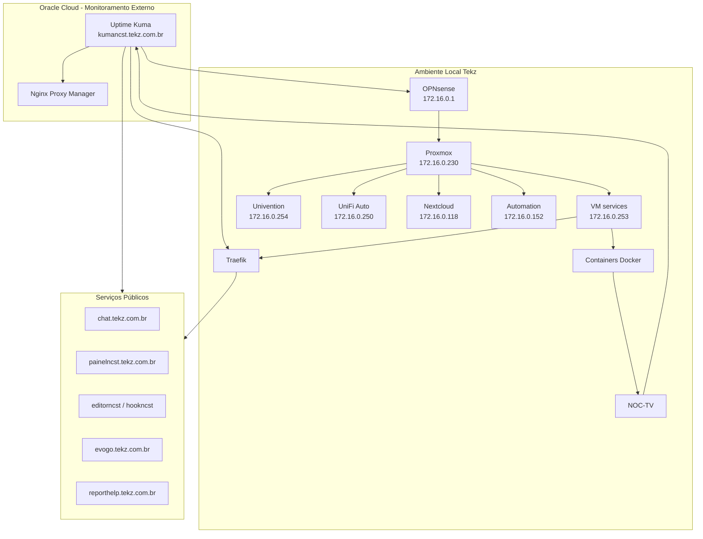

## Visão geral

O monitoramento da infraestrutura interna da **Tekz Tecnologias** tem como objetivo acompanhar a disponibilidade dos principais serviços, links, domínios, servidores, containers e sistemas utilizados na operação.

Atualmente, o principal serviço de monitoramento documentado é o **Uptime Kuma**, hospedado na **Oracle Cloud**, além do painel interno **NOC-TV**, que consulta informações de serviços, tickets e mural de tarefas.

<Warning>
  O monitoramento precisa ficar fora da rede local sempre que possível. Se o monitoramento rodar dentro da própria Tekz, uma queda no link local pode impedir a identificação correta do problema.
</Warning>

## Componentes principais

| Componente | Ambiente | Função |
| --- | --- | --- |
| Uptime Kuma | Oracle Cloud | Monitoramento externo de serviços |
| NOC-TV | VM `services` | Dashboard operacional em TV |
| Oracle Cloud | `144.22.149.6` | Hospeda monitoramento externo e Nginx Proxy Manager |
| Nginx Proxy Manager | Oracle Cloud | Proxy para alguns serviços e para o Uptime Kuma |
| Cloudflare | DNS público | Resolução dos domínios monitorados |
| OPNsense | Rede local | Firewall, NAT, VPN, VLANs e publicação local |
| Traefik | VM `services` | Proxy reverso dos serviços Docker |

## Uptime Kuma

O **Uptime Kuma** foi migrado para uma VM na **Oracle Cloud** para garantir maior confiabilidade no monitoramento.

| Item | Informação |
| --- | --- |
| Serviço | Uptime Kuma |
| Domínio | `kumancst.tekz.com.br` |
| Ambiente | Oracle Cloud |
| IP Oracle | `144.22.149.6` |
| Motivo da hospedagem externa | Monitorar serviços sem depender do link local da Tekz |
| Stack antiga local | `uptime_kumaInactive` |

## Motivo da migração para Oracle Cloud

O Uptime Kuma foi retirado da infraestrutura local porque, quando o monitoramento roda no mesmo ambiente monitorado, ele também cai em caso de falha do link, firewall ou servidor local.

Com o Uptime Kuma na Oracle Cloud, é possível detectar melhor:

- queda do link local da Tekz;
- falha do IP público;
- problemas em DNS;
- indisponibilidade de serviços públicos;
- falha de NAT no OPNsense;
- falha do Traefik;
- indisponibilidade de containers;
- queda de serviços externos.

<Note>
  O monitoramento externo é mais confiável para serviços públicos, pois testa o ambiente da mesma forma que um usuário externo acessaria.
</Note>

## NOC-TV

O **NOC-TV** é um serviço customizado da Tekz que roda na VM `services`.

| Item | Informação |
| --- | --- |
| Serviço | NOC-TV |
| Ambiente | Docker / Compose |
| VM | `services` |
| IP da VM | `172.16.0.253` |
| Função | Dashboard operacional em TV |
| Stack | `noc-tv` |

O NOC-TV exibe informações operacionais em uma TV, consultando fontes como:

- sistema MSP;
- tickets;
- mural de tarefas;
- Uptime Kuma;
- status de serviços online/offline.

## Relação entre NOC-TV e Uptime Kuma

O NOC-TV consulta o Uptime Kuma hospedado na Oracle Cloud para obter status dos serviços.

Fluxo:

```text
NOC-TV
    ↓
Consulta Uptime Kuma
    ↓
Oracle Cloud
    ↓
Retorna status dos serviços
    ↓
Dashboard na TV
```

## Itens recomendados para monitoramento

## Camada de rede

| Item | Endereço / Domínio | O que monitorar |
| --- | --- | --- |
| IP público local Tekz | `179.51.153.51` | Disponibilidade do link local |
| OPNsense | `172.16.0.1` | Acessível via rede interna/VPN |
| OpenVPN | UDP `1194` | Disponibilidade da VPN |
| Cloudflare DNS | `managerncst.tekz.com.br` | Resolução e apontamento |
| Oracle Cloud | `144.22.149.6` | Disponibilidade da VM externa |

## Camada de virtualização

| Item | Endereço | O que monitorar |
| --- | --- | --- |
| Proxmox | `172.16.0.230:8006` | Disponibilidade e painel |
| VM `services` | `172.16.0.253` | Ping, Docker, Traefik e Portainer |
| VM `univention` | `172.16.0.254` | AD, arquivos e disponibilidade |
| VM `unifi-auto` | `172.16.0.250` | UniFi Controller |
| VM `nextcloud` | `172.16.0.118` | Nextcloud e disponibilidade |
| VM `automation` | `172.16.0.152` | Serviços legados e relatórios |

## Camada Docker / Services

| Serviço | Domínio / Acesso | O que monitorar |
| --- | --- | --- |
| Traefik | `managerncst.tekz.com.br` / 80/443 | Entrada dos serviços locais |
| Portainer | `painelncst.tekz.com.br` | Painel Docker |
| Chatwoot | `chat.tekz.com.br` | Atendimento |
| Chatwoot Kanban | `kanban.tekz.com.br` | Addon do Chatwoot |
| n8n Editor | `editorncst.tekz.com.br` | Interface de automação |
| n8n Webhook | `hookncst.tekz.com.br` | Webhooks |
| Dify Web | `difyncst.tekz.com.br` | Interface Dify |
| Dify API | `difyapincst.tekz.com.br` | API Dify |
| Evolution Go | `evogo.tekz.com.br` | WhatsApp / integrações |
| Report HelpTekz | `reporthelp.tekz.com.br` | Relatórios |

## Serviços publicados via Oracle Cloud / NPM

| Serviço | Domínio | O que monitorar |
| --- | --- | --- |
| Uptime Kuma | `kumancst.tekz.com.br` | Monitoramento externo |
| Gerador agente HelpTekz | `agent.gen.helptekz.tekz.com.br` | Gerador `.exe` |
| Drive Tekz | `drive.tekz.com.br` | Nextcloud |
| UniFi Controller | `unifi.tekz.com.br` | Controlador UniFi |
| n8n legado | `n8n.tekz.com.br` | Serviço antigo |
| Evolution API antiga | `wa.tekz.com.br` | Serviço antigo |
| Elastic | `elastic.tekz.com.br` | Serviço legado |
| Chatwoot legado | `chatwoot.tekz.com.br` | Publicação antiga |

<Warning>
  Serviços legados publicados via Oracle/NPM devem ser monitorados, mas também revisados para possível remoção ou migração.
</Warning>

## Serviços privados recomendados para monitoramento interno

Alguns serviços não são públicos e devem ser monitorados internamente ou via VPN.

| Serviço | Acesso | Observação |
| --- | --- | --- |
| Passbolt | `https://172.16.0.253:8443` | Cofre de senhas |
| OPNsense | `https://172.16.0.1` | Firewall |
| Proxmox | `https://172.16.0.230:8006` | Virtualização |
| UCS | `172.16.0.254` | AD e arquivos |
| Services | `172.16.0.253` | Docker |
| Automation | `172.16.0.152` | Legado |

## Tipos de checks recomendados

| Tipo | Uso recomendado |
| --- | --- |
| HTTP/HTTPS | Serviços web e painéis |
| TCP Port | Portas específicas como `8006`, `8443`, `8080`, `8899` |
| Ping | Servidores internos, VMs e IP público |
| DNS | Verificar resolução de domínios |
| Keyword | Validar se a página retornou conteúdo esperado |
| Docker healthcheck | Containers críticos |
| API check | Serviços com endpoints de saúde |
| Certificado SSL | Validade de HTTPS |

## Checks por criticidade

### Críticos

| Serviço | Check recomendado |
| --- | --- |
| Chatwoot | HTTPS \+ keyword |
| Portainer | HTTPS |
| Traefik | HTTPS no domínio principal |
| OPNsense | Ping interno/VPN \+ painel |
| Proxmox | HTTPS `:8006` |
| VM `services` | Ping \+ Docker |
| Passbolt | HTTPS interno/VPN |
| Uptime Kuma | HTTPS |
| OpenVPN | UDP/TCP check ou teste de conexão |
| PostgreSQL | Check interno por porta/serviço |
| Redis | Check interno por porta/serviço |

### Alta prioridade

| Serviço | Check recomendado |
| --- | --- |
| n8n Editor | HTTPS |
| n8n Webhook | HTTPS/API |
| Evolution Go | HTTPS/API |
| UniFi Controller | HTTPS/TCP |
| UCS | Ping \+ serviços |
| Nextcloud | HTTPS |
| Report HelpTekz | HTTPS |
| NOC-TV | HTTP interno |

### Revisar / legado

| Serviço | Check recomendado |
| --- | --- |
| Elastic | HTTPS/TCP |
| n8n legado | HTTP |
| Chatwoot legado | HTTP |
| Evolution API antiga | HTTP/API |
| Docmost antigo | HTTP, se ainda ativo |

## Diagrama Mermaid



## Fluxo de monitoramento externo

```text
Uptime Kuma na Oracle Cloud
    ↓
Consulta domínio público
    ↓
Cloudflare DNS
    ↓
IP público local / Oracle / externo
    ↓
Serviço monitorado
```

Esse fluxo é útil porque valida o caminho real do usuário externo.

## Fluxo do NOC-TV

```text
NOC-TV local
    ↓
Consulta APIs internas
    ↓
Consulta MSP / tickets
    ↓
Consulta Uptime Kuma na Oracle Cloud
    ↓
Exibe dashboard na TV
```

## Alertas recomendados

Configurar alertas para:

- Chatwoot fora;
- Portainer fora;
- Traefik fora;
- n8n webhook fora;
- Evolution Go fora;
- Uptime Kuma fora;
- link local indisponível;
- Proxmox indisponível;
- VM `services` indisponível;
- Passbolt indisponível;
- disco cheio em VMs críticas;
- certificado expirando;
- falha de DNS;
- serviços legados ainda expostos.

## Checklist de indisponibilidade pública

Quando um serviço público estiver fora:

1. Verificar Uptime Kuma.
2. Confirmar se outros serviços também caíram.
3. Se vários serviços locais caíram, verificar:
   - link local da Tekz;
   - OPNsense;
   - NAT 80/443;
   - VM `services`;
   - Traefik.
4. Se apenas um serviço caiu, verificar:
   - DNS do serviço;
   - rota no Traefik;
   - stack no Portainer;
   - logs do container;
   - banco/Redis, se aplicável.
5. Registrar incidente se houver impacto operacional.

## Checklist de falha geral dos serviços via Traefik

Se todos os serviços que apontam para `managerncst.tekz.com.br` estiverem fora:

1. Verificar se `managerncst.tekz.com.br` resolve para `179.51.153.51`.
2. Verificar se o IP público local responde.
3. Verificar link da Tekz.
4. Verificar OPNsense.
5. Verificar NAT `80/443`.
6. Verificar VM `services`.
7. Verificar stack `traefik`.
8. Verificar logs do Traefik.

## Checklist de falha no Uptime Kuma

Se o Uptime Kuma estiver fora:

1. Validar se `kumancst.tekz.com.br` resolve para `144.22.149.6`.
2. Validar se a VM Oracle Cloud está online.
3. Validar Nginx Proxy Manager.
4. Validar serviço/container do Uptime Kuma.
5. Verificar certificado.
6. Testar acesso direto pela Oracle, se aplicável.

## Checklist de falha no NOC-TV

Se o painel da TV estiver sem dados:

1. Confirmar se a stack `noc-tv` está rodando.
2. Validar se a VM `services` está online.
3. Confirmar se o NOC-TV acessa o Uptime Kuma.
4. Verificar APIs do MSP/tickets.
5. Conferir logs do container.
6. Validar conectividade com internet.
7. Verificar se houve alteração em tokens ou endpoints.

## Indicadores recomendados

| Indicador | Objetivo |
| --- | --- |
| Uptime dos serviços públicos | Medir disponibilidade externa |
| Tempo de resposta | Identificar lentidão |
| Certificados próximos de expirar | Evitar falhas HTTPS |
| Serviços em queda recorrente | Identificar instabilidade |
| Containers reiniciando | Identificar falhas de aplicação |
| Uso de disco | Evitar indisponibilidade por storage |
| Falhas de DNS | Identificar problemas de resolução |
| Link local fora | Detectar falha de internet da Tekz |
| Oracle fora | Detectar falha no monitoramento externo |

## Serviços que precisam de monitoramento prioritário

| Prioridade | Serviços |
| --- | --- |
| P1 | OPNsense, Proxmox, VM `services`, Traefik, Portainer, Passbolt |
| P2 | Chatwoot, n8n, Evolution Go, PostgreSQL, Redis |
| P3 | UniFi Controller, Nextcloud, UCS, Report Service |
| P4 | Dify, PGVector, Docmost antigo, serviços legados |
| P5 | Proxies temporários e serviços em descontinuação |

## Boas práticas

- Manter Uptime Kuma fora da rede local.
- Monitorar por domínio público e não apenas por IP.
- Monitorar também serviços internos via VPN ou agente, quando possível.
- Criar alertas para serviços críticos.
- Monitorar certificados SSL.
- Documentar falsos positivos.
- Remover checks de serviços desativados.
- Criar grupo separado para serviços legados.
- Testar alertas periodicamente.
- Registrar incidentes recorrentes.

## Pontos a confirmar

- Quais canais recebem alertas do Uptime Kuma.
- Quais serviços já estão cadastrados no Kuma.
- Se o Kuma monitora certificados SSL.
- Se existe backup do Uptime Kuma.
- Se o NOC-TV possui autenticação/token para APIs.
- Se há monitoramento de disco das VMs.
- Se há monitoramento interno além do Kuma.
- Se Zabbix/Grafana ainda fazem parte da infra.
- Se o OpenVPN está sendo monitorado.
- Se o PostgreSQL e Redis têm checks internos.
- Se há alertas para falha de backup.

## Observações

<Note>
  O monitoramento deve ser revisado sempre que um novo serviço for publicado, removido ou migrado. Todo serviço público importante deve ter pelo menos um check no Uptime Kuma.
</Note>

```text
```