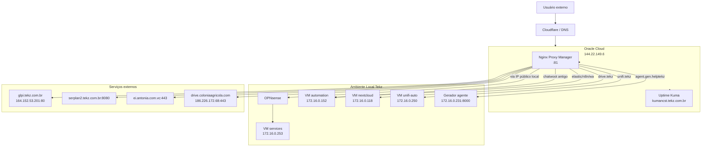

## Visão geral

A **Tekz Tecnologias** utiliza uma VM na **Oracle Cloud** para hospedar serviços auxiliares externos à rede local da empresa.

Essa VM é importante porque alguns serviços precisam continuar acessíveis mesmo quando o link local da Tekz apresenta instabilidade.

Atualmente, os principais serviços conhecidos na Oracle Cloud são:

- **Nginx Proxy Manager**
- **Uptime Kuma**

## Informações principais

| Item | Informação |
| --- | --- |
| Provedor | Oracle Cloud |
| IP público | `144.22.149.6` |
| Nginx Proxy Manager | `http://144.22.149.6:81/` |
| Uptime Kuma | `kumancst.tekz.com.br` |
| Função | Proxy externo, monitoramento e publicação auxiliar |

<Warning>
  Não registrar senhas, tokens, chaves SSH, chaves privadas ou credenciais da Oracle Cloud nesta documentação. Esses dados devem ficar no cofre oficial da Tekz.
</Warning>

## Função da Oracle Cloud

A Oracle Cloud é usada como uma camada externa auxiliar da infraestrutura da Tekz.

Ela ajuda principalmente em dois pontos:

- manter o monitoramento em ambiente externo;
- publicar ou redirecionar alguns serviços usando Nginx Proxy Manager.

## Por que o Uptime Kuma foi migrado

O **Uptime Kuma** foi migrado para a Oracle Cloud porque, rodando fora da rede local da Tekz, ele consegue monitorar os serviços de forma mais confiável.

Quando o Uptime Kuma rodava localmente, uma queda no link da empresa poderia derrubar também o próprio monitoramento.

Com ele na Oracle Cloud, é possível detectar melhor:

- queda do link local;
- indisponibilidade de serviços publicados;
- falha em DNS;
- falha em proxy;
- falha de serviços externos;
- problemas em domínios públicos.

<Note>
  O Uptime Kuma externo é mais confiável para monitorar serviços públicos, porque não depende do ambiente local da Tekz estar online.
</Note>

## Serviços na Oracle Cloud

| Serviço | Acesso | Função |
| --- | --- | --- |
| Nginx Proxy Manager | `http://144.22.149.6:81/` | Gerenciar hosts/proxies externos |
| Uptime Kuma | `kumancst.tekz.com.br` | Monitoramento externo de serviços |
| Proxy hosts | NPM | Redirecionar domínios para serviços locais ou externos |

## Nginx Proxy Manager

O **Nginx Proxy Manager** é usado para gerenciar hosts publicados a partir da Oracle Cloud.

Acesso administrativo:

```text
http://144.22.149.6:81/
```

Ele possui regras apontando tanto para serviços externos quanto para serviços que rodam localmente na Tekz, usando o IP público local:

```text
179.51.153.51
```

## Hosts configurados no Nginx Proxy Manager

| Domínio | Destino | SSL | Status | Observação |
| --- | --- | --- | --- | --- |
| `agent.gen.helptekz.tekz.com.br` | `http://179.51.153.51:8899` | Let's Encrypt | Online | Gerador `.exe` agente HelpTekz |
| `apiei.antonia.com.vc` | `https://ei.antonia.com.vc:443` | Let's Encrypt | Online | Serviço Antonia |
| `chatwoot.tekz.com.br` | `http://179.51.153.51:8085` | Let's Encrypt | Online | Chatwoot antigo/alternativo |
| `drive.coloniaagricola.com` | `https://186.226.172.68:443` | Let's Encrypt | Online | Nextcloud/drive Colônia Agrícola |
| `drive.tekz.com.br` | `https://179.51.153.51:8086` | Let's Encrypt | Online | Nextcloud Tekz |
| `elastic.tekz.com.br` | `https://179.51.153.51:9200` | Let's Encrypt | Online | Elastic legado |
| `glpi.tekz.com.br` | `http://164.152.53.201:80` | Let's Encrypt | Online | GLPI externo |
| `kumancst.tekz.com.br` | `http://uptime-kuma:3001` | Let's Encrypt | Online | Uptime Kuma na Oracle |
| `n8n.tekz.com.br` | `http://179.51.153.51:5678` | Let's Encrypt | Online | n8n legado |
| `serplan.tekz.com.br` | `http://serplan2.tekz.com.br:8080` | Let's Encrypt | Online | Proxy Serplan |
| `unifi.tekz.com.br` | `https://179.51.153.51:8443` | Let's Encrypt | Online | UniFi Controller central |
| `wa.tekz.com.br` | `http://179.51.153.51:8081` | Let's Encrypt | Online | Evolution API antiga |

<Warning>
  Alguns hosts do Nginx Proxy Manager apontam para serviços legados ou antigos da infraestrutura local. Revisar antes de considerar todos como produção.
</Warning>

## Relação com a infraestrutura local

A Oracle Cloud se relaciona com a infraestrutura local da Tekz principalmente através do IP público:

```text
179.51.153.51
```

Esse IP pertence ao ambiente local da Tekz e é usado como destino para diversos hosts configurados no Nginx Proxy Manager.

Fluxo típico:

```text
Usuário externo
    ↓
Cloudflare / DNS
    ↓
Oracle Cloud - Nginx Proxy Manager
    ↓
IP público local da Tekz - 179.51.153.51
    ↓
OPNsense
    ↓
NAT para serviço interno
```

## Relação com Cloudflare

O Cloudflare possui registros DNS apontando para a Oracle Cloud e para o ambiente local.

Exemplo:

| Registro | Tipo | Destino | Observação | | --- | --- | --- | | `kumancst.tekz.com.br` | A | `144.22.149.6` | Aponta para Oracle Cloud | | `managerncst.tekz.com.br` | A | `179.51.153.51` | Aponta para ambiente local da Tekz |

## Uptime Kuma

O Uptime Kuma roda na Oracle Cloud e é usado para monitorar serviços internos e externos da Tekz.

| Item | Informação |
| --- | --- |
| Serviço | Uptime Kuma |
| Domínio | `kumancst.tekz.com.br` |
| Ambiente | Oracle Cloud |
| Motivo da hospedagem externa | Monitorar sem depender do link local |
| Stack antiga local | `uptime_kumaInactive` |

## Relação com NOC-TV

O serviço **NOC-TV**, que roda localmente na VM `services`, consulta o Uptime Kuma hospedado na Oracle Cloud para exibir o status de serviços online/offline no dashboard de TV.

Fluxo:

```text
NOC-TV local
    ↓
Consulta Uptime Kuma
    ↓
Oracle Cloud
    ↓
Retorna status dos serviços
```

## Serviços locais publicados via Oracle Cloud

Alguns serviços locais ainda são publicados usando Nginx Proxy Manager na Oracle Cloud, apontando para portas específicas do IP público local.

| Serviço | Domínio | Destino local |
| --- | --- | --- |
| Gerador agente HelpTekz | `agent.gen.helptekz.tekz.com.br` | `179.51.153.51:8899` |
| Chatwoot legado | `chatwoot.tekz.com.br` | `179.51.153.51:8085` |
| Drive Tekz / Nextcloud | `drive.tekz.com.br` | `179.51.153.51:8086` |
| Elastic | `elastic.tekz.com.br` | `179.51.153.51:9200` |
| n8n legado | `n8n.tekz.com.br` | `179.51.153.51:5678` |
| UniFi Controller | `unifi.tekz.com.br` | `179.51.153.51:8443` |
| Evolution API antiga | `wa.tekz.com.br` | `179.51.153.51:8081` |

## Serviços externos publicados via Oracle Cloud

| Serviço | Domínio | Destino |
| --- | --- | --- |
| GLPI | `glpi.tekz.com.br` | `164.152.53.201:80` |
| Serplan | `serplan.tekz.com.br` | `serplan2.tekz.com.br:8080` |
| Antonia EI | `apiei.antonia.com.vc` | `ei.antonia.com.vc:443` |
| Drive Colônia Agrícola | `drive.coloniaagricola.com` | `186.226.172.68:443` |

## Fluxos principais

### Uptime Kuma

```text
Usuário / NOC-TV
    ↓
kumancst.tekz.com.br
    ↓
Oracle Cloud
    ↓
Uptime Kuma
```

### Proxy para serviço local

```text
Usuário externo
    ↓
Domínio público
    ↓
Oracle Cloud / Nginx Proxy Manager
    ↓
179.51.153.51:porta
    ↓
OPNsense
    ↓
Serviço interno Tekz
```

### Proxy para serviço externo

```text
Usuário externo
    ↓
Domínio público
    ↓
Oracle Cloud / Nginx Proxy Manager
    ↓
Serviço externo de destino
```

## Diagrama Mermaid



## Dependências

| Serviço | Depende de |
| --- | --- |
| Uptime Kuma | Oracle Cloud, container/serviço Kuma, DNS `kumancst` |
| Nginx Proxy Manager | Oracle Cloud, serviço NPM, DNS, certificados |
| Hosts locais publicados | Oracle Cloud, NPM, link local Tekz, OPNsense, NAT local, serviço interno |
| NOC-TV | Uptime Kuma disponível na Oracle Cloud |
| Gerador agente HelpTekz | NPM, IP local Tekz, NAT `8899`, serviço interno |
| UniFi externo | NPM, IP local Tekz, NAT `8443/8080`, VM `unifi-auto` |

## Riscos principais

| Risco | Impacto |
| --- | --- |
| Oracle Cloud fora | Uptime Kuma e proxies via NPM ficam indisponíveis |
| Nginx Proxy Manager parado | Domínios publicados por ele param |
| Uptime Kuma parado | Monitoramento externo fica indisponível |
| IP local da Tekz inacessível | Proxies para serviços locais param |
| Link local da Tekz fora | Serviços locais publicados via Oracle ficam fora |
| Certificado expirado no NPM | Serviços podem apresentar erro HTTPS |
| Host legado mantido sem revisão | Risco de segurança e confusão operacional |

## Checklist de troubleshooting

### Uptime Kuma fora do ar

1. Verificar se `kumancst.tekz.com.br` resolve para `144.22.149.6`.
2. Validar se a VM da Oracle Cloud está online.
3. Verificar se o serviço/container do Uptime Kuma está ativo.
4. Validar se o Nginx Proxy Manager está roteando para `uptime-kuma:3001`.
5. Conferir certificado Let's Encrypt.
6. Testar acesso externo.

### Host publicado pelo NPM fora do ar

1. Acessar Nginx Proxy Manager.
2. Conferir se o proxy host está online.
3. Validar destino configurado.
4. Testar se a Oracle Cloud consegue acessar o destino.
5. Se o destino for local, validar o IP público `179.51.153.51`.
6. Validar NAT no OPNsense.
7. Validar se o serviço interno está online.
8. Conferir certificado.

### Serviço local via Oracle fora

Verificar:

- DNS no Cloudflare;
- NPM na Oracle;
- IP público local da Tekz;
- link local da Tekz;
- OPNsense;
- NAT da porta correspondente;
- VM de destino;
- aplicação.

## Checklist antes de alterar um proxy host

Antes de alterar um proxy host no Nginx Proxy Manager:

1. Copiar configuração atual.
2. Registrar domínio.
3. Registrar destino atual.
4. Validar se há certificado Let's Encrypt.
5. Confirmar se o serviço está em produção.
6. Alterar destino.
7. Testar acesso externo.
8. Registrar alteração em `infra-tekz/incidentes`.

## Recomendações

- Revisar hosts legados periodicamente.
- Migrar serviços que fazem sentido para o padrão Cloudflare → Traefik.
- Manter Uptime Kuma fora da rede local.
- Monitorar a própria VM da Oracle Cloud.
- Documentar todo proxy host novo.
- Remover hosts antigos sem uso.
- Manter backup da configuração do Nginx Proxy Manager.
- Verificar expiração de certificados.
- Evitar publicar painéis administrativos sensíveis sem restrição adicional.

## Pontos a confirmar

- Sistema operacional da VM Oracle.
- Forma de instalação do Nginx Proxy Manager.
- Forma de instalação do Uptime Kuma.
- Caminho dos volumes/configurações.
- Política de backup da VM Oracle.
- Se existe firewall/security list na Oracle permitindo somente portas necessárias.
- Se o NPM possui autenticação forte.
- Se o Uptime Kuma possui backup.
- Quais hosts do NPM ainda estão em produção.
- Quais hosts devem ser migrados para Traefik.
- Quais hosts podem ser removidos.

## Observações

<Note>
  A Oracle Cloud funciona como uma camada externa estratégica para a Tekz. Ela melhora a confiabilidade do monitoramento e também serve como proxy para alguns serviços, mas deve ser revisada para evitar manter publicações legadas sem necessidade.
</Note>

```text
```