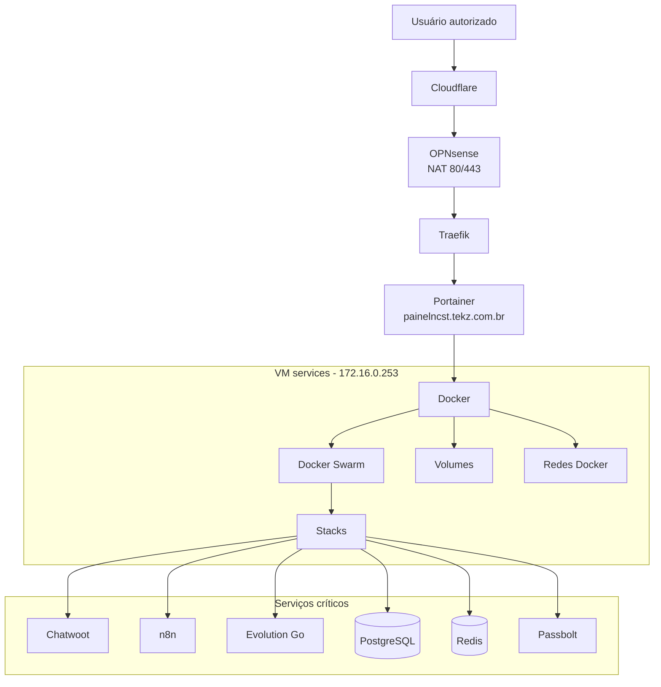

## Visão geral

O **Portainer** é o painel principal de gerenciamento do ambiente Docker da **Tekz Tecnologias**.

Ele roda na VM `services`, que possui o IP:

```text
172.16.0.253
```

O Portainer é usado para administrar:

- containers;
- stacks;
- serviços Swarm;
- volumes;
- redes Docker;
- logs;
- variáveis de ambiente;
- deploys;
- serviços publicados;
- troubleshooting de aplicações.

<Warning>
  O Portainer é um painel administrativo sensível. O acesso deve ser restrito a usuários autorizados.
</Warning>

## Informações principais

| Item | Informação |
| --- | --- |
| Serviço | Portainer |
| VM | `services` |
| IP da VM | `172.16.0.253` |
| Ambiente | Docker / Swarm |
| Domínio público | `painelncst.tekz.com.br` |
| Publicação | Traefik \+ Cloudflare |
| Função | Gerenciamento dos serviços Docker da Tekz |

## Função no ambiente

O Portainer centraliza a operação dos serviços em containers da Tekz.

Através dele é possível:

- visualizar stacks em execução;
- verificar containers parados;
- consultar logs;
- reiniciar serviços;
- atualizar stacks;
- gerenciar variáveis;
- conferir volumes;
- validar redes;
- identificar falhas de deploy;
- administrar serviços Docker Swarm.

## Relação com a VM Services

O Portainer roda dentro da VM `services`.

```text
Proxmox
    ↓
VM services - 172.16.0.253
    ↓
Docker / Swarm
    ↓
Portainer
```

A indisponibilidade da VM `services` causa indisponibilidade do Portainer e dos serviços Docker hospedados nela.

## Publicação do Portainer

O acesso público ao Portainer é feito pelo domínio:

```text
painelncst.tekz.com.br
```

Fluxo de acesso:

O Portainer é publicado via Traefik usando o padrão de entrada (NAT `80/443` → Traefik).

Detalhes do fluxo padrão e da regra de NAT ficam centralizados em:

- `infra-tekz/publicacao.mdx`

## Dependências

| Dependência | Função |
| --- | --- |
| VM `services` | Hospeda o Docker e Portainer |
| Docker | Execução do container do Portainer |
| Docker Swarm | Orquestração das stacks |
| Traefik | Publicação do Portainer via domínio |
| Cloudflare | DNS público |
| OPNsense | NAT 80/443 para Traefik |
| Rede local | Comunicação interna entre serviços |

## Stacks administradas

A lista de stacks (incluindo status e classificação operacional) fica centralizada em:

- `infra-tekz/stacks.mdx`

## Serviços mais críticos no Portainer

| Serviço | Motivo |
| --- | --- |
| `traefik` | Publica os serviços web |
| `postgres` | Banco usado por vários serviços |
| `redis` | Cache/fila para aplicações |
| `chatwoot` | Atendimento e comunicação |
| `n8n_*` | Automações e webhooks |
| `evolutiongo` | Integração WhatsApp |
| `evo-go-connector` | Integração com Chatwoot |
| `passbolt` | Cofre de senhas |
| `portainer` | Administração dos containers |
| `report-service` | Relatórios |
| `noc-tv` | Dashboard operacional interno |

## Relação com Traefik

O Traefik é gerenciado pelo Portainer como uma stack/serviço Docker.

Ele recebe o tráfego das portas `80` e `443` e encaminha para os containers corretos com base nas regras de roteamento.

```text
Cloudflare
    ↓
managerncst.tekz.com.br
    ↓
OPNsense NAT 80/443
    ↓
Traefik
    ↓
Container publicado
```

## Relação com PostgreSQL

A stack `postgres` é uma dependência importante para vários serviços.

Antes de reiniciar ou alterar PostgreSQL, validar impacto em:

- Chatwoot;
- n8n;
- Dify;
- Passbolt;
- PGAdmin;
- outros serviços que usem banco compartilhado.

<Warning>
  Alterações no PostgreSQL podem derrubar múltiplos serviços ao mesmo tempo.
</Warning>

## Relação com Redis

A stack `redis` é usada como cache/fila por serviços como:

- Chatwoot;
- n8n;
- Dify;
- outros serviços de background.

Antes de reiniciar Redis, validar impacto em filas, jobs e sessões.

## Relação com volumes

Os volumes Docker armazenam dados persistentes dos serviços.

Exemplos de dados que podem estar em volumes:

- banco de dados;
- arquivos do Chatwoot;
- configurações do n8n;
- dados do Passbolt;
- arquivos do Dify;
- configurações do Traefik;
- uploads e anexos;
- dados do Report Service.

<Warning>
  Nunca remover volumes sem confirmar exatamente qual serviço depende deles.
</Warning>

## Relação com redes Docker

As redes Docker permitem a comunicação entre containers.

Itens a validar quando um serviço não comunica:

- rede correta associada ao serviço;
- se o serviço está na mesma rede do Traefik;
- se o serviço consegue acessar PostgreSQL;
- se o serviço consegue acessar Redis;
- se o DNS interno do Docker está resolvendo;
- se a stack foi recriada com a rede correta.

## Procedimento para verificar serviço fora do ar

1. Acessar o Portainer.
2. Localizar a stack do serviço.
3. Verificar se todos os containers estão em execução.
4. Conferir logs dos containers com erro.
5. Conferir se Traefik está roteando corretamente.
6. Validar se PostgreSQL/Redis estão online, se aplicável.
7. Conferir variáveis de ambiente.
8. Verificar volumes.
9. Verificar redes.
10. Testar o domínio público.
11. Validar DNS no Cloudflare.
12. Validar NAT 80/443 no OPNsense.

## Procedimento para atualizar uma stack

Antes de atualizar uma stack:

1. Ler o compose atual.
2. Copiar o conteúdo atual como backup.
3. Verificar variáveis de ambiente.
4. Validar volumes persistentes.
5. Confirmar dependências.
6. Avaliar impacto.
7. Atualizar a stack.
8. Acompanhar logs.
9. Testar serviço interno e externo.
10. Registrar alteração.

<Warning>
  Evite atualizar stacks críticas sem cópia do compose atual e sem conhecer os volumes envolvidos.
</Warning>

## Procedimento para reiniciar container

1. Confirmar qual container será reiniciado.
2. Verificar se há impacto no serviço.
3. Consultar logs antes do restart.
4. Reiniciar container/serviço.
5. Acompanhar logs após o restart.
6. Testar acesso ao serviço.
7. Registrar caso tenha sido uma ação corretiva.

## Procedimento para remover stack

Antes de remover uma stack:

1. Confirmar que ela está realmente inativa.
2. Verificar se existe dependência de outro serviço.
3. Fazer backup do compose.
4. Fazer backup dos volumes, se necessário.
5. Verificar se há DNS ou Traefik apontando para ela.
6. Remover a stack.
7. Manter volumes temporariamente, se houver dúvida.
8. Registrar remoção.

<Warning>
  Não remover volumes junto com a stack sem validação. Em muitos casos, a stack pode ser recriada usando os mesmos volumes.
</Warning>

## Checklist de saúde do Portainer

Validar periodicamente:

- se o Portainer está acessível;
- se o endpoint Docker/Swarm está conectado;
- se há containers parados;
- se há stacks com erro;
- se há serviços em restart loop;
- se há volumes crescendo demais;
- se há logs excessivos;
- se o Traefik está saudável;
- se PostgreSQL e Redis estão online;
- se há stacks antigas sem uso;
- se há imagens antigas consumindo espaço.

## Riscos principais

| Risco | Impacto |
| --- | --- |
| Remover volume errado | Perda de dados |
| Alterar compose sem backup | Dificuldade de rollback |
| Reiniciar PostgreSQL sem aviso | Queda de múltiplos serviços |
| Derrubar Traefik | Todos os serviços publicados ficam fora |
| Apagar rede Docker compartilhada | Falha de comunicação entre containers |
| Expor serviço administrativo | Risco de segurança |
| Atualizar stack crítica sem teste | Indisponibilidade |
| Logs sem rotação | Disco cheio |

## Boas práticas

- Sempre copiar o compose antes de alterar.
- Manter nomes de stacks claros.
- Marcar stacks inativas antes de remover.
- Documentar stacks legadas.
- Não remover volumes sem backup.
- Evitar expor painéis administrativos publicamente.
- Usar Traefik para publicação padrão.
- Registrar alterações relevantes em `infra-tekz/incidentes`.
- Fazer backup de bancos antes de alterações importantes.
- Monitorar uso de disco da VM `services`.

## Pontos a confirmar

- Se o Portainer possui backup da configuração.
- Se há usuários antigos no Portainer.
- Se existe autenticação adicional/MFA.
- Se o acesso público ao Portainer deve continuar ativo.
- Se o Portainer deve ser limitado por VPN.
- Quais stacks estão realmente em produção.
- Quais stacks podem ser removidas.
- Se há rotina de backup dos volumes.
- Se há rotação de logs configurada.
- Se há imagens antigas consumindo espaço.

## Diagrama Mermaid



## Observações

<Note>
  O Portainer facilita a operação, mas também concentra alto poder administrativo sobre a infraestrutura Docker. Qualquer alteração nele deve ser feita com cuidado e preferencialmente documentada.
</Note>
