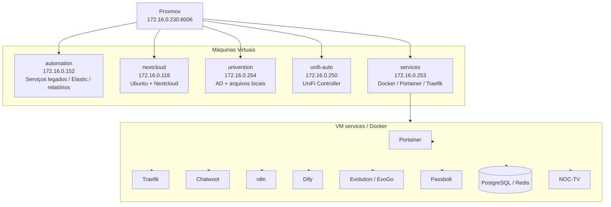

## Visão geral

O servidor **Proxmox** é o principal host de virtualização local da **Tekz Tecnologias**.

Ele hospeda máquinas virtuais essenciais para a operação interna, incluindo serviços de automação, Nextcloud, Univention Server, controlador UniFi central e a VM `services`, onde rodam Docker, Portainer, Traefik e diversos serviços em containers.

## Acesso

| Item | Informação |
| --- | --- |
| Serviço | Proxmox VE |
| IP / Acesso | `172.16.0.230:8006` |
| URL local | `https://172.16.0.230:8006` |
| Função | Host de virtualização principal |
| Rede | LAN principal `172.16.0.0/24` |

<Warning>
  Não registrar senha, token, chave SSH ou credenciais administrativas nesta página. As credenciais devem ficar armazenadas no cofre oficial da Tekz.
</Warning>

## Função no ambiente

O Proxmox é responsável por hospedar as principais VMs internas da Tekz.

Ele é uma peça crítica da infraestrutura, pois a indisponibilidade desse host pode impactar:

- automações internas;
- serviços legados;
- Nextcloud;
- servidor Univention / AD;
- controlador UniFi central;
- ambiente Docker/Portainer;
- publicação de serviços via Traefik;
- serviços públicos e privados hospedados localmente.

## Máquinas virtuais hospedadas

| VM | IP | Função principal | Observação |
| --- | --- | --- | --- |
| automation | `172.16.0.152` | Serviços legados, automações, Elastic e relatórios | Revisar serviços ativos |
| nextcloud | `172.16.0.118` | Ubuntu com Nextcloud | Nextcloud roda dentro da VM |
| univention | `172.16.0.254` | UCS, arquivos locais e AD | Serviço interno crítico |
| unifi-auto | `172.16.0.250` | Controlador UniFi central | Publicado como `unifi.tekz.com.br` |
| services | `172.16.0.253` | Docker, Portainer, Traefik e stacks | VM crítica para serviços internos e públicos |

## VM automation

A VM `automation` possui IP:

```text
172.16.0.152
```

Funções conhecidas:

- serviços legados do n8n;
- Evolution API legado;
- pequenas automações internas;
- relatórios de firewall;
- Elastic para coleta de dados de firewall;
- serviços antigos ainda em revisão.

Serviço conhecido:

```text
http://172.16.0.152:85/index.html
```

<Warning>
  Alguns serviços da VM `automation` podem estar legados ou não funcionando corretamente. Antes de depender operacionalmente deles, validar status e logs.
</Warning>

## VM nextcloud

A VM `nextcloud` possui IP:

```text
172.16.0.118
```

| Item | Informação |
| --- | --- |
| Sistema operacional | Ubuntu |
| Serviço principal | Nextcloud |
| Tipo de instalação | Nextcloud instalado dentro do Ubuntu |
| Publicação externa | Via NAT direto na porta externa `8086` para `443` interno |

## VM univention

A VM `univention` possui IP:

```text
172.16.0.254
```

| Item | Informação |
| --- | --- |
| Sistema | Univention Corporate Server |
| Funções | AD e arquivos locais |
| Importância | Alta |
| Acesso | Pela LAN ou VPN |

Essa VM é importante para autenticação e armazenamento de arquivos locais.

## VM unifi-auto

A VM `unifi-auto` possui IP:

```text
172.16.0.250
```

| Item | Informação |
| --- | --- |
| Serviço | UniFi Controller |
| Função | Controlador UniFi central da Tekz |
| Domínio público | `unifi.tekz.com.br` |
| Portas relacionadas | `8443` e `8080` |
| Uso | Gerenciamento centralizado de APs UniFi de clientes |

Essa VM é usada para controlar centralmente ambientes UniFi/Ubiquiti de vários clientes.

## VM services

A VM `services` possui IP:

```text
172.16.0.253
```

É uma das VMs mais críticas da infraestrutura interna da Tekz.

| Item | Informação |
| --- | --- |
| Função | Docker, Portainer, Traefik e serviços internos |
| Portainer público | `painelncst.tekz.com.br` |
| Passbolt privado | `https://172.16.0.253:8443` |
| Publicação web | Traefik \+ Cloudflare |
| Rede | LAN principal |

Na VM `services` rodam:

- Portainer;
- Docker Swarm;
- Traefik;
- Chatwoot;
- n8n;
- Dify;
- Evolution / EvoGo;
- Passbolt;
- PostgreSQL;
- Redis;
- PGAdmin;
- Docmost;
- Report Service;
- NOC-TV;
- outros serviços auxiliares.

## Dependências importantes

| Serviço | Depende de |
| --- | --- |
| Portainer | VM `services` e Docker |
| Traefik | VM `services`, Docker e NAT 80/443 |
| Serviços públicos Docker | Proxmox, VM `services`, Traefik, Cloudflare e OPNsense |
| Passbolt | VM `services` |
| UniFi Controller | VM `unifi-auto` |
| Nextcloud | VM `nextcloud` |
| AD / arquivos | VM `univention` |
| Relatórios legados | VM `automation` |

## Fluxo de publicação dos serviços Docker

A publicação web dos serviços Docker locais segue o padrão (NAT `80/443` → Traefik).

O fluxo completo e a regra de NAT ficam centralizados em:

- `infra-tekz/publicacao.mdx`

## Diagrama Mermaid



## Acesso administrativo

O Proxmox deve ser acessado preferencialmente pela rede local ou VPN.

| Forma de acesso | Recomendação |
| --- | --- |
| LAN local | Permitido |
| VPN OpenVPN | Recomendado para acesso externo |
| WAN direta | Evitar quando possível |
| Publicação pública | Revisar necessidade |

<Warning>
  O Proxmox é um serviço administrativo sensível. Se possível, o acesso externo deve ser limitado por VPN.
</Warning>

## NAT relacionado

Existe redirecionamento no firewall para o Proxmox.

| Porta externa | Destino interno | Porta interna | Serviço |
| --- | --- | --- | --- |
| `8006` | `172.16.0.230` | `8006` | Proxmox |

<Warning>
  A exposição do Proxmox na WAN deve ser revisada periodicamente. Sempre que possível, priorizar acesso via VPN.
</Warning>

## Checklist de validação

Em caso de problema com serviços internos, validar primeiro o Proxmox:

1. Acessar `https://172.16.0.230:8006`.
2. Verificar se o host está online.
3. Conferir uso de CPU.
4. Conferir uso de memória.
5. Conferir datastores.
6. Verificar se há snapshots antigos.
7. Verificar se as VMs principais estão ligadas.
8. Conferir logs de erro no host.
9. Validar conectividade de rede das VMs.
10. Validar se a VM `services` está online.

## Checklist das VMs críticas

| VM | Validação |
| --- | --- |
| `services` | Deve estar online para Portainer, Traefik e serviços Docker |
| `univention` | Deve estar online para AD e arquivos locais |
| `unifi-auto` | Deve estar online para gerenciamento UniFi |
| `nextcloud` | Deve estar online para Nextcloud |
| `automation` | Validar serviços legados conforme necessidade |

## Pontos a monitorar

- Disponibilidade do host Proxmox.
- Espaço em disco dos datastores.
- Uso de CPU.
- Uso de memória.
- Status das VMs.
- Snapshots antigos.
- Erros de storage.
- Rede das VMs.
- Backups das VMs.
- Temperatura/saúde física do servidor, se disponível.

## Backups

Ainda é necessário documentar a política de backup do Proxmox e das VMs.

Itens que precisam ser confirmados:

- se existe backup automático das VMs;
- destino dos backups;
- frequência;
- retenção;
- se há backup externo;
- se há teste de restauração;
- se há backup da configuração do Proxmox;
- se há backup dos volumes Docker da VM `services`.

<Warning>
  A ausência de backup documentado para o Proxmox e VMs críticas representa risco operacional importante.
</Warning>

## Recomendações

- Documentar recursos de cada VM: CPU, RAM e disco.
- Documentar datastores do Proxmox.
- Verificar snapshots antigos e remover os desnecessários.
- Definir política de backup das VMs.
- Priorizar backup da VM `services`.
- Priorizar backup da VM `univention`.
- Priorizar backup do Nextcloud.
- Evitar exposição pública do painel Proxmox.
- Registrar alterações importantes em `infra-tekz/incidentes`.
- Criar procedimento de restauração de VM crítica.

## Pontos a confirmar

- Nome exato do host Proxmox.
- Recursos físicos do servidor.
- Quantidade de discos e tipo de storage.
- Datastores configurados.
- Política atual de backup.
- Se existe cluster ou host único.
- Se existe UPS/nobreak associado.
- Configuração de rede do Proxmox.
- Bridges utilizadas pelas VMs.
- IDs das VMs.
- Recursos de CPU/RAM/disco de cada VM.
- Se o NAT externo para `8006` deve permanecer ativo.

## Observações

<Note>
  O Proxmox é a base da maior parte da infraestrutura local da Tekz. Qualquer indisponibilidade nele pode afetar vários serviços internos e públicos.
</Note>

```text
```
