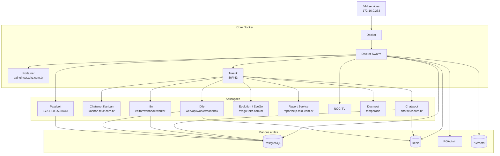

## Visão geral

A VM **services** é uma das máquinas mais críticas da infraestrutura interna da **Tekz Tecnologias**.

Ela possui o IP:

```text
172.16.0.253
```

Essa VM concentra o ambiente Docker da Tekz, incluindo:

- Portainer;
- Docker Swarm;
- Traefik;
- bancos de dados;
- serviços públicos;
- serviços privados;
- automações;
- ferramentas internas;
- integrações;
- painéis administrativos;
- aplicações auxiliares.

A maior parte dos serviços publicados na web pela Tekz passa por esta VM.

<Warning>
  A indisponibilidade da VM `services` pode afetar vários serviços internos e públicos da Tekz.
</Warning>

## Informações principais

| Item | Informação |
| --- | --- |
| Nome | `services` |
| IP | `172.16.0.253` |
| Ambiente | VM no Proxmox |
| Função | Docker, Portainer, Traefik e serviços internos |
| Rede | LAN principal `172.16.0.0/24` |
| Publicação web | Traefik \+ Cloudflare |
| Portainer público | `painelncst.tekz.com.br` |
| Passbolt privado | `https://172.16.0.253:8443` |

## Função no ambiente

A VM `services` é responsável por hospedar e operar boa parte dos serviços da Tekz em containers Docker.

Ela atua como base para:

- serviços de atendimento;
- automações;
- integrações com WhatsApp;
- ferramentas de IA;
- bancos compartilhados;
- painéis internos;
- documentação;
- serviços de relatórios;
- proxy reverso;
- publicação de aplicações na web.

## Componentes principais

| Componente | Função |
| --- | --- |
| Docker | Execução dos containers |
| Docker Swarm | Orquestração das stacks |
| Portainer | Gerenciamento visual dos containers e stacks |
| Traefik | Proxy reverso para publicação dos serviços |
| PostgreSQL | Banco de dados usado por diversos serviços |
| Redis | Cache/fila para serviços |
| Volumes Docker | Armazenamento persistente das aplicações |
| Redes Docker | Comunicação entre containers e stacks |

## Fluxo de publicação web

A publicação web (Cloudflare → OPNsense → NAT `80/443` → Traefik) é padrão na infraestrutura local.

Para evitar duplicação, o fluxo completo, a tabela do NAT `80/443` e as orientações sobre NAT direto ficam centralizados em:

- `infra-tekz/publicacao.mdx`

## Portainer

O Portainer é usado para gerenciar os containers, stacks e serviços Docker da Tekz.

| Item | Informação |
| --- | --- |
| Serviço | Portainer |
| Ambiente | Docker / Swarm |
| Domínio público | `painelncst.tekz.com.br` |
| Função | Gerenciamento de containers, stacks, volumes, redes e serviços |

<Warning>
  O Portainer é um painel administrativo sensível. O acesso deve ser protegido e limitado a usuários autorizados.
</Warning>

## Traefik

O Traefik é o proxy reverso principal dos serviços Docker.

Ele recebe o tráfego HTTP/HTTPS vindo do OPNsense e direciona para o container correto conforme o domínio acessado.

| Item | Informação |
| --- | --- |
| Serviço | Traefik |
| Portas | `80` e `443` |
| Função | Proxy reverso dos serviços Docker |
| Origem do tráfego | OPNsense / NAT 80 e 443 |
| Destino | Containers publicados |

## Serviços privados

Alguns serviços da VM `services` não devem ter exposição pública.

### Passbolt

O Passbolt é usado como cofre de senhas da Tekz.

| Item | Informação |
| --- | --- |
| Serviço | Passbolt |
| Acesso | `https://172.16.0.253:8443` |
| Exposição pública | Não possui domínio público documentado |
| Acesso recomendado | LAN ou VPN |
| Função | Cofre de senhas |

<Warning>
  O Passbolt deve permanecer restrito à rede local ou VPN.
</Warning>

## Stacks conhecidas

A lista completa e o status das stacks ficam centralizados em:

- `infra-tekz/stacks.mdx`

## Serviços principais

### Chatwoot

O Chatwoot é usado para atendimento e integrações de comunicação.

| Item | Informação |
| --- | --- |
| Stack | `chatwoot` |
| Banco | PostgreSQL da stack/serviço `postgres` |
| Domínio principal | `chat.tekz.com.br` |
| Observação | Usa banco PostgreSQL hospedado na própria infraestrutura Docker |

### Chatwoot Kanban

Addon usado junto ao Chatwoot.

| Item | Informação |
| --- | --- |
| Stack | `chatwoot_kanban` |
| Domínio | `kanban.tekz.com.br` |
| Função | Complemento visual/kanban para o Chatwoot |

### n8n

O n8n é usado para automações internas e integrações.

| Stack | Função |
| --- | --- |
| `n8n_editor` | Interface do n8n |
| `n8n_webhook` | Endpoint de webhooks |
| `n8n_worker` | Processamento em background |
| `n8n_mcp_api` | API MCP relacionada ao n8n |

Domínios relacionados:

| Serviço | Domínio |
| --- | --- |
| n8n Editor | `editorncst.tekz.com.br` |
| n8n Webhook | `hookncst.tekz.com.br` |

### Dify

O Dify é usado para RAG, IA e automações com inteligência artificial.

| Stack | Função |
| --- | --- |
| `dify_web` | Interface web |
| `dify_api` | API |
| `dify_worker` | Worker |
| `dify_sandbox` | Sandbox |
| `dify-plugin-daemon` | Plugins |

Domínios relacionados:

| Serviço | Domínio |
| --- | --- |
| Dify Web | `difyncst.tekz.com.br` |
| Dify API | `difyapincst.tekz.com.br` |

<Note>
  O Dify não é usado com frequência atualmente, mas continua documentado por já ter sido utilizado em fluxos de RAG e automação com IA.
</Note>

### Evolution / EvoGo

A infraestrutura possui stacks antigas e novas relacionadas à integração WhatsApp.

| Stack | Status / Observação |
| --- | --- |
| `evolutiongo` | Stack em teste/uso atual |
| `evo-go-connector` | Conector entre Evolution Go e Chatwoot |
| `evolution_v2Inactive` | Inativa / legado |
| `evogoInactive` | Inativa / legado |

Domínios relacionados:

| Serviço | Domínio |
| --- | --- |
| EvoGo | `evogo.tekz.com.br` |
| Evolution antigo | `evoncst.tekz.com.br` |

<Warning>
  As stacks antigas de Evolution foram funcionais recentemente, mas estão inativas durante testes com `evolutiongo` \+ `evo-go-connector`. Validar antes de remover.
</Warning>

### NOC-TV

O `noc-tv` é um serviço customizado da Tekz para exibir dashboard em TV.

| Item | Informação |
| --- | --- |
| Stack | `noc-tv` |
| Ambiente | Compose |
| Função | Dashboard operacional para TV |
| Consulta | MSP, mural de tarefas e Uptime Kuma |

O NOC-TV consulta serviços internos e externos para exibir:

- dados de tickets;
- mural de tarefas;
- status de serviços online/offline;
- dados do Uptime Kuma hospedado na Oracle Cloud.

### Report Service

Serviço utilizado para geração de relatórios.

| Item | Informação |
| --- | --- |
| Stack | `report-service` |
| Domínio relacionado | `reporthelp.tekz.com.br` |
| Função | Gerador de relatórios HelpTekz / cliente |

### Docmost

O Docmost ainda está rodando na stack `docmost_tekz`, mas será removido futuramente.

| Item | Informação |
| --- | --- |
| Stack | `docmost_tekz` |
| Status | Temporário / em descontinuação |
| Observação | Documentação migrando para Mintlify |

## Bancos e dependências

### PostgreSQL

O PostgreSQL é uma dependência importante para vários serviços.

| Item | Informação |
| --- | --- |
| Stack | `postgres` |
| Função | Banco de dados compartilhado |
| Usado por | Chatwoot e outros serviços |

<Warning>
  Antes de alterar ou reiniciar PostgreSQL, validar impacto nos serviços dependentes.
</Warning>

### Redis

O Redis é usado como cache/fila por serviços como Chatwoot, n8n e outros.

| Item | Informação |
| --- | --- |
| Stack | `redis` |
| Função | Cache e filas |
| Criticidade | Alta |

### PGAdmin

| Item | Informação |
| --- | --- |
| Stack | `pgadmin` |
| Função | Administração visual do PostgreSQL |

### PGVector

| Item | Informação |
| --- | --- |
| Stack | `pgvector` |
| Função | Banco vetorial / RAG / IA |
| Uso | Integrações de IA, quando necessário |

## Serviços inativos ou legados

| Serviço / Stack | Motivo / Observação |
| --- | --- |
| `uptime_kumaInactive` | Migrado para Oracle Cloud |
| `evolution_v2Inactive` | Inativo durante testes com Evolution Go |
| `evogoInactive` | Inativo / legado |
| `docmost_tekz` | Será removido após migração completa para Mintlify |

## Dependências críticas

| Serviço | Depende de |
| --- | --- |
| Serviços públicos | DNS Cloudflare, OPNsense, NAT 80/443, Traefik e VM `services` |
| Portainer | Docker e VM `services` |
| Traefik | Docker, rede, labels/configuração e NAT 80/443 |
| Chatwoot | PostgreSQL, Redis e containers da stack |
| n8n | PostgreSQL/Redis, workers e webhooks |
| Dify | API, worker, sandbox, plugins, banco e Redis |
| Passbolt | VM `services`, banco e volumes |
| NOC-TV | APIs internas, MSP e Uptime Kuma |
| Report Service | Containers e dependências internas |

## Diagrama Mermaid



## Checklist de validação

Quando algum serviço da VM `services` estiver fora:

1. Confirmar se a VM `services` responde em `172.16.0.253`.
2. Verificar se o Docker está ativo.
3. Verificar se o Portainer está acessível.
4. Verificar se o Traefik está rodando.
5. Conferir se a stack do serviço está ativa.
6. Validar logs do container.
7. Verificar se PostgreSQL/Redis estão ativos, se o serviço depender deles.
8. Validar DNS no Cloudflare.
9. Validar NAT 80/443 no OPNsense.
10. Testar acesso interno e externo.

## Checklist antes de reiniciar a VM

Antes de reiniciar a VM `services`:

- validar impacto em Chatwoot;
- validar impacto em n8n;
- validar impacto em Evolution/EvoGo;
- validar impacto em Portainer;
- validar impacto em Traefik;
- validar impacto em Passbolt;
- validar se há processos críticos em execução;
- avisar equipe, se necessário;
- garantir que a VM suba automaticamente após reboot.

## Backups necessários

Itens que devem possuir backup:

- volumes Docker;
- bancos PostgreSQL;
- configuração do Portainer;
- configuração do Traefik;
- dados do Passbolt;
- dados do Chatwoot;
- workflows do n8n;
- configurações do Dify;
- dados do Evolution/EvoGo;
- arquivos do Report Service;
- configurações do NOC-TV.

<Warning>
  A política de backup da VM `services` deve ser documentada e testada. Essa VM concentra muitos serviços críticos.
</Warning>

## Pontos a revisar

- Quais stacks ainda estão realmente em produção.
- Quais stacks podem ser removidas.
- Quais serviços inativos ainda ocupam recursos.
- Quais volumes precisam de backup prioritário.
- Se todos os serviços públicos estão atrás do Traefik.
- Se algum serviço está exposto indevidamente.
- Se logs estão crescendo sem rotação.
- Se PostgreSQL possui dumps automáticos.
- Se Passbolt possui rotina de backup segura.
- Se Portainer tem backup da configuração.
- Se Traefik possui configuração versionada ou exportável.

## Observações

<Note>
  A VM `services` deve ser tratada como ambiente de produção. Alterações em Docker, Traefik, PostgreSQL, Redis ou Portainer podem impactar vários serviços ao mesmo tempo.
</Note>

```text
```
