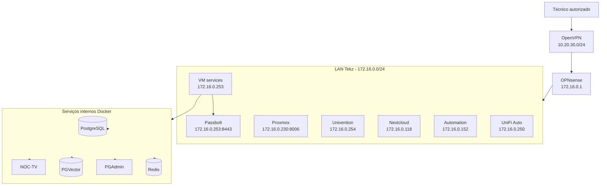

## Visão geral

Esta página documenta os **serviços privados** da infraestrutura interna da **Tekz Tecnologias**.

São considerados serviços privados aqueles que não devem ficar expostos publicamente na internet e devem ser acessados apenas pela:

- rede local da Tekz;
- VPN OpenVPN;
- acesso administrativo controlado.

<Warning>
  Serviços privados geralmente possuem acesso sensível ou administrativo. Eles não devem ser publicados publicamente sem análise de segurança.
</Warning>

## Objetivo

O objetivo desta página é centralizar:

- serviços acessíveis apenas por IP interno;
- painéis administrativos;
- serviços de infraestrutura;
- serviços de autenticação;
- cofres de senha;
- servidores internos;
- sistemas que devem ser acessados via VPN;
- serviços que não devem possuir domínio público.

## Rede principal

A maior parte dos serviços privados está na LAN principal da Tekz:

```text
172.16.0.0/24
```

O gateway/firewall principal é:

```text
172.16.0.1
```

## Acesso recomendado

| Forma de acesso | Uso recomendado |
| --- | --- |
| LAN local | Quando estiver fisicamente na rede da Tekz |
| OpenVPN | Quando estiver fora da empresa |
| WAN pública | Evitar para serviços privados |
| NAT direto | Evitar para painéis administrativos sensíveis |

## Serviços privados principais

| Serviço | Acesso | Origem | Função |
| --- | --- | --- | --- |
| OPNsense | `https://172.16.0.1` | Appliance VMware | Firewall, DHCP, VLANs, NAT e VPN |
| Proxmox | `https://172.16.0.230:8006` | Servidor Proxmox | Virtualização local |
| Passbolt | `https://172.16.0.253:8443` | VM `services` | Cofre de senhas |
| VM Services | `172.16.0.253` | Proxmox | Docker, Portainer, Traefik e stacks |
| Univention Server | `172.16.0.254` | Proxmox | AD e arquivos locais |
| Nextcloud interno | `172.16.0.118` | Proxmox | Nextcloud em Ubuntu |
| Automation | `172.16.0.152` | Proxmox | Serviços legados e automações |
| UniFi Auto interno | `172.16.0.250` | Proxmox | Controlador UniFi central |
| Gerador relatório firewall | `http://172.16.0.152:85/index.html` | VM `automation` | Relatórios legados |
| Nginx Proxy Manager Oracle | `http://144.22.149.6:81/` | Oracle Cloud | Proxy externo / hosts |

<Note>
  Alguns serviços possuem acesso público alternativo por domínio ou NAT, mas continuam sendo considerados sensíveis. Sempre priorizar acesso por VPN quando possível.
</Note>

## Passbolt

O **Passbolt** é o cofre de senhas da Tekz.

| Item | Informação |
| --- | --- |
| Serviço | Passbolt |
| Acesso | `https://172.16.0.253:8443` |
| VM | `services` |
| Exposição pública | Não documentada |
| Acesso recomendado | LAN ou VPN |
| Função | Armazenamento de credenciais |

<Warning>
  O Passbolt armazena credenciais sensíveis da empresa e de clientes. Ele deve permanecer restrito à rede local ou VPN.
</Warning>

## Dependências do Passbolt

- VM `services` online;
- Docker ativo;
- stack `passbolt` ativa;
- banco de dados disponível;
- volumes persistentes íntegros;
- acesso via LAN ou VPN.

## Pontos de atenção do Passbolt

- Verificar backup do banco.
- Verificar backup dos volumes.
- Confirmar recuperação das chaves/configurações necessárias.
- Revisar usuários antigos.
- Evitar exposição pública.
- Documentar procedimento de restauração.

---

## OPNsense

O **OPNsense** é o firewall principal da Tekz.

| Item | Informação |
| --- | --- |
| Serviço | OPNsense |
| Acesso interno | `https://172.16.0.1` |
| Função | Firewall, gateway, DHCP, VLANs, NAT, OpenVPN |
| Ambiente | Appliance VMware |

## Funções críticas

- LAN principal;
- VLANs;
- DHCP;
- OpenVPN;
- NAT;
- regras de firewall;
- isolamento entre redes;
- publicação de serviços.

<Warning>
  Alterações no OPNsense podem impactar internet, VPN, serviços públicos, VLANs, Docker, Proxmox e acesso remoto.
</Warning>

---

## Proxmox

O **Proxmox** é o host principal de virtualização da Tekz.

| Item | Informação |
| --- | --- |
| Serviço | Proxmox |
| Acesso interno | `https://172.16.0.230:8006` |
| Função | Virtualização local |
| Rede | LAN principal |

## VMs hospedadas

| VM | IP | Função |
| --- | --- | --- |
| `automation` | `172.16.0.152` | Serviços legados e automações |
| `nextcloud` | `172.16.0.118` | Nextcloud |
| `univention` | `172.16.0.254` | AD e arquivos locais |
| `unifi-auto` | `172.16.0.250` | Controlador UniFi central |
| `services` | `172.16.0.253` | Docker, Portainer e Traefik |

<Warning>
  O Proxmox é um painel administrativo sensível. O acesso externo deve ser preferencialmente via VPN.
</Warning>

---

## VM Services

A VM `services` concentra o ambiente Docker da Tekz.

| Item | Informação |
| --- | --- |
| VM | `services` |
| IP | `172.16.0.253` |
| Função | Docker, Portainer, Traefik e serviços |
| Serviços privados | Passbolt, PostgreSQL, Redis e componentes internos |
| Serviços públicos | Chatwoot, n8n, Dify, EvoGo, Portainer, Report Service |

## Serviços internos na VM Services

| Serviço | Tipo | Observação |
| --- | --- | --- |
| Passbolt | Privado | Cofre de senhas |
| PostgreSQL | Interno | Banco usado por múltiplos serviços |
| Redis | Interno | Cache/fila |
| Traefik | Interno / público | Proxy reverso |
| Portainer | Administrativo | Gerenciamento Docker |
| PGAdmin | Administrativo | Administração PostgreSQL |
| PGVector | Interno | Banco vetorial / RAG |
| NOC-TV | Interno | Dashboard operacional |

## Cuidados

- Não remover volumes sem backup.
- Não reiniciar PostgreSQL sem validar impacto.
- Não reiniciar Redis sem validar filas.
- Não alterar Traefik sem testar serviços públicos.
- Não expor serviços internos sem necessidade.

---

## Univention Server

A VM `univention` roda o servidor **UCS / Univention Corporate Server**.

| Item | Informação |
| --- | --- |
| IP | `172.16.0.254` |
| Função | AD e arquivos locais |
| Acesso recomendado | LAN ou VPN |
| Criticidade | Alta |

## Serviços relacionados

- Autenticação;
- arquivos locais;
- compartilhamentos internos;
- possível integração com estações e serviços internos.

<Warning>
  Alterações no Univention podem afetar autenticação, arquivos e acessos internos.
</Warning>

---

## Nextcloud interno

A VM `nextcloud` roda Ubuntu com Nextcloud instalado diretamente.

| Item | Informação |
| --- | --- |
| IP | `172.16.0.118` |
| Sistema | Ubuntu |
| Serviço | Nextcloud |
| Publicação externa | Também existe acesso via `drive.tekz.com.br` |
| Acesso interno | IP local |

## Observações

O Nextcloud possui publicação externa via Oracle Cloud/NPM, mas também deve ser documentado como serviço sensível devido ao armazenamento de arquivos.

---

## Automation

A VM `automation` concentra serviços legados e automações antigas.

| Item | Informação |
| --- | --- |
| IP | `172.16.0.152` |
| Função | Serviços legados, automações, Elastic e relatórios |
| Criticidade | Média / Alta |
| Status | Revisar serviços ativos |

## Serviços conhecidos

| Serviço | Acesso | Observação |
| --- | --- | --- |
| Gerador PDF relatórios firewall | `http://172.16.0.152:85/index.html` | Serviço local conhecido |
| Elastic | `172.16.0.152:9200` | Legado / exposto por NAT |
| n8n legado | `172.16.0.152:5678` | Legado |
| Evolution API legado | `172.16.0.152:8080` | Legado |
| Chatwoot legado | `172.16.0.152:3000` | Legado |

<Warning>
  Alguns serviços da VM `automation` podem estar obsoletos ou não funcionando corretamente. Revisar antes de depender deles.
</Warning>

---

## UniFi Auto

A VM `unifi-auto` hospeda o controlador UniFi central da Tekz.

| Item | Informação |
| --- | --- |
| IP | `172.16.0.250` |
| Serviço | UniFi Controller |
| Domínio público | `unifi.tekz.com.br` |
| Função | Controlar APs UniFi de clientes |
| Portas relacionadas | `8443` e `8080` |

## Observações

Embora o UniFi possua acesso público para gerenciamento e adoção, o painel deve ser tratado como serviço administrativo sensível.

---

## Serviços administrativos sensíveis

| Serviço | Acesso | Recomendação |
| --- | --- | --- |
| OPNsense | `https://172.16.0.1` | LAN/VPN |
| Proxmox | `https://172.16.0.230:8006` | LAN/VPN |
| Passbolt | `https://172.16.0.253:8443` | LAN/VPN |
| Portainer | `painelncst.tekz.com.br` | Avaliar restrição adicional |
| PGAdmin | A confirmar | LAN/VPN |
| Nginx Proxy Manager | `http://144.22.149.6:81/` | Restringir acesso |
| UniFi Controller | `unifi.tekz.com.br` | Acesso administrativo sensível |

## Serviços que deveriam ser avaliados para acesso apenas via VPN

| Serviço | Motivo |
| --- | --- |
| Proxmox | Painel de virtualização |
| Portainer | Administração Docker |
| Elastic | Serviço sensível / legado |
| PGAdmin | Administração de banco |
| Nginx Proxy Manager | Administração de proxies |
| OPNsense | Firewall principal |
| Passbolt | Cofre de senhas |

<Warning>
  Serviços administrativos publicados na internet devem ser revisados. Sempre que possível, limitar acesso por VPN ou aplicar camadas adicionais de proteção.
</Warning>

## Fluxo recomendado de acesso privado

```text
Técnico externo
    ↓
OpenVPN
    ↓
Rede VPN 10.20.30.0/24
    ↓
LAN Tekz 172.16.0.0/24
    ↓
Serviço privado
```

## Diagrama Mermaid



## Política recomendada

| Tipo de serviço | Política recomendada |
| --- | --- |
| Firewall | Acesso apenas LAN/VPN |
| Virtualização | Acesso apenas LAN/VPN |
| Cofre de senhas | Acesso apenas LAN/VPN |
| Banco de dados | Acesso interno |
| Painel Docker | Restrito a autorizados |
| Monitoramento interno | LAN/VPN ou com autenticação |
| Serviços legados | Revisar exposição |
| Serviços públicos | Publicar via Traefik/NPM com proteção |

## Checklist para acessar serviço privado

1. Conectar na VPN, se estiver fora da empresa.
2. Confirmar IP recebido na rede `10.20.30.0/24`.
3. Testar acesso ao firewall `172.16.0.1`.
4. Testar acesso ao serviço desejado.
5. Confirmar se o serviço responde pelo IP interno.
6. Validar credenciais no cofre oficial.
7. Não compartilhar prints ou dados sensíveis.

## Checklist para publicar um serviço privado

Antes de tornar público qualquer serviço privado:

1. Confirmar necessidade real.
2. Identificar tipo de informação exposta.
3. Verificar autenticação.
4. Verificar se suporta HTTPS.
5. Verificar se pode ficar atrás de VPN.
6. Avaliar se precisa de IP allowlist.
7. Avaliar risco de exposição.
8. Definir domínio.
9. Documentar em `servicos-publicos`.
10. Registrar alteração.

<Warning>
  Nem todo serviço que funciona via navegador deve ser publicado na internet.
</Warning>

## Checklist de revisão periódica

Revisar periodicamente:

- serviços privados expostos indevidamente;
- usuários antigos;
- acessos administrativos;
- NATs diretos;
- portas abertas;
- domínios legados;
- serviços sem uso;
- backups dos serviços críticos;
- logs de acesso;
- autenticação forte/MFA.

## Pontos a confirmar

- Se o Passbolt possui backup testado.
- Se o Proxmox ainda precisa estar exposto por NAT direto.
- Se o Portainer deve ser restrito à VPN.
- Se o Nginx Proxy Manager deve ter restrição de IP.
- Se PGAdmin está exposto ou apenas interno.
- Se Elastic deve continuar publicado.
- Se serviços legados da VM `automation` ainda são usados.
- Se todos os acessos privados estão documentados no cofre.
- Se há MFA nos painéis administrativos.
- Se há política de revisão de usuários.

## Observações

<Note>
  Esta página deve ser usada como referência rápida para saber quais serviços são internos, sensíveis ou administrativos. Serviços privados devem priorizar acesso via LAN ou VPN.
</Note>

```text
```