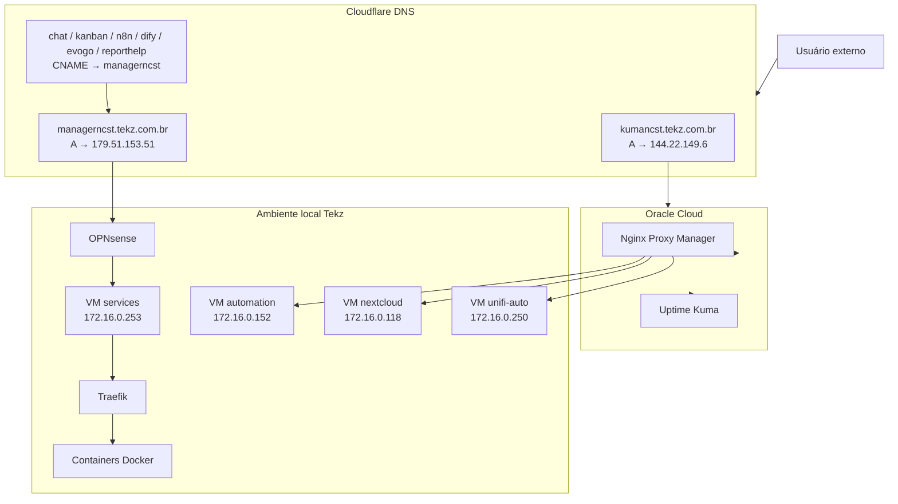

## Visão geral

Esta página documenta os **serviços públicos** da infraestrutura da **Tekz Tecnologias**.

São considerados serviços públicos aqueles acessíveis pela internet através de domínios, subdomínios, Cloudflare, Traefik, Nginx Proxy Manager ou NAT direto no firewall.

A Tekz utiliza dois fluxos principais de publicação:

- **Cloudflare → OPNsense → Traefik → Containers Docker**
- **Cloudflare → Oracle Cloud / Nginx Proxy Manager → Serviço de destino**

<Warning>
  Serviços públicos expõem pontos da infraestrutura na internet. Toda publicação deve ser documentada, revisada e protegida adequadamente.
</Warning>

## Fluxo principal — Traefik local

A maior parte dos serviços públicos novos ou padronizados deve seguir este fluxo:

O fluxo completo (incluindo NAT `80/443`) fica centralizado em:

- `infra-tekz/publicacao.mdx`

## Fluxo alternativo — Oracle Cloud / NPM

Alguns serviços ainda são publicados através do **Nginx Proxy Manager** na Oracle Cloud.

```text
Usuário externo
    ↓
Cloudflare DNS
    ↓
Oracle Cloud - 144.22.149.6
    ↓
Nginx Proxy Manager
    ↓
IP/porta de destino
    ↓
Serviço interno ou externo
```

## Serviços publicados via Traefik local

| Serviço | Domínio | Stack / Origem | Observação |
| --- | --- | --- | --- |
| Chatwoot | `chat.tekz.com.br` | `chatwoot` | Atendimento |
| Chatwoot Kanban | `kanban.tekz.com.br` | `chatwoot_kanban` | Addon/kanban do Chatwoot |
| Portainer | `painelncst.tekz.com.br` | `portainer` | Painel Docker |
| n8n Editor | `editorncst.tekz.com.br` | `n8n_editor` | Interface do n8n |
| n8n Webhook | `hookncst.tekz.com.br` | `n8n_webhook` | Webhooks do n8n |
| Dify Web | `difyncst.tekz.com.br` | `dify_web` | Interface do Dify |
| Dify API | `difyapincst.tekz.com.br` | `dify_api` | API do Dify |
| Evolution Go | `evogo.tekz.com.br` | `evolutiongo` | API/serviço WhatsApp |
| Evolution antigo | `evoncst.tekz.com.br` | `evolution_v2Inactive` / legado | Verificar uso atual |
| Report HelpTekz | `reporthelp.tekz.com.br` | `report-service` | Gerador de relatórios |

## Serviços publicados via Oracle Cloud / Nginx Proxy Manager

| Serviço | Domínio | Destino | Observação |
| --- | --- | --- | --- |
| Gerador agente HelpTekz | `agent.gen.helptekz.tekz.com.br` | `http://179.51.153.51:8899` | Gerador `.exe` do agente HelpTekz |
| Chatwoot legado | `chatwoot.tekz.com.br` | `http://179.51.153.51:8085` | Publicação antiga/alternativa |
| Drive Tekz | `drive.tekz.com.br` | `https://179.51.153.51:8086` | Nextcloud Tekz |
| Elastic | `elastic.tekz.com.br` | `https://179.51.153.51:9200` | Elastic legado |
| n8n legado | `n8n.tekz.com.br` | `http://179.51.153.51:5678` | n8n antigo |
| UniFi Controller | `unifi.tekz.com.br` | `https://179.51.153.51:8443` | Controlador UniFi central |
| Evolution API antiga | `wa.tekz.com.br` | `http://179.51.153.51:8081` | Evolution legado |
| Uptime Kuma | `kumancst.tekz.com.br` | `http://uptime-kuma:3001` | Monitoramento na Oracle Cloud |

<Warning>
  Os serviços publicados via Oracle Cloud/NPM incluem vários serviços legados. Eles devem ser revisados para confirmar o que ainda está em produção.
</Warning>

## Serviços externos ou de clientes publicados via Oracle Cloud

| Serviço | Domínio | Destino | Observação |
| --- | --- | --- | --- |
| GLPI | `glpi.tekz.com.br` | `http://164.152.53.201:80` | Serviço externo |
| Serplan | `serplan.tekz.com.br` | `http://serplan2.tekz.com.br:8080` | Proxy para serviço Serplan |
| Antonia EI | `apiei.antonia.com.vc` | `https://ei.antonia.com.vc:443` | Serviço Antonia |
| Drive Colônia Agrícola | `drive.coloniaagricola.com` | `https://186.226.172.68:443` | Serviço do cliente Colônia Agrícola |

## Resumo por criticidade

### Críticos

| Serviço | Domínio | Motivo |
| --- | --- | --- |
| Chatwoot | `chat.tekz.com.br` | Atendimento e comunicação |
| Portainer | `painelncst.tekz.com.br` | Administração Docker |
| n8n Webhook | `hookncst.tekz.com.br` | Integrações e automações |
| Evolution Go | `evogo.tekz.com.br` | Integração WhatsApp |
| UniFi Controller | `unifi.tekz.com.br` | Gerenciamento de APs de clientes |
| Uptime Kuma | `kumancst.tekz.com.br` | Monitoramento externo |
| Report HelpTekz | `reporthelp.tekz.com.br` | Relatórios / suporte a clientes |

### Importantes

| Serviço | Domínio | Observação |
| --- | --- | --- |
| n8n Editor | `editorncst.tekz.com.br` | Interface administrativa de automações |
| Chatwoot Kanban | `kanban.tekz.com.br` | Addon operacional |
| Drive Tekz | `drive.tekz.com.br` | Nextcloud |
| Gerador agente HelpTekz | `agent.gen.helptekz.tekz.com.br` | Geração de instalador/agente |
| Dify Web | `difyncst.tekz.com.br` | IA/RAG |
| Dify API | `difyapincst.tekz.com.br` | IA/RAG |

### Legados / revisar

| Serviço | Domínio | Motivo |
| --- | --- | --- |
| Chatwoot legado | `chatwoot.tekz.com.br` | Publicação antiga |
| n8n legado | `n8n.tekz.com.br` | Serviço antigo |
| Evolution API antiga | `wa.tekz.com.br` | Serviço antigo |
| Evolution antigo | `evoncst.tekz.com.br` | Stack legada/inativa |
| Elastic | `elastic.tekz.com.br` | Serviço sensível exposto |
| Docmost | A confirmar | Será removido após migração para Mintlify |

## Detalhamento dos principais serviços

## Chatwoot

| Item | Informação |
| --- | --- |
| Domínio principal | `chat.tekz.com.br` |
| Stack | `chatwoot` |
| Publicação | Traefik local |
| Banco | PostgreSQL |
| Cache/fila | Redis |
| Criticidade | Alta |

O Chatwoot é usado para atendimento e comunicação. Ele depende de PostgreSQL, Redis, Traefik, Cloudflare, OPNsense e VM `services`.

## Chatwoot Kanban

| Item | Informação |
| --- | --- |
| Domínio | `kanban.tekz.com.br` |
| Stack | `chatwoot_kanban` |
| Publicação | Traefik local |
| Função | Addon/kanban para Chatwoot |

## Portainer

| Item | Informação |
| --- | --- |
| Domínio | `painelncst.tekz.com.br` |
| Stack | `portainer` |
| Publicação | Traefik local |
| Função | Gerenciamento Docker |

<Warning>
  Portainer é um serviço administrativo sensível. Avaliar restrição adicional por VPN, autenticação forte ou política de acesso.
</Warning>

## n8n

| Serviço | Domínio | Stack |
| --- | --- | --- |
| n8n Editor | `editorncst.tekz.com.br` | `n8n_editor` |
| n8n Webhook | `hookncst.tekz.com.br` | `n8n_webhook` |
| n8n legado | `n8n.tekz.com.br` | VM `automation` / legado |

O n8n é usado para automações, webhooks e integrações internas.

## Dify

| Serviço | Domínio | Stack |
| --- | --- | --- |
| Dify Web | `difyncst.tekz.com.br` | `dify_web` |
| Dify API | `difyapincst.tekz.com.br` | `dify_api` |

O Dify é usado eventualmente para RAG, IA e automações integradas ao n8n.

## Evolution / EvoGo

| Serviço | Domínio | Origem |
| --- | --- | --- |
| Evolution Go | `evogo.tekz.com.br` | `evolutiongo` |
| Evolution antigo | `evoncst.tekz.com.br` | Legado |
| Evolution API antiga | `wa.tekz.com.br` | VM `automation` / NPM Oracle |

Esses serviços são usados para integrações WhatsApp.

<Warning>
  O ambiente Evolution/EvoGo está em fase de transição. Validar qual stack/domínio está oficialmente em produção antes de alterar ou remover serviços.
</Warning>

## UniFi Controller

| Item | Informação |
| --- | --- |
| Domínio | `unifi.tekz.com.br` |
| VM | `unifi-auto` |
| IP interno | `172.16.0.250` |
| Publicação | Oracle Cloud / NPM |
| Portas relacionadas | `8443` e `8080` |
| Função | Controlador central UniFi |

O controlador UniFi é usado para gerenciar APs UniFi/Ubiquiti de clientes.

## Uptime Kuma

| Item | Informação |
| --- | --- |
| Domínio | `kumancst.tekz.com.br` |
| Ambiente | Oracle Cloud |
| IP Oracle | `144.22.149.6` |
| Função | Monitoramento externo |

O Uptime Kuma foi migrado para a Oracle Cloud para não depender do link local da Tekz.

## Report HelpTekz

| Item | Informação |
| --- | --- |
| Domínio | `reporthelp.tekz.com.br` |
| Stack | `report-service` |
| Publicação | Traefik local |
| Função | Gerador de relatórios HelpTekz / cliente |

## Gerador agente HelpTekz

| Item | Informação |
| --- | --- |
| Domínio | `agent.gen.helptekz.tekz.com.br` |
| Publicação | Oracle Cloud / NPM |
| Destino | `179.51.153.51:8899` |
| Função | Gerador `.exe` do agente HelpTekz |

## Nextcloud / Drive Tekz

| Item | Informação |
| --- | --- |
| Domínio | `drive.tekz.com.br` |
| VM | `nextcloud` |
| IP interno | `172.16.0.118` |
| Publicação | Oracle Cloud / NPM |
| Destino | `179.51.153.51:8086` |

## Elastic

| Item | Informação |
| --- | --- |
| Domínio | `elastic.tekz.com.br` |
| VM | `automation` |
| IP interno | `172.16.0.152` |
| Porta | `9200` |
| Publicação | Oracle Cloud / NPM |
| Status | Legado / revisar |

<Warning>
  Elastic é sensível e deve ser revisado. Confirmar se precisa continuar exposto publicamente.
</Warning>

## Dependências gerais

| Camada | Dependência |
| --- | --- |
| DNS | Cloudflare |
| Entrada local | IP público `179.51.153.51` |
| Firewall | OPNsense |
| Proxy local | Traefik |
| Containers | VM `services` |
| Administração Docker | Portainer |
| Bancos | PostgreSQL / Redis |
| Proxy externo | Oracle Cloud / NPM |
| Monitoramento | Uptime Kuma |

## Diagrama Mermaid



## Checklist para publicar novo serviço público

1. Definir se o serviço será publicado via Traefik ou Oracle Cloud/NPM.
2. Criar ou atualizar stack/serviço.
3. Validar porta interna.
4. Configurar Traefik ou NPM.
5. Criar DNS no Cloudflare.
6. Testar resolução DNS.
7. Testar acesso externo.
8. Validar certificado HTTPS.
9. Documentar domínio, stack, porta e dependências.
10. Registrar alteração, se for serviço crítico.

## Checklist de troubleshooting

### Serviço público fora do ar

1. Verificar DNS no Cloudflare.
2. Confirmar se o domínio aponta para o destino correto.
3. Validar se o IP público local ou Oracle está acessível.
4. Validar OPNsense/NAT, se for local.
5. Validar Traefik ou NPM.
6. Validar container/serviço.
7. Conferir logs.
8. Testar serviço internamente.
9. Verificar certificado.
10. Confirmar se houve alteração recente.

## Pontos a revisar

- Quais serviços ainda precisam ficar públicos.
- Quais serviços deveriam ser acessíveis apenas por VPN.
- Se Portainer deve continuar público.
- Se Proxmox deve continuar exposto por NAT direto.
- Se Elastic deve continuar público.
- Se `chatwoot.tekz.com.br` ainda é necessário.
- Se `wa.tekz.com.br` ainda é necessário.
- Se `n8n.tekz.com.br` ainda é necessário.
- Se `evoncst.tekz.com.br` ainda é necessário.
- Quais serviços legados podem ser removidos.
- Quais domínios devem migrar para Traefik.

## Boas práticas

- Publicar novos serviços preferencialmente via Traefik.
- Evitar NAT direto sempre que possível.
- Evitar expor painéis administrativos publicamente.
- Usar VPN para serviços sensíveis.
- Documentar todo domínio criado.
- Manter comentários no Cloudflare.
- Revisar periodicamente serviços públicos.
- Remover domínios sem uso.
- Testar HTTPS após alterações.
- Registrar mudanças relevantes.

## Observações

<Note>
  Esta página deve ser mantida sempre atualizada. Ela serve como mapa rápido de tudo que a Tekz expõe publicamente na internet.
</Note>

```text
```
