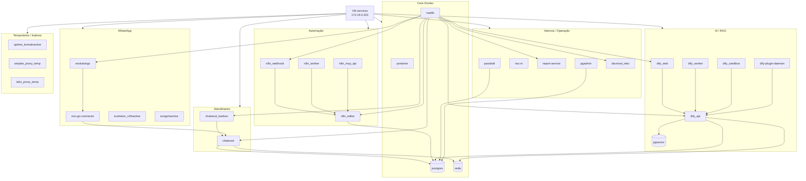

## Visão geral

Esta página documenta as principais **stacks Docker** da infraestrutura interna da **Tekz Tecnologias**.

As stacks rodam principalmente na VM `services`, que possui o IP:

```text
172.16.0.253
```

O gerenciamento é feito pelo **Portainer**, publicado em:

```text
painelncst.tekz.com.br
```

A maior parte dos serviços é executada em **Docker Swarm**, com alguns serviços em **Docker Compose**.

<Warning>
  Antes de alterar, reiniciar ou remover qualquer stack, validar dependências, volumes, banco de dados, DNS, Traefik e impacto operacional.
</Warning>

## Resumo das stacks

| Stack | Tipo | Status | Função / Observação |
| --- | --- | --- | --- |
| `chatwoot` | Swarm | Ativa | Atendimento e comunicação |
| `chatwoot_kanban` | Swarm | Ativa | Addon/kanban para Chatwoot |
| `dify-plugin-daemon` | Swarm | Baixo uso | Plugins do Dify |
| `dify_api` | Swarm | Baixo uso | API do Dify |
| `dify_sandbox` | Swarm | Baixo uso | Ambiente sandbox do Dify |
| `dify_web` | Swarm | Baixo uso | Interface web do Dify |
| `dify_worker` | Swarm | Baixo uso | Worker do Dify |
| `docmost_tekz` | Swarm | Temporária | Documentação antiga, prevista para remoção |
| `evo-go-connector` | Swarm | Ativa / teste | Conector Evolution Go \+ Chatwoot |
| `evogoInactive` | Swarm | Inativa | Legado / manter até validação |
| `evolution_v2Inactive` | Swarm | Inativa | Legado / funcionava anteriormente |
| `evolutiongo` | Swarm | Ativa / teste | Evolution Go para WhatsApp |
| `n8n_editor` | Swarm | Ativa | Interface do n8n |
| `n8n_mcp_api` | Swarm | Ativa | API MCP relacionada ao n8n |
| `n8n_webhook` | Swarm | Ativa | Webhooks do n8n |
| `n8n_worker` | Swarm | Ativa | Workers do n8n |
| `noc-tv` | Compose | Ativa | Dashboard operacional para TV |
| `passbolt` | Swarm | Ativa / privada | Cofre de senhas |
| `pgadmin` | Swarm | Uso eventual | Administração do PostgreSQL |
| `pgvector` | Swarm | Uso eventual | Banco vetorial / RAG / IA |
| `portainer` | Swarm | Ativa | Gerenciamento Docker |
| `postgres` | Swarm | Crítica | Banco PostgreSQL compartilhado |
| `redis` | Swarm | Crítica | Cache/fila |
| `report-service` | Swarm | Ativa | Serviço de relatórios |
| `serplan_proxy_temp` | Swarm | Temporária | Proxy temporário |
| `tekz_proxy_temp` | Swarm | Temporária | Proxy temporário |
| `traefik` | Swarm | Crítica | Proxy reverso HTTP/HTTPS |
| `uptime_kumaInactive` | Swarm | Inativa | Migrado para Oracle Cloud |

## Classificação operacional

### Stacks críticas

Stacks que sustentam serviços essenciais ou afetam vários sistemas.

| Stack | Motivo |
| --- | --- |
| `traefik` | Publica os serviços web via HTTP/HTTPS |
| `postgres` | Banco usado por múltiplas aplicações |
| `redis` | Cache/fila de serviços importantes |
| `portainer` | Administração do ambiente Docker |
| `chatwoot` | Atendimento e comunicação |
| `passbolt` | Cofre de senhas |
| `n8n_editor` | Interface principal de automações |
| `n8n_webhook` | Entrada de webhooks |
| `n8n_worker` | Execução de automações |
| `evolutiongo` | Integração WhatsApp em teste/uso |
| `evo-go-connector` | Conector entre Evolution Go e Chatwoot |

### Stacks ativas

Stacks atualmente usadas na operação.

| Stack | Função |
| --- | --- |
| `chatwoot` | Plataforma de atendimento |
| `chatwoot_kanban` | Visualização/kanban para Chatwoot |
| `evolutiongo` | API/serviço WhatsApp |
| `evo-go-connector` | Integração entre Evolution Go e Chatwoot |
| `n8n_editor` | Editor do n8n |
| `n8n_webhook` | Webhooks do n8n |
| `n8n_worker` | Workers do n8n |
| `n8n_mcp_api` | API MCP do n8n |
| `noc-tv` | Dashboard de TV |
| `passbolt` | Cofre de senhas |
| `portainer` | Painel Docker |
| `postgres` | Banco de dados |
| `redis` | Cache/fila |
| `report-service` | Relatórios |
| `traefik` | Proxy reverso |

### Stacks de uso eventual

Stacks que existem no ambiente, mas não são usadas com frequência.

| Stack | Observação |
| --- | --- |
| `dify_web` | Interface Dify |
| `dify_api` | API Dify |
| `dify_worker` | Worker Dify |
| `dify_sandbox` | Sandbox Dify |
| `dify-plugin-daemon` | Plugins Dify |
| `pgadmin` | Administração PostgreSQL |
| `pgvector` | Banco vetorial / RAG |

### Stacks legadas, inativas ou temporárias

Stacks que devem ser revisadas antes de remoção definitiva.

| Stack | Motivo |
| --- | --- |
| `docmost_tekz` | Documentação migrando para Mintlify |
| `evogoInactive` | Inativa / legado |
| `evolution_v2Inactive` | Inativa durante testes com Evolution Go |
| `uptime_kumaInactive` | Uptime Kuma migrado para Oracle Cloud |
| `serplan_proxy_temp` | Proxy temporário |
| `tekz_proxy_temp` | Proxy temporário |

<Note>
  Stacks marcadas como inativas não devem ser removidas sem antes validar volumes, DNS, Traefik, dependências e histórico de uso.
</Note>

---

## Stack `chatwoot`

## Função

A stack `chatwoot` hospeda a plataforma de atendimento da Tekz.

| Item | Informação |
| --- | --- |
| Stack | `chatwoot` |
| Tipo | Swarm |
| Domínio principal | `chat.tekz.com.br` |
| Banco | PostgreSQL |
| Cache/fila | Redis |
| Criticidade | Alta |

## Dependências

- PostgreSQL;
- Redis;
- Traefik;
- Cloudflare;
- OPNsense;
- VM `services`.

## Observações

- O Chatwoot usa o banco PostgreSQL que roda na stack `postgres`.
- Reiniciar PostgreSQL ou Redis pode impactar o Chatwoot.
- Alterações em integrações WhatsApp podem impactar conversas e contatos.

---

## Stack `chatwoot_kanban`

## Função

A stack `chatwoot_kanban` é um addon para o Chatwoot.

| Item | Informação |
| --- | --- |
| Stack | `chatwoot_kanban` |
| Tipo | Swarm |
| Domínio | `kanban.tekz.com.br` |
| Função | Complemento visual/kanban para o Chatwoot |
| Criticidade | Média |

## Dependências

- Chatwoot;
- Traefik;
- Cloudflare;
- VM `services`.

---

## Stacks Dify

O Dify é usado para fluxos de RAG, IA e automação com inteligência artificial, geralmente integrado ao n8n e outros serviços.

## Stacks relacionadas

| Stack | Função |
| --- | --- |
| `dify_web` | Interface web do Dify |
| `dify_api` | API do Dify |
| `dify_worker` | Worker do Dify |
| `dify_sandbox` | Sandbox do Dify |
| `dify-plugin-daemon` | Serviço de plugins do Dify |

## Domínios relacionados

| Serviço | Domínio |
| --- | --- |
| Dify Web | `difyncst.tekz.com.br` |
| Dify API | `difyapincst.tekz.com.br` |

## Dependências

- PostgreSQL;
- Redis;
- PGVector, quando usado para RAG;
- Traefik;
- Cloudflare;
- VM `services`.

<Note>
  O Dify não é usado com frequência atualmente, mas deve permanecer documentado enquanto as stacks existirem no ambiente.
</Note>

---

## Stack `docmost_tekz`

## Função

A stack `docmost_tekz` hospeda o Docmost, usado anteriormente para documentação interna.

| Item | Informação |
| --- | --- |
| Stack | `docmost_tekz` |
| Tipo | Swarm |
| Status | Temporária |
| Observação | Será removida após a migração completa para Mintlify |

## Observações

- Manter até confirmar que toda documentação necessária foi migrada.
- Antes de remover, verificar se há dados não migrados.
- Fazer backup/exportação se houver conteúdo útil.

---

## Stacks Evolution / EvoGo

A infraestrutura possui stacks antigas e novas relacionadas à integração WhatsApp.

## Stacks relacionadas

| Stack | Status | Função |
| --- | --- | --- |
| `evolutiongo` | Ativa / teste | API/serviço WhatsApp atual em teste/uso |
| `evo-go-connector` | Ativa / teste | Conector entre Evolution Go e Chatwoot |
| `evolution_v2Inactive` | Inativa | Evolution v2 legado |
| `evogoInactive` | Inativa | Versão EvoGo anterior/inativa |

## Domínios relacionados

| Serviço | Domínio |
| --- | --- |
| EvoGo | `evogo.tekz.com.br` |
| Evolution antigo | `evoncst.tekz.com.br` |

## Observações

<Warning>
  As stacks antigas de Evolution e EvoGo foram funcionais recentemente. Não remover sem validar se ainda há dados, volumes, webhooks ou integrações dependentes.
</Warning>

## Pontos a revisar

- Qual stack está oficialmente em produção.
- Se `evolution_v2Inactive` ainda possui dados úteis.
- Se `evogoInactive` ainda possui volumes necessários.
- Se `evo-go-connector` está sendo usado pelo Chatwoot.
- Se os domínios antigos ainda apontam para serviços ativos.
- Se há integrações no n8n apontando para endpoints antigos.

---

## Stacks n8n

O n8n é usado para automações internas, webhooks e integrações.

## Stacks relacionadas

| Stack | Função |
| --- | --- |
| `n8n_editor` | Interface web do n8n |
| `n8n_webhook` | Endpoint de webhooks |
| `n8n_worker` | Workers de execução |
| `n8n_mcp_api` | API MCP relacionada ao n8n |

## Domínios relacionados

| Serviço | Domínio |
| --- | --- |
| n8n Editor | `editorncst.tekz.com.br` |
| n8n Webhook | `hookncst.tekz.com.br` |

## Dependências

- PostgreSQL;
- Redis, se aplicável;
- Traefik;
- Cloudflare;
- workers ativos;
- webhooks publicados.

## Observações

- Antes de reiniciar workers, validar se há execuções importantes em andamento.
- Antes de alterar webhooks, validar integrações externas.
- Workflows críticos devem ser exportados ou versionados quando possível.

---

## Stack `noc-tv`

## Função

A stack `noc-tv` roda um servidor web customizado usado para exibir um dashboard operacional em TV.

| Item | Informação |
| --- | --- |
| Stack | `noc-tv` |
| Tipo | Compose |
| Função | Dashboard operacional para TV |
| Criticidade | Média |

## O que o NOC-TV consulta

- MSP;
- dados de tickets;
- mural de tarefas;
- Uptime Kuma;
- status de serviços online/offline.

## Observações

O Uptime Kuma consultado pelo NOC-TV roda atualmente na Oracle Cloud, para maior confiabilidade.

---

## Stack `passbolt`

## Função

A stack `passbolt` hospeda o cofre de senhas da Tekz.

| Item | Informação |
| --- | --- |
| Stack | `passbolt` |
| Tipo | Swarm |
| Acesso | `https://172.16.0.253:8443` |
| Exposição pública | Não documentada / acesso privado |
| Criticidade | Crítica |

<Warning>
  O Passbolt armazena credenciais sensíveis. Deve ser acessado apenas pela LAN ou VPN e possuir backup confiável.
</Warning>

## Dependências

- VM `services`;
- Docker;
- banco de dados;
- volumes persistentes;
- acesso via LAN/VPN.

## Pontos a revisar

- Backup do banco do Passbolt.
- Backup dos volumes.
- Chaves e configurações necessárias para restauração.
- Usuários antigos.
- Política de acesso.

---

## Stack `postgres`

## Função

A stack `postgres` hospeda o banco PostgreSQL compartilhado por vários serviços.

| Item | Informação |
| --- | --- |
| Stack | `postgres` |
| Tipo | Swarm |
| Função | Banco de dados compartilhado |
| Criticidade | Crítica |

## Serviços que podem depender do PostgreSQL

- Chatwoot;
- n8n;
- Dify;
- Passbolt;
- PGAdmin;
- outros serviços internos.

<Warning>
  Antes de reiniciar, alterar ou remover o PostgreSQL, validar todos os serviços dependentes e garantir backup atualizado.
</Warning>

## Backups necessários

- dump dos bancos;
- volumes persistentes;
- credenciais armazenadas no cofre;
- documentação de restauração.

---

## Stack `redis`

## Função

A stack `redis` fornece cache e fila para aplicações.

| Item | Informação |
| --- | --- |
| Stack | `redis` |
| Tipo | Swarm |
| Função | Cache / fila |
| Criticidade | Alta |

## Serviços que podem depender do Redis

- Chatwoot;
- n8n;
- Dify;
- jobs em background;
- outros serviços em containers.

## Observações

Reiniciar Redis pode impactar filas, sessões e jobs temporariamente.

---

## Stack `report-service`

## Função

A stack `report-service` é usada para geração de relatórios.

| Item | Informação |
| --- | --- |
| Stack | `report-service` |
| Tipo | Swarm |
| Domínio relacionado | `reporthelp.tekz.com.br` |
| Função | Gerador de relatórios HelpTekz / cliente |

## Dependências

- Traefik;
- Cloudflare;
- VM `services`;
- serviços ou APIs consumidas pelo relatório.

---

## Stack `traefik`

## Função

A stack `traefik` é o proxy reverso principal da VM `services`.

| Item | Informação |
| --- | --- |
| Stack | `traefik` |
| Tipo | Swarm |
| Portas | `80` e `443` |
| Função | Proxy reverso HTTP/HTTPS |
| Criticidade | Crítica |

## Fluxo

```text
Cloudflare
    ↓
managerncst.tekz.com.br
    ↓
OPNsense NAT 80/443
    ↓
Traefik
    ↓
Container correspondente
```

<Warning>
  Se o Traefik cair, os serviços publicados via domínio podem ficar inacessíveis.
</Warning>

---

## Stack `uptime_kumaInactive`

## Status

A stack `uptime_kumaInactive` está inativa porque o Uptime Kuma foi migrado para uma VM na Oracle Cloud.

## Motivo da migração

O monitoramento externo ficou mais confiável rodando fora da rede local da Tekz, pois não depende do link de internet da empresa.

| Item | Informação |
| --- | --- |
| Stack antiga | `uptime_kumaInactive` |
| Status | Inativa |
| Novo ambiente | Oracle Cloud |
| Domínio | `kumancst.tekz.com.br` |

---

## Proxies temporários

## Stacks relacionadas

| Stack | Observação |
| --- | --- |
| `serplan_proxy_temp` | Proxy temporário |
| `tekz_proxy_temp` | Proxy temporário |

## Observações

- Confirmar se ainda estão em uso.
- Validar se há DNS apontando para essas stacks.
- Remover apenas após confirmar que não há dependência.

---

## Dependências gerais

| Componente | Impacto |
| --- | --- |
| VM `services` | Base de todas as stacks |
| Docker | Execução dos containers |
| Docker Swarm | Orquestração das stacks |
| Portainer | Gerenciamento |
| Traefik | Publicação dos serviços |
| PostgreSQL | Banco de múltiplas aplicações |
| Redis | Cache/fila |
| Volumes Docker | Persistência de dados |
| Cloudflare | DNS público |
| OPNsense | NAT 80/443 e firewall |

## Diagrama Mermaid



## Checklist antes de alterar uma stack

Antes de alterar qualquer stack:

1. Identificar se está em produção, teste, legado ou inativa.
2. Copiar o compose atual.
3. Verificar variáveis de ambiente.
4. Identificar volumes persistentes.
5. Verificar dependências com PostgreSQL, Redis e Traefik.
6. Verificar domínios relacionados.
7. Validar se há DNS no Cloudflare.
8. Validar se há integração no n8n ou Chatwoot.
9. Planejar rollback.
10. Registrar alteração após execução.

## Checklist antes de remover uma stack

1. Confirmar que a stack está realmente inativa.
2. Validar se não há DNS apontando para ela.
3. Verificar se o Traefik não possui roteamento ativo.
4. Verificar se não há webhooks ou integrações externas.
5. Fazer backup do compose.
6. Fazer backup dos volumes, se necessário.
7. Remover a stack.
8. Manter volumes temporariamente, caso haja dúvida.
9. Registrar a remoção.

<Warning>
  Não remover volumes junto com a stack sem validação. Volumes podem conter dados importantes mesmo quando a stack está inativa.
</Warning>

## Pontos a revisar

- Confirmar quais stacks estão realmente em produção.
- Confirmar quais stacks podem ser removidas.
- Revisar stacks inativas de Evolution/EvoGo.
- Revisar necessidade do Docmost após migração para Mintlify.
- Revisar proxies temporários.
- Confirmar backup do PostgreSQL.
- Confirmar backup do Passbolt.
- Confirmar backup dos workflows do n8n.
- Confirmar backup de volumes do Chatwoot.
- Confirmar backup das configurações do Traefik.
- Revisar uso de disco causado por volumes e logs.

## Observações

<Note>
  Esta página deve ser atualizada sempre que uma stack nova for criada, removida ou desativada. O ideal é que cada stack crítica tenha, futuramente, uma página própria ou seção com dependências, volumes, domínios e procedimento de restauração.
</Note>

```text
```