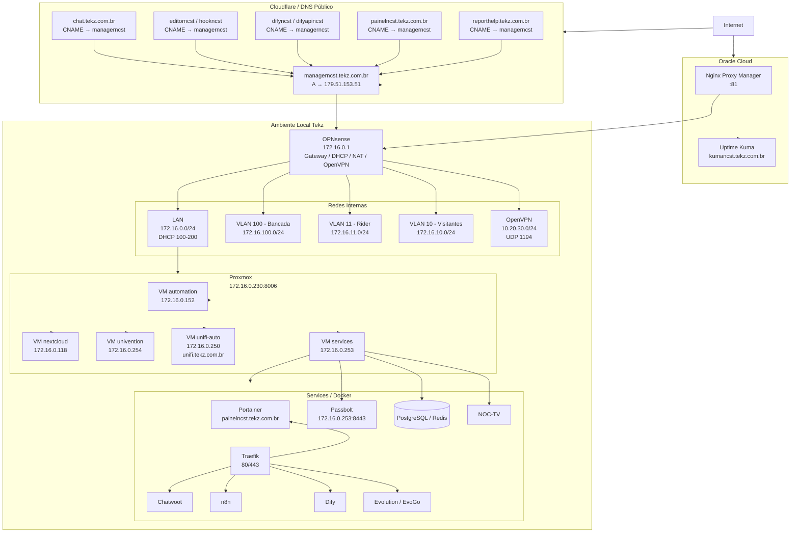
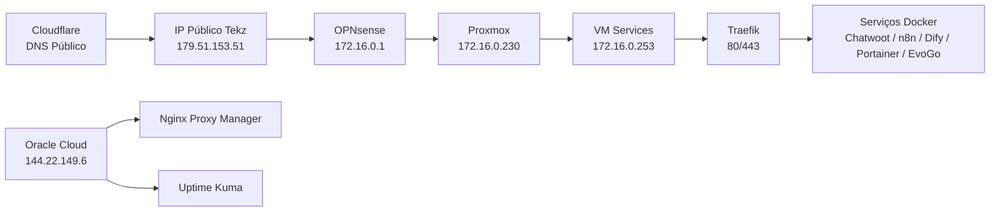

## Visão geral

A topologia da infraestrutura interna da **Tekz Tecnologias** é composta por firewall OPNsense, rede local segmentada por VLANs, servidor Proxmox, máquinas virtuais internas, ambiente Docker com Portainer/Traefik e serviços externos auxiliares na Oracle Cloud.

O firewall OPNsense é o ponto central da rede local, responsável por gateway, DHCP, isolamento entre VLANs, regras de firewall, OpenVPN e redirecionamentos de portas.

O servidor Proxmox principal hospeda as VMs internas da Tekz, incluindo a VM `services`, que concentra o ambiente Docker, Portainer, Traefik e diversos serviços publicados na web.

## Fluxo principal da infraestrutura

```text
Internet
    ↓
Firewall OPNsense
    ├─ LAN 172.16.0.0/24
    ├─ VLAN 100 - Bancada
    ├─ VLAN 11 - Rider
    ├─ VLAN 10 - Visitantes
    └─ OpenVPN 10.20.30.0/24

LAN 172.16.0.0/24
    ├─ Proxmox 172.16.0.230
    │   ├─ automation 172.16.0.152
    │   ├─ nextcloud 172.16.0.118
    │   ├─ univention 172.16.0.254
    │   ├─ unifi-auto 172.16.0.250
    │   └─ services 172.16.0.253
    │       ├─ Portainer
    │       ├─ Docker Swarm
    │       ├─ Traefik
    │       ├─ Chatwoot
    │       ├─ n8n
    │       ├─ Dify
    │       ├─ Evolution / EvoGo
    │       ├─ Passbolt
    │       ├─ PostgreSQL
    │       ├─ Redis
    │       └─ outros serviços
    └─ demais equipamentos internos
```

## Camadas da topologia

A infraestrutura pode ser entendida em cinco camadas principais:

| Camada | Função |
| --- | --- |
| Borda / Firewall | OPNsense, NAT, VPN, DHCP, VLANs e regras de segurança |
| Rede local | LAN e VLANs internas |
| Virtualização | Proxmox e VMs internas |
| Containers | Docker Swarm, Portainer, Traefik e stacks |
| Publicação externa | Cloudflare, DNS público, NAT local e Oracle Cloud |

## Firewall e redes

O firewall OPNsense está localizado na rede principal com IP:

```text
172.16.0.1
```

Ele gerencia a LAN e as VLANs internas.

| Rede | Finalidade | DHCP |
| --- | --- | --- |
| LAN `172.16.0.0/24` | Rede principal interna | `172.16.0.100` até `172.16.0.200` |
| VLAN 100 `172.16.100.0/24` | Bancada | `172.16.100.100` até `172.16.100.200` |
| VLAN 11 `172.16.11.0/24` | Rider | `172.16.11.100` até `172.16.11.105` |
| VLAN 10 `172.16.10.0/24` | Visitantes | `172.16.10.100` até `172.16.10.200` |

<Note>
  As VLANs possuem regras no firewall bloqueando a comunicação direta entre uma rede e outra.
</Note>

## VPN

O acesso externo seguro à rede local da Tekz é feito através de um servidor **OpenVPN** no OPNsense.

| Item | Informação |
| --- | --- |
| Serviço | OpenVPN |
| Protocolo | UDP |
| Porta | `1194` |
| Rede VPN | `10.20.30.0/24` |
| Função | Acesso externo à rede local da empresa |

## Proxmox

O servidor Proxmox principal está localizado na LAN da Tekz.

| Item | Informação |
| --- | --- |
| IP / Acesso | `172.16.0.230:8006` |
| Função | Host de virtualização local |
| Ambiente | Servidor principal de VMs internas |

## Máquinas virtuais

O Proxmox hospeda as principais VMs internas da Tekz.

| VM | IP | Função |
| --- | --- | --- |
| automation | `172.16.0.152` | Serviços legados, automações, Elastic, n8n/Evolution antigos e relatórios |
| nextcloud | `172.16.0.118` | Ubuntu com Nextcloud |
| univention | `172.16.0.254` | UCS, arquivos locais e AD |
| unifi-auto | `172.16.0.250` | Controlador UniFi central |
| services | `172.16.0.253` | Docker, Portainer, Traefik e serviços internos |

## VM Services

A VM `services` é uma das principais máquinas da infraestrutura.

Ela concentra:

- Portainer;
- Docker Swarm;
- Traefik;
- Chatwoot;
- n8n;
- Dify;
- Evolution / EvoGo;
- Passbolt;
- PostgreSQL;
- Redis;
- Docmost;
- NOC-TV;
- Report Service;
- outros serviços auxiliares.

## Publicação dos serviços locais

A publicação dos serviços locais normalmente segue este fluxo:

```text
Cloudflare
    ↓
CNAME do serviço
    ↓
managerncst.tekz.com.br
    ↓
IP público local 179.51.153.51
    ↓
Firewall OPNsense
    ↓
NAT 80/443
    ↓
Traefik na VM services
    ↓
Container correspondente
```

O registro principal é:

```text
managerncst.tekz.com.br → 179.51.153.51
```

Os demais serviços geralmente são publicados criando um `CNAME` apontando para `managerncst.tekz.com.br`.

## Oracle Cloud

A Tekz também possui uma VM na **Oracle Cloud**, usada para serviços externos auxiliares.

| Serviço | Acesso / Observação |
| --- | --- |
| Nginx Proxy Manager | `http://144.22.149.6:81/` |
| Uptime Kuma | `kumancst.tekz.com.br` |

O Uptime Kuma foi migrado para a Oracle Cloud para aumentar a confiabilidade do monitoramento, evitando depender exclusivamente do link local da Tekz.

## Fluxo da Oracle Cloud

```text
Internet
    ↓
Oracle Cloud - 144.22.149.6
    ├─ Nginx Proxy Manager
    └─ Uptime Kuma
```

Alguns serviços publicados pelo Nginx Proxy Manager da Oracle Cloud apontam de volta para serviços locais da Tekz através do IP público `179.51.153.51`.

## Topologia Mermaid



## Topologia simplificada



## Relações importantes

| Origem | Destino | Finalidade |
| --- | --- | --- |
| Cloudflare | `179.51.153.51` | Entrada pública para serviços locais |
| OPNsense | VM `services` | NAT 80/443 para Traefik |
| Traefik | Containers Docker | Roteamento HTTP/HTTPS por domínio |
| Oracle Cloud | Serviços locais | Proxy externo para alguns serviços |
| OpenVPN | LAN Tekz | Acesso remoto seguro |
| Proxmox | VMs internas | Virtualização da infraestrutura local |
| UniFi Auto | Sites de clientes | Gerenciamento central de APs UniFi |
| Uptime Kuma | Serviços internos/externos | Monitoramento de disponibilidade |

## Observações técnicas

- O OPNsense é o ponto central de roteamento, VPN, NAT e isolamento.
- A VM `services` concentra a maior parte dos serviços Docker.
- O Traefik é o principal proxy reverso local dos serviços publicados.
- O Cloudflare centraliza os registros DNS públicos.
- O registro `managerncst.tekz.com.br` funciona como ponto principal de entrada para serviços locais.
- O Uptime Kuma roda na Oracle Cloud para não depender exclusivamente do link local.
- Alguns serviços antigos ainda usam NAT direto para VMs específicas, fora do fluxo padrão via Traefik.
- Serviços legados na VM `automation` devem ser revisados antes de serem considerados críticos.

```text
```