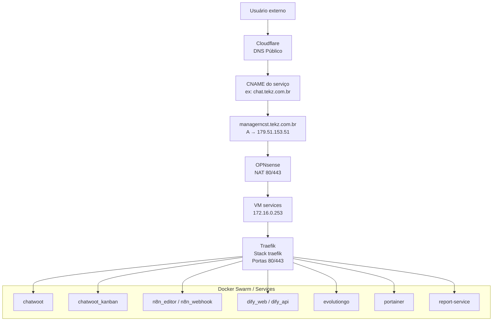
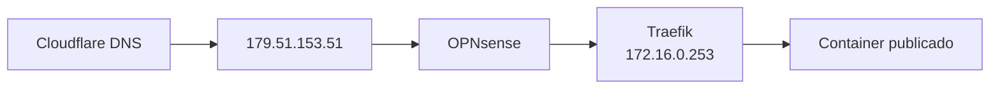

## Visão geral

O **Traefik** é o proxy reverso principal da infraestrutura Docker da **Tekz Tecnologias**.

Ele roda na VM `services`, localizada no IP:

```text
172.16.0.253
```

O Traefik recebe o tráfego HTTP/HTTPS encaminhado pelo firewall OPNsense e direciona cada requisição para o container correto com base no domínio acessado.

Ele é o componente responsável por publicar boa parte dos serviços internos da Tekz na web.

<Warning>
  Se o Traefik ficar indisponível, vários serviços públicos publicados por domínio podem sair do ar ao mesmo tempo.
</Warning>

## Informações principais

| Item | Informação |
| --- | --- |
| Serviço | Traefik |
| VM | `services` |
| IP da VM | `172.16.0.253` |
| Ambiente | Docker Swarm |
| Stack | `traefik` |
| Portas | `80` e `443` |
| Função | Proxy reverso HTTP/HTTPS |
| Publicação | OPNsense NAT → Traefik → container |

## Função no ambiente

O Traefik atua como camada de entrada dos serviços Docker publicados pela Tekz.

Ele é responsável por:

- receber tráfego HTTP;
- receber tráfego HTTPS;
- identificar o domínio acessado;
- aplicar as regras de roteamento;
- encaminhar a requisição para o container correto;
- permitir publicação de múltiplos serviços usando o mesmo IP público;
- reduzir a necessidade de NAT direto para cada aplicação.

## Fluxo padrão de publicação

O fluxo completo (Cloudflare → OPNsense → NAT `80/443` → Traefik) e os detalhes do NAT ficam centralizados em:

- `infra-tekz/publicacao.mdx`

## Estratégia com Cloudflare

A estratégia atual usa um registro principal:

```text
managerncst.tekz.com.br → 179.51.153.51
```

E os demais serviços são criados como `CNAME` apontando para:

```text
managerncst.tekz.com.br
```

Isso permite publicar novos serviços sem criar um novo registro A para cada domínio.

## Exemplos de CNAMEs

| Domínio | Tipo | Destino | Função |
| --- | --- | --- | --- |
| `chat.tekz.com.br` | CNAME | `managerncst.tekz.com.br` | Chatwoot |
| `kanban.tekz.com.br` | CNAME | `managerncst.tekz.com.br` | Chatwoot Kanban |
| `editorncst.tekz.com.br` | CNAME | `managerncst.tekz.com.br` | n8n Editor |
| `hookncst.tekz.com.br` | CNAME | `managerncst.tekz.com.br` | n8n Webhook |
| `difyncst.tekz.com.br` | CNAME | `managerncst.tekz.com.br` | Dify Web |
| `difyapincst.tekz.com.br` | CNAME | `managerncst.tekz.com.br` | Dify API |
| `evogo.tekz.com.br` | CNAME | `managerncst.tekz.com.br` | Evolution Go |
| `evoncst.tekz.com.br` | CNAME | `managerncst.tekz.com.br` | Evolution antigo |
| `painelncst.tekz.com.br` | CNAME | `managerncst.tekz.com.br` | Portainer |
| `reporthelp.tekz.com.br` | CNAME | `managerncst.tekz.com.br` | Report Service |

<Note>
  No Cloudflare, esses registros estão como **Somente DNS**, permitindo que o tráfego chegue diretamente ao IP público local e seja tratado pelo Traefik.
</Note>

## Serviços publicados pelo Traefik

| Serviço | Domínio | Stack relacionada |
| --- | --- | --- |
| Chatwoot | `chat.tekz.com.br` | `chatwoot` |
| Chatwoot Kanban | `kanban.tekz.com.br` | `chatwoot_kanban` |
| n8n Editor | `editorncst.tekz.com.br` | `n8n_editor` |
| n8n Webhook | `hookncst.tekz.com.br` | `n8n_webhook` |
| Dify Web | `difyncst.tekz.com.br` | `dify_web` |
| Dify API | `difyapincst.tekz.com.br` | `dify_api` |
| EvoGo | `evogo.tekz.com.br` | `evolutiongo` |
| Evolution antigo | `evoncst.tekz.com.br` | `evolution_v2Inactive` / legado |
| Portainer | `painelncst.tekz.com.br` | `portainer` |
| Report Service | `reporthelp.tekz.com.br` | `report-service` |

## Serviços fora do fluxo padrão do Traefik

Alguns serviços ainda utilizam NAT direto ou Nginx Proxy Manager na Oracle Cloud, em vez do fluxo padrão Cloudflare → Traefik.

Para a lista de exceções (NAT direto) e revisão de exposição, use:

- `infra-tekz/publicacao.mdx`
- `infra-tekz/oracle-cloud.mdx`

<Warning>
  Serviços fora do Traefik devem ser revisados periodicamente, principalmente quando expõem painéis administrativos ou serviços legados.
</Warning>

## Como um novo serviço deve ser publicado

O fluxo recomendado para publicar um novo serviço é:

1. Criar ou atualizar a stack no Portainer.
2. Garantir que o container esteja na rede usada pelo Traefik.
3. Configurar as labels ou regras necessárias do Traefik.
4. Criar um `CNAME` no Cloudflare apontando para `managerncst.tekz.com.br`.
5. Validar que o serviço responde internamente.
6. Validar acesso externo pelo domínio.
7. Documentar o serviço em:
   - `infra-tekz/stacks`;
   - `infra-tekz/servicos-publicos`;
   - `infra-tekz/dns-publico`;
   - `infra-tekz/traefik`.

## Modelo de documentação para novo serviço

```text
Serviço:
Stack:
Container:
Domínio:
Tipo de DNS:
Destino DNS:
Rede Docker:
Porta interna do container:
Roteamento Traefik:
TLS:
Dependências:
Observações:
```

## Relação com Docker Swarm

O Traefik opera integrado ao ambiente Docker/Swarm.

Para que um serviço seja publicado corretamente, normalmente ele precisa:

- estar na rede correta do Docker;
- possuir labels de roteamento;
- expor a porta interna correta;
- estar saudável;
- ter o domínio correspondente apontando no Cloudflare;
- estar acessível pelo Traefik.

## Relação com Portainer

A stack `traefik` é administrada via Portainer.

Antes de alterar a stack do Traefik:

- copiar o compose atual;
- revisar labels e redes;
- validar certificados;
- validar volumes;
- validar impacto nos serviços publicados;
- planejar rollback.

<Warning>
  Alterações incorretas na stack do Traefik podem derrubar todos os serviços publicados por domínio.
</Warning>

## Relação com DNS

O Traefik depende do DNS público estar correto.

Fluxo de DNS esperado:

```text
servico.tekz.com.br
    ↓
CNAME para managerncst.tekz.com.br
    ↓
A record para 179.51.153.51
```

Se o DNS estiver incorreto, o tráfego não chega ao Traefik.

## Relação com firewall

O Traefik depende do OPNsense encaminhando corretamente as portas públicas:

- `80`;
- `443`.

Se essas regras forem removidas ou alteradas, os serviços publicados via Traefik ficarão indisponíveis externamente.

## Diagrama Mermaid



## Diagrama simplificado



## Checklist de troubleshooting

### Serviço publicado fora do ar

1. Verificar se o domínio resolve no Cloudflare.
2. Confirmar se o CNAME aponta para `managerncst.tekz.com.br`.
3. Confirmar se `managerncst.tekz.com.br` aponta para `179.51.153.51`.
4. Validar se o IP público local está acessível.
5. Verificar NAT `80/443` no OPNsense.
6. Confirmar se a VM `services` está online.
7. Confirmar se a stack `traefik` está ativa.
8. Verificar logs do Traefik.
9. Confirmar se a stack da aplicação está ativa.
10. Validar se o container está na rede correta do Traefik.
11. Verificar labels/regras do serviço.
12. Testar acesso interno ao container.

### Erro 404 no Traefik

Possíveis causas:

- domínio não configurado nas labels;
- regra `Host()` incorreta;
- serviço não está na rede do Traefik;
- stack publicada com nome diferente;
- DNS apontando para o local certo, mas sem rota no Traefik;
- container não expõe a porta esperada.

### Erro 502 / Bad Gateway

Possíveis causas:

- container de destino está parado;
- porta interna configurada incorretamente;
- aplicação não está escutando na porta esperada;
- serviço não está saudável;
- Traefik não consegue alcançar o container;
- rede Docker incorreta.

### Certificado HTTPS com problema

Possíveis causas:

- configuração TLS incorreta;
- desafio/certificado não renovou;
- domínio não resolve corretamente;
- Cloudflare em modo incompatível;
- serviço não exposto corretamente na porta 443;
- configuração ausente no Traefik.

## Checklist antes de alterar Traefik

Antes de alterar a stack `traefik`:

- copiar o compose atual;
- validar arquivo de configuração;
- validar volumes;
- validar certificados;
- validar rede Docker;
- listar serviços publicados;
- planejar rollback;
- evitar alterações em horário crítico;
- acompanhar logs após alteração;
- testar serviços principais.

## Serviços prioritários para testar após alteração

Após alterar Traefik, testar:

| Serviço | Domínio |
| --- | --- |
| Portainer | `painelncst.tekz.com.br` |
| Chatwoot | `chat.tekz.com.br` |
| Kanban | `kanban.tekz.com.br` |
| n8n Editor | `editorncst.tekz.com.br` |
| n8n Webhook | `hookncst.tekz.com.br` |
| Dify Web | `difyncst.tekz.com.br` |
| Dify API | `difyapincst.tekz.com.br` |
| EvoGo | `evogo.tekz.com.br` |
| Report Service | `reporthelp.tekz.com.br` |

## Boas práticas

- Publicar novos serviços preferencialmente via Traefik.
- Evitar NAT direto para serviços web.
- Manter nomes de domínios claros.
- Usar CNAME para `managerncst.tekz.com.br`.
- Documentar cada domínio novo.
- Evitar expor painéis administrativos sem proteção adicional.
- Manter backup do compose/configuração do Traefik.
- Registrar alterações relevantes.
- Revisar serviços antigos fora do Traefik.
- Testar serviços críticos após qualquer mudança.

## Riscos principais

| Risco | Impacto |
| --- | --- |
| Traefik parado | Serviços publicados ficam fora |
| NAT 80/443 removido | Serviços não recebem tráfego externo |
| DNS incorreto | Domínio não chega ao ambiente local |
| Labels incorretas | Serviço não é roteado |
| Rede Docker errada | Traefik não alcança container |
| Certificado inválido | Erro HTTPS |
| Exposição indevida | Risco de segurança |
| Alteração sem rollback | Dificuldade de recuperação |

## Pontos a confirmar

- Nome da rede Docker usada pelo Traefik.
- Método de emissão/renovação de certificados.
- Se todos os serviços usam labels ou arquivo dinâmico.
- Se há dashboard do Traefik habilitado.
- Se o dashboard é protegido.
- Se há middleware de autenticação em serviços sensíveis.
- Se todos os serviços públicos estão documentados.
- Se existe backup versionado do compose do Traefik.
- Se serviços antigos podem migrar de NAT direto para Traefik.
- Se o Cloudflare deve permanecer como **Somente DNS** em todos os registros.

## Observações

<Note>
  O Traefik é a camada que permite publicar vários serviços usando o mesmo IP público e as mesmas portas 80/443. Ele deve ser tratado como componente crítico da infraestrutura Docker da Tekz.
</Note>

```text
```
