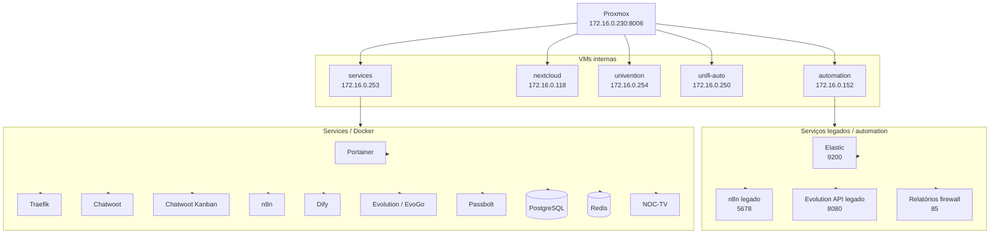

## Visão geral

As máquinas virtuais internas da **Tekz Tecnologias** rodam no servidor Proxmox principal, acessível em:

```text
https://172.16.0.230:8006
```

Essas VMs sustentam serviços importantes da operação interna, incluindo automações, Nextcloud, AD/arquivos, controlador UniFi central e ambiente Docker com Portainer, Traefik e stacks de aplicações.

## Resumo das VMs

| VM | IP | Função principal | Criticidade |
| --- | --- | --- | --- |
| `automation` | `172.16.0.152` | Serviços legados, automações, Elastic e relatórios | Média / Alta |
| `nextcloud` | `172.16.0.118` | Ubuntu com Nextcloud | Alta |
| `univention` | `172.16.0.254` | UCS, arquivos locais e AD | Alta |
| `unifi-auto` | `172.16.0.250` | Controlador UniFi central | Alta |
| `services` | `172.16.0.253` | Docker, Portainer, Traefik e serviços em containers | Crítica |

<Warning>
  Não registrar senhas, chaves SSH, tokens, credenciais de banco ou credenciais administrativas nesta página. As credenciais devem ficar armazenadas no cofre oficial da Tekz.
</Warning>

## VM `automation`

A VM `automation` possui IP:

```text
172.16.0.152
```

Essa VM concentra serviços legados, automações antigas e integrações que foram importantes em fases anteriores da infraestrutura.

## Funções conhecidas

- Serviços legados do n8n.
- Evolution API legado.
- Pequenas automações internas.
- Automações de relatório de firewall.
- Elastic para coleta de dados do firewall.
- Outros serviços legados ainda em revisão.

## Serviços conhecidos

| Serviço | Acesso / Porta | Observação |
| --- | --- | --- |
| Gerador PDF de relatórios de firewall | `http://172.16.0.152:85/index.html` | Serviço local conhecido |
| Elastic | `172.16.0.152:9200` | Exposto por NAT no firewall |
| n8n legado | `172.16.0.152:5678` | Exposto por NAT no firewall |
| Evolution API legado | `172.16.0.152:8080` | Porta externa `8081` |
| Chatwoot legado | `172.16.0.152:3000` | Porta externa `8085` |

## NATs relacionados

| Porta externa | Destino interno | Porta interna | Serviço |
| --- | --- | --- | --- |
| `9200` | `172.16.0.152` | `9200` | Elastic |
| `5678` | `172.16.0.152` | `5678` | n8n legado |
| `8081` | `172.16.0.152` | `8080` | Evolution API legado |
| `8085` | `172.16.0.152` | `3000` | Chatwoot legado |
| `85` | `172.16.0.152` | `85` | Relatório Tekz / gerador local |

<Warning>
  A VM `automation` possui serviços legados e alguns podem não estar funcionando corretamente. Validar status, dependências e necessidade antes de considerar qualquer serviço como produção.
</Warning>

## Pontos a revisar

- Quais automações ainda estão em uso.
- Se o Elastic ainda precisa ficar exposto.
- Se o n8n legado ainda é necessário.
- Se Evolution API legado ainda é necessário.
- Se Chatwoot legado ainda é necessário.
- Se os relatórios de firewall ainda funcionam corretamente.
- Se algum serviço deve ser migrado para a VM `services`.

---

## VM `nextcloud`

A VM `nextcloud` possui IP:

```text
172.16.0.118
```

## Função

Essa VM roda Ubuntu e hospeda o Nextcloud diretamente dentro do sistema operacional.

| Item | Informação |
| --- | --- |
| Sistema operacional | Ubuntu |
| Serviço principal | Nextcloud |
| IP | `172.16.0.118` |
| Publicação externa | NAT direto |
| Porta externa | `8086` |
| Porta interna | `443` |

## NAT relacionado

| Porta externa | Destino interno | Porta interna | Serviço |
| --- | --- | --- | --- |
| `8086` | `172.16.0.118` | `443` | Nextcloud |

## Dependências

- Proxmox online.
- VM `nextcloud` ligada.
- Serviço web do Nextcloud ativo.
- Banco de dados do Nextcloud funcionando.
- Certificado/HTTPS válido, se aplicável.
- NAT no firewall preservado.
- DNS público correspondente, quando usado.

## Pontos a revisar

- URL pública atual do Nextcloud.
- Política de backup dos arquivos.
- Política de backup do banco de dados.
- Espaço em disco da VM.
- Atualizações do Ubuntu.
- Atualizações do Nextcloud.
- Se a publicação direta por NAT deve continuar ou migrar para proxy.

---

## VM `univention`

A VM `univention` possui IP:

```text
172.16.0.254
```

## Função

A VM `univention` roda **Univention Corporate Server** e é usada como servidor de AD e arquivos locais.

| Item | Informação |
| --- | --- |
| Sistema | Univention Corporate Server |
| IP | `172.16.0.254` |
| Função principal | AD e arquivos locais |
| Acesso | LAN ou VPN |
| Criticidade | Alta |

## Serviços relacionados

- Autenticação / AD.
- Arquivos locais.
- Possíveis compartilhamentos SMB.
- Serviços internos vinculados ao UCS.

## Dependências

- Proxmox online.
- VM `univention` ligada.
- Disco com espaço livre.
- Serviços de domínio funcionando.
- Rede LAN acessível.
- Clientes internos conseguindo autenticar/acessar arquivos.

## Pontos a revisar

- Nome do domínio interno.
- Compartilhamentos ativos.
- Política de backup dos arquivos.
- Usuários e grupos importantes.
- Espaço em disco.
- Serviços UCS ativos.
- Integração com Nextcloud, se houver.

<Warning>
  Essa VM é crítica para arquivos e autenticação. Qualquer alteração deve ser feita com cuidado e, preferencialmente, após backup.
</Warning>

---

## VM `unifi-auto`

A VM `unifi-auto` possui IP:

```text
172.16.0.250
```

## Função

Essa VM hospeda o controlador UniFi central da Tekz.

O principal objetivo é permitir que a Tekz conecte vários sites de clientes e gerencie centralmente APs UniFi/Ubiquiti através do domínio:

```text
unifi.tekz.com.br
```

| Item | Informação |
| --- | --- |
| Serviço | UniFi Controller |
| IP | `172.16.0.250` |
| Domínio público | `unifi.tekz.com.br` |
| Função | Controlador central de APs UniFi |
| Uso | Gerenciamento de sites de clientes |

## Portas relacionadas

| Porta externa | Destino interno | Porta interna | Serviço |
| --- | --- | --- | --- |
| `8443` | `172.16.0.250` | `8443` | UniFi Controller |
| `8080` | `172.16.0.250` | `8080` | Adoção UniFi |

## Dependências

- Proxmox online.
- VM `unifi-auto` ligada.
- Serviço UniFi ativo.
- NAT no firewall preservado.
- DNS `unifi.tekz.com.br` apontando corretamente.
- Porta de adoção disponível para equipamentos remotos.
- Backup/exportação da configuração UniFi.

## Pontos a revisar

- Backup automático do UniFi Controller.
- Quantidade de sites conectados.
- Status dos APs adotados.
- Certificado usado no acesso.
- Se o domínio `unifi.tekz.com.br` está passando por Cloudflare ou DNS only.
- Política de atualização do controller.

<Warning>
  Essa VM impacta o gerenciamento centralizado de clientes com UniFi. Antes de atualizar ou reiniciar, validar impacto operacional.
</Warning>

---

## VM `services`

A VM `services` possui IP:

```text
172.16.0.253
```

## Função

A VM `services` é uma das máquinas mais críticas da infraestrutura interna da Tekz.

Ela concentra o ambiente Docker, Portainer, Traefik e boa parte dos serviços internos e públicos da empresa.

| Item | Informação |
| --- | --- |
| IP | `172.16.0.253` |
| Função | Docker, Portainer, Traefik e serviços em containers |
| Publicação principal | Traefik \+ Cloudflare |
| Portainer público | `painelncst.tekz.com.br` |
| Passbolt privado | `https://172.16.0.253:8443` |
| Criticidade | Crítica |

## Serviços conhecidos na VM `services`

- Portainer.
- Docker Swarm.
- Traefik.
- Chatwoot.
- Chatwoot Kanban.
- Dify.
- n8n.
- Evolution / EvoGo.
- Evo Go Connector.
- Docmost.
- Passbolt.
- PostgreSQL.
- Redis.
- PGAdmin.
- PGVector.
- Report Service.
- NOC-TV.
- Proxies temporários.
- Outros serviços auxiliares.

## Fluxo de publicação

```text
Cloudflare
    ↓
managerncst.tekz.com.br
    ↓
IP público local 179.51.153.51
    ↓
OPNsense
    ↓
NAT 80/443
    ↓
VM services - 172.16.0.253
    ↓
Traefik
    ↓
Container correspondente
```

## NATs principais relacionados

| Porta externa | Destino interno | Porta interna | Serviço |
| --- | --- | --- | --- |
| `80` | `172.16.0.253` | `80` | Traefik HTTP |
| `443` | `172.16.0.253` | `443` | Traefik HTTPS |

## Serviços privados na VM `services`

| Serviço | Acesso | Observação |
| --- | --- | --- |
| Passbolt | `https://172.16.0.253:8443` | Somente rede local/VPN |
| Portainer | `painelncst.tekz.com.br` | Painel Docker |
| Traefik | Interno | Proxy reverso dos containers |
| PostgreSQL | Interno | Banco usado por múltiplos serviços |
| Redis | Interno | Cache/fila para serviços |

## Dependências

- Proxmox online.
- VM `services` ligada.
- Docker funcionando.
- Portainer funcionando.
- Traefik funcionando.
- Rede overlay/swarm funcionando.
- PostgreSQL e Redis disponíveis.
- NAT 80/443 no OPNsense preservado.
- DNS no Cloudflare apontando corretamente.

<Warning>
  A indisponibilidade da VM `services` pode afetar diversos sistemas públicos e internos, incluindo Chatwoot, n8n, Dify, Portainer, Evolution/EvoGo, relatórios e serviços auxiliares.
</Warning>

## Pontos a revisar

- Política de backup dos volumes Docker.
- Backup dos bancos PostgreSQL.
- Backup do Passbolt.
- Backup do Portainer.
- Backup das configurações do Traefik.
- Stacks antigas ou inativas.
- Serviços duplicados/legados.
- Uso de CPU/RAM/disco.
- Tamanho de volumes Docker.
- Logs crescendo sem rotação.

---

## Diagrama Mermaid



## Criticidade das VMs

| VM | Criticidade | Motivo |
| --- | --- | --- |
| `services` | Crítica | Hospeda Docker, Traefik, Portainer e serviços públicos |
| `univention` | Alta | AD e arquivos locais |
| `unifi-auto` | Alta | Controla APs UniFi de clientes |
| `nextcloud` | Alta | Armazena arquivos e colaboração |
| `automation` | Média / Alta | Serviços legados e automações ainda em revisão |

## Checklist geral de validação

Em caso de falha em algum serviço:

1. Verificar se o Proxmox está online.
2. Verificar se a VM correspondente está ligada.
3. Confirmar IP da VM.
4. Testar ping para a VM.
5. Acessar o serviço localmente.
6. Verificar logs do serviço.
7. Verificar uso de CPU, RAM e disco.
8. Validar NAT/DNS se o serviço for público.
9. Validar dependências como banco, Redis, Traefik ou rede.
10. Registrar incidente se houver impacto operacional.

## Pontos gerais a confirmar

- IDs das VMs no Proxmox.
- Quantidade de CPU/RAM/disco de cada VM.
- Datastore utilizado por cada VM.
- Política de backup de cada VM.
- Se existe snapshot antigo.
- Serviços ativos em cada VM.
- Serviços legados que podem ser removidos.
- Dependências entre VMs.
- Ordem recomendada de inicialização após queda geral.
- Procedimento de restauração de cada VM.

## Ordem sugerida após queda geral

Caso o ambiente precise ser restaurado após queda completa, validar nesta ordem:

1. Firewall OPNsense.
2. Proxmox.
3. VM `services`.
4. VM `univention`.
5. VM `unifi-auto`.
6. VM `nextcloud`.
7. VM `automation`.

<Note>
  Essa ordem é uma sugestão inicial. Deve ser ajustada após validação das dependências reais entre os serviços.
</Note>

```text
```