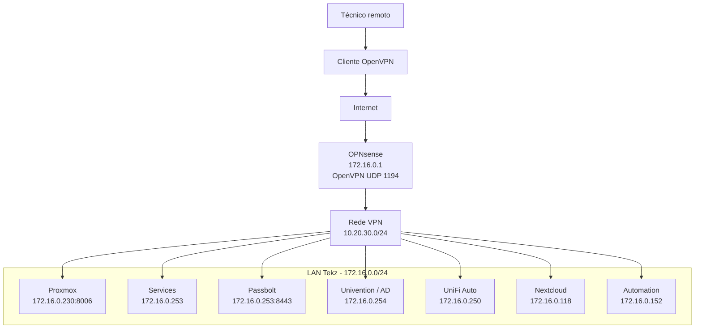

## Visão geral

A **Tekz Tecnologias** utiliza um servidor **OpenVPN** configurado no firewall OPNsense para permitir acesso externo seguro à rede local da empresa.

A VPN é usada pela equipe técnica para acessar recursos internos, servidores, painéis administrativos e serviços privados sem expor esses acessos diretamente na internet.

## Serviço VPN

| Item | Informação |
| --- | --- |
| Tipo | OpenVPN |
| Firewall | OPNsense |
| IP do firewall | `172.16.0.1` |
| Protocolo | UDP |
| Porta | `1194` |
| Rede da VPN | `10.20.30.0/24` |
| Finalidade | Acesso externo seguro à rede local da Tekz |

<Warning>
  Não registrar certificados, chaves privadas, arquivos `.ovpn`, senhas ou credenciais nesta documentação. Esses dados devem ficar armazenados no cofre oficial da Tekz.
</Warning>

## Função da VPN

A VPN permite que usuários autorizados acessem a rede interna da Tekz a partir de fora da empresa.

Ela deve ser usada principalmente para:

- acessar o firewall OPNsense;
- acessar o Proxmox;
- acessar a VM `services`;
- acessar o Passbolt;
- acessar o Univention Server;
- acessar serviços privados sem domínio público;
- realizar manutenção remota;
- validar serviços internos;
- acessar painéis administrativos que não devem ser expostos publicamente.

## Rede da VPN

A rede usada pelos clientes OpenVPN é:

```text
10.20.30.0/24
```

Essa rede é separada da LAN principal e das VLANs internas.

## Redes internas relacionadas

| Rede | Finalidade |
| --- | --- |
| `172.16.0.0/24` | LAN principal da Tekz |
| `172.16.100.0/24` | VLAN 100 / Bancada |
| `172.16.11.0/24` | VLAN 11 / Rider |
| `172.16.10.0/24` | VLAN 10 / Visitantes |
| `10.20.30.0/24` | Rede dos clientes OpenVPN |

## Serviços acessados via VPN

Os serviços abaixo devem ser acessados preferencialmente pela VPN, e não por exposição direta na internet.

| Serviço | Endereço | Observação |
| --- | --- | --- |
| OPNsense | `https://172.16.0.1` | Firewall principal |
| Proxmox | `https://172.16.0.230:8006` | Host de virtualização |
| Services | `172.16.0.253` | VM Docker / Portainer / Traefik |
| Passbolt | `https://172.16.0.253:8443` | Cofre de senhas |
| Univention Server | `172.16.0.254` | AD e arquivos locais |
| UniFi Auto | `172.16.0.250` | Controlador UniFi central |
| Nextcloud | `172.16.0.118` | VM Ubuntu com Nextcloud |
| Automation | `172.16.0.152` | Serviços legados e automações |

## Serviços privados importantes

### Passbolt

O Passbolt é um serviço privado e deve ser acessado apenas pela rede local ou VPN.

```text
https://172.16.0.253:8443
```

### Proxmox

O acesso ao Proxmox é sensível e deve ser tratado como acesso administrativo crítico.

```text
https://172.16.0.230:8006
```

### OPNsense

O firewall OPNsense pode ser administrado pela VPN quando o técnico estiver fora da empresa.

```text
https://172.16.0.1
```

## Fluxo de acesso

```text
Técnico remoto
    ↓
Cliente OpenVPN
    ↓
OPNsense UDP 1194
    ↓
Rede VPN 10.20.30.0/24
    ↓
Rede interna Tekz
    ↓
Serviço privado
```

## Diagrama Mermaid



## Regras esperadas

A VPN deve permitir acesso somente aos recursos necessários para suporte e administração.

| Origem | Destino | Status esperado |
| --- | --- | --- |
| VPN `10.20.30.0/24` | LAN `172.16.0.0/24` | Permitido conforme regras |
| VPN `10.20.30.0/24` | OPNsense | Permitido para administração |
| VPN `10.20.30.0/24` | Proxmox | Permitido para administração |
| VPN `10.20.30.0/24` | Passbolt | Permitido |
| VPN `10.20.30.0/24` | VLAN Visitantes | Preferencialmente bloqueado |
| VPN `10.20.30.0/24` | Internet pela Tekz | A confirmar |

<Note>
  Confirmar no OPNsense se a VPN permite acesso apenas à LAN principal ou também às VLANs internas.
</Note>

## Segurança

A VPN deve ser tratada como acesso privilegiado à infraestrutura interna.

Boas práticas recomendadas:

- liberar VPN apenas para técnicos autorizados;
- remover usuários antigos;
- revogar certificados de usuários desligados;
- não compartilhar arquivos `.ovpn`;
- proteger arquivos de configuração;
- revisar logs de conexão periodicamente;
- evitar uso da VPN em máquinas de terceiros;
- documentar alterações em usuários, certificados e regras;
- manter backup da configuração do OPNsense.

## Arquivos e credenciais

Os dados abaixo não devem ser registrados nesta documentação:

- arquivo `.ovpn`;
- certificado do usuário;
- chave privada;
- senha do usuário;
- senha do OPNsense;
- chave TLS;
- credenciais administrativas.

Use apenas referência ao cofre:

```text
Credencial armazenada em:
Passbolt / Tekz / OpenVPN
```

## Checklist de conexão

Quando a VPN não conectar:

1. Confirmar se a internet do técnico está funcionando.
2. Confirmar se o link da Tekz está ativo.
3. Validar se a porta UDP `1194` está acessível.
4. Verificar se o serviço OpenVPN está ativo no OPNsense.
5. Conferir se o usuário/certificado ainda está válido.
6. Verificar data/hora da máquina do usuário.
7. Testar com outro perfil VPN, se houver.
8. Conferir logs do OpenVPN no OPNsense.

## Checklist após conectar

Após conectar na VPN, validar:

1. Se o cliente recebeu IP da rede `10.20.30.0/24`.
2. Se consegue pingar o firewall `172.16.0.1`.
3. Se consegue acessar o Proxmox `172.16.0.230:8006`.
4. Se consegue acessar o Passbolt `172.16.0.253:8443`.
5. Se consegue acessar os serviços necessários.
6. Se há rota para a LAN principal.
7. Se há bloqueio indevido entre VPN e VLANs.

## Problemas comuns

### Conecta, mas não acessa a LAN

Possíveis causas:

- rota não está sendo enviada ao cliente;
- regra de firewall da OpenVPN bloqueando acesso;
- cliente conectado sem permissão para LAN;
- conflito de sub-rede com a rede local do usuário remoto;
- DNS não resolvendo nomes internos.

### Não conecta

Possíveis causas:

- porta UDP `1194` bloqueada;
- serviço OpenVPN parado;
- certificado expirado ou revogado;
- usuário usando arquivo `.ovpn` antigo;
- link local da Tekz indisponível;
- IP público alterado;
- regra de firewall alterada.

### Acesso lento

Possíveis causas:

- internet do técnico instável;
- upload do link da Tekz limitado;
- rota passando por rede ruim;
- latência alta;
- muitos acessos simultâneos;
- serviço interno lento, e não necessariamente a VPN.

## Pontos a confirmar

- Nome exato do servidor OpenVPN no OPNsense.
- Se há autenticação por usuário e certificado ou somente certificado.
- Se existe MFA.
- Se a VPN publica rota para todas as VLANs ou somente para LAN.
- Se o tráfego de internet do cliente passa pela VPN ou sai localmente.
- Se existem usuários antigos que devem ser removidos.
- Se há backup atualizado da configuração OpenVPN.
- Se existe política de expiração ou renovação de certificados.

## Procedimento recomendado para novo usuário VPN

```text
1. Criar usuário/certificado no OPNsense.
2. Exportar configuração OpenVPN.
3. Armazenar arquivo e credenciais no cofre seguro, se aplicável.
4. Entregar ao técnico por canal seguro.
5. Testar conexão.
6. Validar acesso aos serviços necessários.
7. Registrar criação do acesso na documentação ou controle interno.
```

## Procedimento recomendado para remoção de usuário VPN

```text
1. Identificar usuário/certificado.
2. Revogar ou remover acesso no OPNsense.
3. Remover arquivo/credencial do cofre, se aplicável.
4. Validar que o usuário não consegue mais conectar.
5. Registrar remoção.
```

## Observações

<Warning>
  A VPN dá acesso direto à rede interna da Tekz. Todo usuário VPN deve ser tratado como acesso sensível e revisado periodicamente.
</Warning>

<Note>
  Sempre que possível, serviços administrativos devem ser acessados pela VPN em vez de ficarem publicados diretamente na internet.
</Note>

```text
```